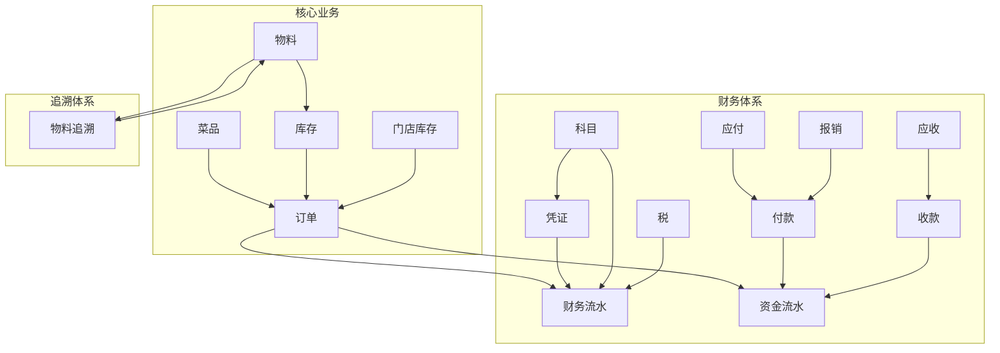

# 食品溯源系统 - 业务对象地图

## 业务对象总览

| 对象名称 | 状态 | 真相源 | 数据库表 | 实体 |
|---------|------|--------|----------|------|
| 菜品 (Food) | VERIFIED | foods表 | foods | Food |
| 物料 (Material) | VERIFIED | material_archives表 | material_archives | Material |
| 库存 (Inventory) | VERIFIED | inventory表 | inventory | Inventory |
| 门店库存 (StoreInventory) | VERIFIED | store_inventory表 | store_inventory | StoreInventory |
| 订单 (Order) | VERIFIED | orders表 | orders | Order |
| 凭证 (Voucher) | VERIFIED | finance_vouchers表 | finance_vouchers | Voucher |
| 应付 (Payable) | VERIFIED | payables表 | payables | Payable |
| 应收 (Receivable) | VERIFIED | receivables表 | receivables | Receivable |
| 科目 (AccountingSubject) | VERIFIED | accounting_subjects表 | accounting_subjects | AccountingSubject |
| 物料追溯 (MaterialTraceCode) | VERIFIED | material_trace_code表 | material_trace_code | MaterialTraceCode |
| 财务流水 (FinanceRecord) | VERIFIED | finance_records表 | finance_records | FinanceRecord |
| 资金流水 (FundFlow) | VERIFIED | fund_flows表 | fund_flows | FundFlow |
| 收款 (Receipt) | VERIFIED | receipt表 | receipt | Receipt |
| 付款 (Payment) | VERIFIED | payment表 | payment | Payment |
| 税 (TaxRecord) | VERIFIED | tax_record表 | tax_record | TaxRecord |
| 报销 (InvoiceReimbursement) | VERIFIED | invoice_reimbursement表 | invoice_reimbursement | InvoiceReimbursement |
| food (旧菜品表) | LEGACY | - | food | food |
| product (遗留产品表) | LEGACY | - | product | product |
| orders_legacy (旧订单表) | LEGACY | - | orders_legacy | orders_legacy |
| voucher_header (死体系) | LEGACY | - | voucher_header | voucher_header |
| sales_order (虚实体) | LEGACY | - | sales_order | sales_order |

---

## 核心业务对象详细地图

### 1. 菜品 (Food)

| 属性 | 描述 |
|------|------|
| **Truth Source** | foods表 |
| **DB Table** | `foods` |
| **Entity** | `Food` |
| **API** | `GET /api/v1/foods`, `POST /api/v1/foods`, `PUT /api/v1/foods/:id`, `DELETE /api/v1/foods/:id` |
| **Frontend** | `src/views/food/FoodList.vue`, `src/views/food/FoodForm.vue` |
| **Write Path** | `FoodService.create()`, `FoodService.update()`, `FoodService.delete()` |
| **Read Path** | `FoodRepository.findById()`, `FoodRepository.findAll()`, `FoodRepository.findByCategory()` |
| **Event** | `FoodCreatedEvent`, `FoodUpdatedEvent`, `FoodDeletedEvent` |
| **State** | `ACTIVE`, `INACTIVE`, `DISCONTINUED` |
| **Permission** | `food:read`, `food:write`, `food:delete` |
| **Data Scope** | 按门店、按品类、按供应商 |
| **Legacy** | `food` 表（旧表，已废弃） |
| **Consumers** | `OrderService`, `InventoryService`, `MenuService` |
| **Dependencies** | `Category`, `Supplier`, `Material` |
| **Known Issues** | 无 |
| **Decision Dependencies** | 菜品分类体系设计、菜品编码规则 |

---

### 2. 物料 (Material)

| 属性 | 描述 |
|------|------|
| **Truth Source** | material_archives表 |
| **DB Table** | `material_archives` |
| **Entity** | `Material` |
| **API** | `GET /api/v1/materials`, `POST /api/v1/materials`, `PUT /api/v1/materials/:id` |
| **Frontend** | `src/views/material/MaterialList.vue`, `src/views/material/MaterialForm.vue` |
| **Write Path** | `MaterialService.create()`, `MaterialService.update()` |
| **Read Path** | `MaterialRepository.findById()`, `MaterialRepository.findAll()` |
| **Event** | `MaterialCreatedEvent`, `MaterialUpdatedEvent` |
| **State** | `ACTIVE`, `INACTIVE` |
| **Permission** | `material:read`, `material:write` |
| **Data Scope** | 按品类、按供应商、按批次 |
| **Legacy** | 无 |
| **Consumers** | `InventoryService`, `TraceabilityService`, `ProductionService` |
| **Dependencies** | `Category`, `Supplier` |
| **Known Issues** | 无 |
| **Decision Dependencies** | 物料编码规则、物料分类体系 |

---

### 3. 库存 (Inventory)

| 属性 | 描述 |
|------|------|
| **Truth Source** | inventory表 |
| **DB Table** | `inventory` |
| **Entity** | `Inventory` |
| **API** | `GET /api/v1/inventory`, `POST /api/v1/inventory/in`, `POST /api/v1/inventory/out` |
| **Frontend** | `src/views/inventory/InventoryList.vue`, `src/views/inventory/StockInForm.vue` |
| **Write Path** | `InventoryService.stockIn()`, `InventoryService.stockOut()`, `InventoryService.transfer()` |
| **Read Path** | `InventoryRepository.findByMaterial()`, `InventoryRepository.findByWarehouse()` |
| **Event** | `StockInEvent`, `StockOutEvent`, `TransferEvent`, `LowStockEvent` |
| **State** | `NORMAL`, `LOW`, `OUT_OF_STOCK` |
| **Permission** | `inventory:read`, `inventory:write`, `inventory:transfer` |
| **Data Scope** | 按仓库、按物料、按批次 |
| **Legacy** | 无 |
| **Consumers** | `OrderService`, `ProductionService`, `TraceabilityService` |
| **Dependencies** | `Material`, `Warehouse`, `Batch` |
| **Known Issues** | 无 |
| **Decision Dependencies** | 库存计价方法（先进先出、加权平均）、库存预警规则 |

---

### 4. 门店库存 (StoreInventory)

| 属性 | 描述 |
|------|------|
| **Truth Source** | store_inventory表 |
| **DB Table** | `store_inventory` |
| **Entity** | `StoreInventory` |
| **API** | `GET /api/v1/store-inventory`, `POST /api/v1/store-inventory/in`, `POST /api/v1/store-inventory/out` |
| **Frontend** | `src/views/store-inventory/StoreInventoryList.vue` |
| **Write Path** | `StoreInventoryService.stockIn()`, `StoreInventoryService.stockOut()` |
| **Read Path** | `StoreInventoryRepository.findByStore()`, `StoreInventoryRepository.findByFood()` |
| **Event** | `StoreStockInEvent`, `StoreStockOutEvent` |
| **State** | `NORMAL`, `LOW`, `OUT_OF_STOCK` |
| **Permission** | `store-inventory:read`, `store-inventory:write` |
| **Data Scope** | 按门店、按菜品、按日期 |
| **Legacy** | 无 |
| **Consumers** | `OrderService`, `StoreReportService` |
| **Dependencies** | `Food`, `Store` |
| **Known Issues** | 无 |
| **Decision Dependencies** | 门店库存与中央库存同步策略 |

---

### 5. 订单 (Order)

| 属性 | 描述 |
|------|------|
| **Truth Source** | orders表 |
| **DB Table** | `orders` |
| **Entity** | `Order` |
| **API** | `GET /api/v1/orders`, `POST /api/v1/orders`, `PUT /api/v1/orders/:id/status` |
| **Frontend** | `src/views/order/OrderList.vue`, `src/views/order/OrderDetail.vue` |
| **Write Path** | `OrderService.create()`, `OrderService.updateStatus()`, `OrderService.cancel()` |
| **Read Path** | `OrderRepository.findById()`, `OrderRepository.findByDateRange()` |
| **Event** | `OrderCreatedEvent`, `OrderPaidEvent`, `OrderCancelledEvent`, `OrderCompletedEvent` |
| **State** | `PENDING`, `PAID`, `PREPARING`, `COMPLETED`, `CANCELLED` |
| **Permission** | `order:read`, `order:write`, `order:cancel` |
| **Data Scope** | 按门店、按日期、按客户、按状态 |
| **Legacy** | `orders_legacy` 表（旧订单表，已废弃） |
| **Consumers** | `InventoryService`, `FinanceService`, `TraceabilityService` |
| **Dependencies** | `Food`, `Store`, `Customer`, `Payment` |
| **Known Issues** | 无 |
| **Decision Dependencies** | 订单状态机设计、订单编号规则 |

---

### 6. 凭证 (Voucher)

| 属性 | 描述 |
|------|------|
| **Truth Source** | finance_vouchers表 |
| **DB Table** | `finance_vouchers` |
| **Entity** | `Voucher` |
| **API** | `GET /api/v1/vouchers`, `POST /api/v1/vouchers`, `PUT /api/v1/vouchers/:id` |
| **Frontend** | `src/views/finance/VoucherList.vue`, `src/views/finance/VoucherForm.vue` |
| **Write Path** | `VoucherService.create()`, `VoucherService.update()` |
| **Read Path** | `VoucherRepository.findById()`, `VoucherRepository.findByDateRange()` |
| **Event** | `VoucherCreatedEvent`, `VoucherApprovedEvent` |
| **State** | `DRAFT`, `PENDING`, `APPROVED`, `REJECTED` |
| **Permission** | `voucher:read`, `voucher:write`, `voucher:approve` |
| **Data Scope** | 按期间、按类型、按部门 |
| **Legacy** | `voucher_header` 表（死体系，已废弃） |
| **Consumers** | `FinanceReportService`, `TaxService` |
| **Dependencies** | `AccountingSubject`, `VoucherDetail` |
| **Known Issues** | 无 |
| **Decision Dependencies** | 凭证类型设计、审批流程 |

---

### 7. 应付 (Payable)

| 属性 | 描述 |
|------|------|
| **Truth Source** | payables表 |
| **DB Table** | `payables` |
| **Entity** | `Payable` |
| **API** | `GET /api/v1/payables`, `POST /api/v1/payables`, `PUT /api/v1/payables/:id` |
| **Frontend** | `src/views/finance/PayableList.vue` |
| **Write Path** | `PayableService.create()`, `PayableService.settle()` |
| **Read Path** | `PayableRepository.findBySupplier()`, `PayableRepository.findUnsettled()` |
| **Event** | `PayableCreatedEvent`, `PayableSettledEvent` |
| **State** | `PENDING`, `PARTIAL`, `SETTLED`, `OVERDUE` |
| **Permission** | `payable:read`, `payable:write`, `payable:settle` |
| **Data Scope** | 按供应商、按日期、按状态 |
| **Legacy** | 无 |
| **Consumers** | `PaymentService`, `FinanceReportService` |
| **Dependencies** | `Supplier`, `Payment`, `Voucher` |
| **Known Issues** | 无 |
| **Decision Dependencies** | 账期设计、付款条件 |

---

### 8. 应收 (Receivable)

| 属性 | 描述 |
|------|------|
| **Truth Source** | receivables表 |
| **DB Table** | `receivables` |
| **Entity** | `Receivable` |
| **API** | `GET /api/v1/receivables`, `POST /api/v1/receivables`, `PUT /api/v1/receivables/:id` |
| **Frontend** | `src/views/finance/ReceivableList.vue` |
| **Write Path** | `ReceivableService.create()`, `ReceivableService.collect()` |
| **Read Path** | `ReceivableRepository.findByCustomer()`, `ReceivableRepository.findUnsettled()` |
| **Event** | `ReceivableCreatedEvent`, `ReceivableCollectedEvent` |
| **State** | `PENDING`, `PARTIAL`, `COLLECTED`, `OVERDUE` |
| **Permission** | `receivable:read`, `receivable:write`, `receivable:collect` |
| **Data Scope** | 按客户、按日期、按状态 |
| **Legacy** | 无 |
| **Consumers** | `ReceiptService`, `FinanceReportService` |
| **Dependencies** | `Customer`, `Receipt`, `Voucher` |
| **Known Issues** | 无 |
| **Decision Dependencies** | 账期设计、收款条件 |

---

### 9. 科目 (AccountingSubject)

| 属性 | 描述 |
|------|------|
| **Truth Source** | accounting_subjects表 |
| **DB Table** | `accounting_subjects` |
| **Entity** | `AccountingSubject` |
| **API** | `GET /api/v1/accounting-subjects`, `POST /api/v1/accounting-subjects` |
| **Frontend** | `src/views/finance/AccountingSubjectList.vue` |
| **Write Path** | `AccountingSubjectService.create()`, `AccountingSubjectService.update()` |
| **Read Path** | `AccountingSubjectRepository.findById()`, `AccountingSubjectRepository.findByType()` |
| **Event** | `AccountingSubjectCreatedEvent` |
| **State** | `ACTIVE`, `INACTIVE` |
| **Permission** | `accounting-subject:read`, `accounting-subject:write` |
| **Data Scope** | 按类型（资产、负债、权益、收入、费用） |
| **Legacy** | 无 |
| **Consumers** | `VoucherService`, `FinanceReportService` |
| **Dependencies** | 无 |
| **Known Issues** | 无 |
| **Decision Dependencies** | 会计科目体系设计 |

---

### 10. 物料追溯 (MaterialTraceCode)

| 属性 | 描述 |
|------|------|
| **Truth Source** | material_trace_code表 |
| **DB Table** | `material_trace_code` |
| **Entity** | `MaterialTraceCode` |
| **API** | `GET /api/v1/material-trace-codes`, `POST /api/v1/material-trace-codes` |
| **Frontend** | `src/views/traceability/MaterialTraceCodeList.vue` |
| **Write Path** | `MaterialTraceCodeService.create()`, `MaterialTraceCodeService.bind()` |
| **Read Path** | `MaterialTraceCodeRepository.findByMaterial()`, `MaterialTraceCodeRepository.findByBatch()` |
| **Event** | `MaterialTraceCodeCreatedEvent` |
| **State** | `ACTIVE`, `USED`, `EXPIRED` |
| **Permission** | `material-trace-code:read`, `material-trace-code:write` |
| **Data Scope** | 按物料、按批次、按供应商 |
| **Legacy** | 无 |
| **Consumers** | `TraceabilityService`, `InventoryService` |
| **Dependencies** | `Material`, `Batch`, `Supplier` |
| **Known Issues** | 无 |
| **Decision Dependencies** | 追溯码编码规则、追溯粒度 |

---

### 11. 财务流水 (FinanceRecord)

| 属性 | 描述 |
|------|------|
| **Truth Source** | finance_records表 |
| **DB Table** | `finance_records` |
| **Entity** | `FinanceRecord` |
| **API** | `GET /api/v1/finance-records` |
| **Frontend** | `src/views/finance/FinanceRecordList.vue` |
| **Write Path** | `FinanceRecordService.record()` |
| **Read Path** | `FinanceRecordRepository.findByDateRange()`, `FinanceRecordRepository.findByType()` |
| **Event** | `FinanceRecordCreatedEvent` |
| **State** | `ACTIVE` |
| **Permission** | `finance-record:read` |
| **Data Scope** | 按日期、按类型、按部门 |
| **Legacy** | 无 |
| **Consumers** | `FinanceReportService`, `TaxService` |
| **Dependencies** | `Voucher`, `AccountingSubject` |
| **Known Issues** | 无 |
| **Decision Dependencies** | 流水记录粒度、流水类型设计 |

---

### 12. 资金流水 (FundFlow)

| 属性 | 描述 |
|------|------|
| **Truth Source** | fund_flows表 |
| **DB Table** | `fund_flows` |
| **Entity** | `FundFlow` |
| **API** | `GET /api/v1/fund-flows` |
| **Frontend** | `src/views/finance/FundFlowList.vue` |
| **Write Path** | `FundFlowService.record()` |
| **Read Path** | `FundFlowRepository.findByDateRange()`, `FundFlowRepository.findByAccount()` |
| **Event** | `FundFlowCreatedEvent` |
| **State** | `ACTIVE` |
| **Permission** | `fund-flow:read` |
| **Data Scope** | 按日期、按账户、按类型（收入/支出） |
| **Legacy** | 无 |
| **Consumers** | `FinanceReportService`, `CashFlowService` |
| **Dependencies** | `BankAccount`, `Voucher` |
| **Known Issues** | 无 |
| **Decision Dependencies** | 资金账户体系、资金流水粒度 |

---

### 13. 收款 (Receipt)

| 属性 | 描述 |
|------|------|
| **Truth Source** | receipt表 |
| **DB Table** | `receipt` |
| **Entity** | `Receipt` |
| **API** | `GET /api/v1/receipts`, `POST /api/v1/receipts` |
| **Frontend** | `src/views/finance/ReceiptList.vue`, `src/views/finance/ReceiptForm.vue` |
| **Write Path** | `ReceiptService.create()` |
| **Read Path** | `ReceiptRepository.findById()`, `ReceiptRepository.findByCustomer()` |
| **Event** | `ReceiptCreatedEvent` |
| **State** | `PENDING`, `CONFIRMED`, `REJECTED` |
| **Permission** | `receipt:read`, `receipt:write` |
| **Data Scope** | 按客户、按日期、按状态 |
| **Legacy** | 无 |
| **Consumers** | `ReceivableService`, `FinanceReportService` |
| **Dependencies** | `Customer`, `Receivable`, `BankAccount` |
| **Known Issues** | 无 |
| **Decision Dependencies** | 收款方式设计、收款确认流程 |

---

### 14. 付款 (Payment)

| 属性 | 描述 |
|------|------|
| **Truth Source** | payment表 |
| **DB Table** | `payment` |
| **Entity** | `Payment` |
| **API** | `GET /api/v1/payments`, `POST /api/v1/payments` |
| **Frontend** | `src/views/finance/PaymentList.vue`, `src/views/finance/PaymentForm.vue` |
| **Write Path** | `PaymentService.create()` |
| **Read Path** | `PaymentRepository.findById()`, `PaymentRepository.findBySupplier()` |
| **Event** | `PaymentCreatedEvent` |
| **State** | `PENDING`, `CONFIRMED`, `REJECTED` |
| **Permission** | `payment:read`, `payment:write` |
| **Data Scope** | 按供应商、按日期、按状态 |
| **Legacy** | 无 |
| **Consumers** | `PayableService`, `FinanceReportService` |
| **Dependencies** | `Supplier`, `Payable`, `BankAccount` |
| **Known Issues** | 无 |
| **Decision Dependencies** | 付款方式设计、付款审批流程 |

---

### 15. 税 (TaxRecord)

| 属性 | 描述 |
|------|------|
| **Truth Source** | tax_record表 |
| **DB Table** | `tax_record` |
| **Entity** | `TaxRecord` |
| **API** | `GET /api/v1/tax-records`, `POST /api/v1/tax-records` |
| **Frontend** | `src/views/finance/TaxRecordList.vue` |
| **Write Path** | `TaxRecordService.create()` |
| **Read Path** | `TaxRecordRepository.findByDateRange()`, `TaxRecordRepository.findByType()` |
| **Event** | `TaxRecordCreatedEvent` |
| **State** | `PENDING`, `FILED`, `PAID` |
| **Permission** | `tax-record:read`, `tax-record:write` |
| **Data Scope** | 按日期、按税种、按状态 |
| **Legacy** | 无 |
| **Consumers** | `FinanceReportService`, `TaxDeclarationService` |
| **Dependencies** | `Voucher`, `AccountingSubject` |
| **Known Issues** | 无 |
| **Decision Dependencies** | 税种设计、税务申报周期 |

---

### 16. 报销 (InvoiceReimbursement)

| 属性 | 描述 |
|------|------|
| **Truth Source** | invoice_reimbursement表 |
| **DB Table** | `invoice_reimbursement` |
| **Entity** | `InvoiceReimbursement` |
| **API** | `GET /api/v1/invoice-reimbursements`, `POST /api/v1/invoice-reimbursements` |
| **Frontend** | `src/views/finance/InvoiceReimbursementList.vue`, `src/views/finance/InvoiceReimbursementForm.vue` |
| **Write Path** | `InvoiceReimbursementService.create()` |
| **Read Path** | `InvoiceReimbursementRepository.findByApplicant()`, `InvoiceReimbursementRepository.findByStatus()` |
| **Event** | `InvoiceReimbursementCreatedEvent`, `InvoiceReimbursementApprovedEvent` |
| **State** | `DRAFT`, `PENDING`, `APPROVED`, `REJECTED`, `PAID` |
| **Permission** | `invoice-reimbursement:read`, `invoice-reimbursement:write`, `invoice-reimbursement:approve` |
| **Data Scope** | 按申请人、按日期、按状态 |
| **Legacy** | 无 |
| **Consumers** | `PaymentService`, `FinanceReportService` |
| **Dependencies** | `Employee`, `Invoice`, `Voucher` |
| **Known Issues** | 无 |
| **Decision Dependencies** | 报销类型设计、审批流程、报销限额 |

---

## 遗留对象详细地图

### 1. food (旧菜品表)

| 属性 | 描述 |
|------|------|
| **Truth Source** | 无（已废弃） |
| **DB Table** | `food` |
| **Entity** | `food` |
| **API** | 无 |
| **Frontend** | 无 |
| **Write Path** | 无 |
| **Read Path** | 无 |
| **Event** | 无 |
| **State** | `DEPRECATED` |
| **Permission** | 无 |
| **Data Scope** | 无 |
| **Legacy** | 是（已废弃，数据已迁移到 `foods` 表） |
| **Consumers** | 无 |
| **Dependencies** | 无 |
| **Known Issues** | 表结构与新表不兼容，数据可能不一致 |
| **Decision Dependencies** | 数据迁移策略、表删除计划 |

---

### 2. product (遗留产品表)

| 属性 | 描述 |
|------|------|
| **Truth Source** | 无（已废弃） |
| **DB Table** | `product` |
| **Entity** | `product` |
| **API** | 无 |
| **Frontend** | 无 |
| **Write Path** | 无 |
| **Read Path** | 无 |
| **Event** | 无 |
| **State** | `DEPRECATED` |
| **Permission** | 无 |
| **Data Scope** | 无 |
| **Legacy** | 是（已废弃，功能已被 `foods` 和 `material_archives` 替代） |
| **Consumers** | 无 |
| **Dependencies** | 无 |
| **Known Issues** | 表结构与新表不兼容，数据可能不一致 |
| **Decision Dependencies** | 数据迁移策略、表删除计划 |

---

### 3. orders_legacy (旧订单表)

| 属性 | 描述 |
|------|------|
| **Truth Source** | 无（已废弃） |
| **DB Table** | `orders_legacy` |
| **Entity** | `orders_legacy` |
| **API** | 无 |
| **Frontend** | 无 |
| **Write Path** | 无 |
| **Read Path** | 无 |
| **Event** | 无 |
| **State** | `DEPRECATED` |
| **Permission** | 无 |
| **Data Scope** | 无 |
| **Legacy** | 是（已废弃，数据已迁移到 `orders` 表） |
| **Consumers** | 无 |
| **Dependencies** | 无 |
| **Known Issues** | 表结构与新表不兼容，数据可能不一致 |
| **Decision Dependencies** | 数据迁移策略、表删除计划 |

---

### 4. voucher_header (死体系)

| 属性 | 描述 |
|------|------|
| **Truth Source** | 无（已废弃） |
| **DB Table** | `voucher_header` |
| **Entity** | `voucher_header` |
| **API** | 无 |
| **Frontend** | 无 |
| **Write Path** | 无 |
| **Read Path** | 无 |
| **Event** | 无 |
| **State** | `DEPRECATED` |
| **Permission** | 无 |
| **Data Scope** | 无 |
| **Legacy** | 是（已废弃，功能已被 `finance_vouchers` 替代） |
| **Consumers** | 无 |
| **Dependencies** | 无 |
| **Known Issues** | 表结构与新表不兼容，数据可能不一致 |
| **Decision Dependencies** | 数据迁移策略、表删除计划 |

---

### 5. sales_order (虚实体)

| 属性 | 描述 |
|------|------|
| **Truth Source** | 无（已废弃） |
| **DB Table** | `sales_order` |
| **Entity** | `sales_order` |
| **API** | 无 |
| **Frontend** | 无 |
| **Write Path** | 无 |
| **Read Path** | 无 |
| **Event** | 无 |
| **State** | `DEPRECATED` |
| **Permission** | 无 |
| **Data Scope** | 无 |
| **Legacy** | 是（已废弃，功能已被 `orders` 替代） |
| **Consumers** | 无 |
| **Dependencies** | 无 |
| **Known Issues** | 表结构与新表不兼容，数据可能不一致 |
| **Decision Dependencies** | 数据迁移策略、表删除计划 |

---

## 业务对象关系图

## 数据流概览

1. **订单流程**: `Order` → `Inventory`/`StoreInventory` → `FinanceRecord` → `FundFlow`
2. **采购流程**: `Material` → `Inventory` → `Payable` → `Payment` → `FundFlow`
3. **销售流程**: `Food` → `Order` → `Receivable` → `Receipt` → `FundFlow`
4. **追溯流程**: `Material` → `MaterialTraceCode` → `Order` → 消费者

## 维护说明

1. **新增业务对象**: 请按照核心业务对象的格式添加
2. **遗留对象处理**: 定期评估遗留对象的使用情况，制定迁移或删除计划
3. **状态更新**: 及时更新业务对象的状态（如从 `ACTIVE` 变为 `DEPRECATED`）
4. **依赖关系**: 新增或修改业务对象时，检查并更新依赖关系