# 食品溯源系统 - 前端地图

> 最后更新：2026-09-09

---

## 一、前端终端总览

| 终端名称 | 技术栈 | 路由/页面数 | 功能定位 |
|---------|--------|------------|----------|
| Management Frontend | Vue 3 + TypeScript + Vite 8 + Pinia + Element Plus | 100+ 路由 / 23 个业务目录 | 主管理后台 |
| POS | Vue 3 + TypeScript + Vite 5 | 11 路由 | 收银终端 |
| Kitchen | Vue 3 + TypeScript + Vite 5 | 4 路由 | 后厨终端 |
| Employee | Vue 3 + Capacitor | 30+ 路由 | 员工门户 |
| MiniProgram | 微信小程序原生 | 24 页面 | 微信小程序 |
| Receiving Mobile | Vue 3 + Capacitor (嵌入frontend) | 1 个大页面 | 收货验收移动端 |

**前端路由/页面总数：170+**

---

## 二、前端终端矩阵

```
    Management Frontend  ████████████████████████████████  100+ 路由 / 23 目录
    Employee             ██████████████████               30+ 路由
    MiniProgram          ████████████████                 24 页面
    POS                  ███████                          11 路由
    Kitchen              ███                              4  路由
    Receiving Mobile     █                                1  页面
```

---

## 三、前端客户端详细地图

### 1. Management Frontend (主管理后台)

| 属性 | 描述 |
|------|------|
| **技术栈** | Vue 3 + TypeScript + Vite 8 + Pinia + Element Plus |
| **路由数** | 100+ |
| **业务目录** | 23 个 |
| **路由守卫** | 基于域权限矩阵 |
| **状态管理** | Pinia |
| **UI 组件库** | Element Plus |
| **构建工具** | Vite 8 |

#### 业务模块列表

| 模块名称 | 目录名 | 功能说明 |
|---------|--------|----------|
| 工作台 | workspace | 首页仪表盘、快捷入口、数据概览 |
| 产品中心 | product | 菜品管理、物料管理、产品分类 |
| 订单管理 | order | 订单列表、订单详情、订单状态流转 |
| 运营中心 | operations | 营销活动、优惠券、会员运营 |
| 门店管理 | store-management | 门店信息、门店配置、门店授权 |
| 采购管理 | purchase | 采购计划、采购订单、供应商管理 |
| 仓储管理 | warehouse | 库存管理、出入库、库存盘点 |
| 会员管理 | member | 会员信息、会员等级、积分管理 |
| 财务中心 | finance | 凭证管理、应收应付、财务报表 |
| 资产管理 | asset | 固定资产、折旧管理、资产盘点 |
| 人事管理 | hr | 员工管理、考勤、排班、薪资 |
| 食品追溯 | traceability | 追溯码、追溯查询、追溯报告 |
| 设备管理 | device | 设备注册、设备监控、设备维护 |
| 系统管理 | system | 用户管理、角色管理、菜单管理 |
| 电子签章 | seal | 签章管理、签章审批、签章使用 |
| 供应商门户 | supplier-portal | 供应商信息、供应商报价、供应商协同 |

#### 权限守卫机制

```
┌─────────────────────────────────────────────────┐
│                 路由请求                         │
└──────────────────┬──────────────────────────────┘
                   ▼
┌─────────────────────────────────────────────────┐
│  路由守卫 (Navigation Guard)                     │
│  - 检查用户登录状态                               │
│  - 验证 Token 有效性                             │
└──────────────────┬──────────────────────────────┘
                   ▼
┌─────────────────────────────────────────────────┐
│  域权限矩阵验证                                  │
│  - 验证用户是否有权访问该域                       │
│  - 检查角色权限配置                               │
└──────────────────┬──────────────────────────────┘
                   ▼
┌─────────────────────────────────────────────────┐
│  页面渲染                                        │
└─────────────────────────────────────────────────┘
```

---

### 2. POS (收银终端)

| 属性 | 描述 |
|------|------|
| **技术栈** | Vue 3 + TypeScript + Vite 5 |
| **路由数** | 11 |
| **功能定位** | 收银点操作终端 |

#### 功能列表

| 功能模块 | 说明 |
|---------|------|
| 收银 | 扫码点单、手动开单、收银结算 |
| 订单 | 当日订单、历史订单、订单查询 |
| 支付 | 现金、微信、支付宝、会员支付 |
| 桌台 | 桌台状态、开台、清台、转台 |
| 叫号 | 取餐号管理、叫号提醒 |
| 后厨 | 后厨通信、出餐确认 |

---

### 3. Kitchen (后厨终端)

| 属性 | 描述 |
|------|------|
| **技术栈** | Vue 3 + TypeScript + Vite 5 |
| **路由数** | 4 |
| **功能定位** | 后厨制作终端 |

#### 功能列表

| 功能模块 | 说明 |
|---------|------|
| 制作终端 | 订单接收、制作状态、出餐确认 |
| 扫码制作 | 扫码接单、扫码出餐 |
| 工位打印 | 订单打印、标签打印 |
| 出餐窗口 | 出餐排队、出餐叫号 |

---

### 4. Employee (员工门户)

| 属性 | 描述 |
|------|------|
| **技术栈** | Vue 3 + Capacitor |
| **路由数** | 30+ |
| **功能定位** | 员工自助服务门户 |

#### 功能列表

| 功能模块 | 说明 |
|---------|------|
| 考勤 | 打卡、考勤记录、请假申请 |
| 排班 | 班次查询、排班表、换班申请 |
| 薪资 | 工资条、薪资明细、个税查询 |
| 审批 | 请假审批、报销审批、通用审批 |
| 培训 | 培训课程、培训考试、培训记录 |
| 知识库 | 操作规范、食品安全知识、FAQ |

---

### 5. MiniProgram (微信小程序)

| 属性 | 描述 |
|------|------|
| **技术栈** | 微信小程序原生 |
| **页面数** | 24 |
| **功能定位** | C端用户入口 |

#### 功能列表

| 功能模块 | 说明 |
|---------|------|
| 点餐 | 菜单浏览、加购、下单 |
| 订单 | 订单列表、订单详情、订单追踪 |
| 会员 | 会员注册、会员信息、积分查询 |
| 优惠券 | 领券中心、我的券包、券核销 |
| 充值 | 会员充值、充值记录、余额查询 |

---

### 6. Receiving Mobile (收货验收移动端)

| 属性 | 描述 |
|------|------|
| **技术栈** | Vue 3 + Capacitor (嵌入frontend) |
| **页面数** | 1 个大页面 |
| **功能定位** | 仓库收货验收专用终端 |

#### 功能列表

| 功能模块 | 说明 |
|---------|------|
| 卡片式验收 | 物料卡片展示、逐项验收 |
| 扫码 | 物料扫码、批次扫码 |
| 拍照 | 质量拍照、异常拍照 |
| 双签存证 | 供应商签名、验收员签名、电子存证 |

---

## 四、前端技术栈矩阵

| 终端 | 框架 | 构建工具 | 状态管理 | UI 组件库 | 移动端方案 |
|------|------|---------|---------|----------|-----------|
| Management Frontend | Vue 3 | Vite 8 | Pinia | Element Plus | - |
| POS | Vue 3 | Vite 5 | Pinia | Element Plus | - |
| Kitchen | Vue 3 | Vite 5 | Pinia | Element Plus | - |
| Employee | Vue 3 | Capacitor | Pinia | Element Plus | Capacitor |
| MiniProgram | 原生 | 微信开发者工具 | - | - | - |
| Receiving Mobile | Vue 3 | Capacitor | Pinia | Element Plus | Capacitor (嵌入) |

---

## 五、前端路由统计

| 终端 | 路由/页面数 | 占比 |
|------|------------|------|
| Management Frontend | 100+ | 58.8% |
| Employee | 30+ | 17.6% |
| MiniProgram | 24 | 14.1% |
| POS | 11 | 6.5% |
| Kitchen | 4 | 2.4% |
| Receiving Mobile | 1 | 0.6% |
| **合计** | **170+** | **100%** |

```
    Management Frontend  ████████████████████████████░░░░░░  58.8%
    Employee             █████████░░░░░░░░░░░░░░░░░░░░░░░░  17.6%
    MiniProgram          ███████░░░░░░░░░░░░░░░░░░░░░░░░░░  14.1%
    POS                  ███░░░░░░░░░░░░░░░░░░░░░░░░░░░░░░   6.5%
    Kitchen              █░░░░░░░░░░░░░░░░░░░░░░░░░░░░░░░░   2.4%
    Receiving Mobile     ░░░░░░░░░░░░░░░░░░░░░░░░░░░░░░░░░   0.6%
```

---

## 六、前端架构关系图

```mermaid
graph TB
    subgraph Management Frontend
        MF[主管理后台<br/>Vue 3 + Vite 8]
        MF_R[100+ 路由]
        MF_M[23 个业务模块]
    end
    
    subgraph POS Terminal
        POS[收银终端<br/>Vue 3 + Vite 5]
        POS_F[收银/订单/支付/桌台]
    end
    
    subgraph Kitchen Terminal
        KITCH[后厨终端<br/>Vue 3 + Vite 5]
        KITCH_F[制作/扫码/打印/出餐]
    end
    
    subgraph Employee Portal
        EMP[员工门户<br/>Vue 3 + Capacitor]
        EMP_F[考勤/排班/薪资/审批]
    end
    
    subgraph MiniProgram
        MP[微信小程序<br/>原生开发]
        MP_F[点餐/订单/会员/优惠/充值]
    end
    
    subgraph Receiving Mobile
        RM[收货验收移动端<br/>Vue 3 + Capacitor]
        RM_F[卡片验收/扫码/拍照/双签]
    end
    
    subgraph Backend API
        API[后端 API]
        AUTH[认证服务]
        PERM[权限服务]
    end
    
    MF --> API
    POS --> API
    KITCH --> API
    EMP --> API
    MP --> API
    RM --> API
    
    MF --> AUTH
    POS --> AUTH
    KITCH --> AUTH
    EMP --> AUTH
    
    MF --> PERM
    POS --> PERM
```



---

## 七、前端模块与后端对应关系

| 前端模块 | 后端模块 | API 路径 |
|---------|---------|---------|
| workspace (工作台) | - | 多个聚合 API |
| product (产品中心) | Food/Material | `/api/v1/foods`, `/api/v1/materials` |
| order (订单管理) | Order | `/api/v1/orders` |
| operations (运营中心) | Member/Marketing | `/api/v1/members`, `/api/v1/coupons` |
| store-management (门店管理) | Store | `/api/v1/stores` |
| purchase (采购管理) | Purchase/Supplier | `/api/v1/purchases`, `/api/v1/suppliers` |
| warehouse (仓储管理) | Inventory/Warehouse | `/api/v1/inventory`, `/api/v1/warehouses` |
| member (会员管理) | Member | `/api/v1/members` |
| finance (财务中心) | Finance | `/api/v1/vouchers`, `/api/v1/payables`, `/api/v1/receivables` |
| asset (资产管理) | Asset | `/api/v1/assets` |
| hr (人事管理) | HR | `/api/v1/employees`, `/api/v1/attendance` |
| traceability (食品追溯) | Traceability | `/api/v1/trace-codes` |
| device (设备管理) | Device | `/api/v1/devices` |
| system (系统管理) | System | `/api/v1/users`, `/api/v1/roles`, `/api/v1/menus` |
| seal (电子签章) | Seal | `/api/v1/seals` |
| supplier-portal (供应商门户) | Supplier | `/api/v1/supplier-portal` |

---

## 八、关键技术点

### 1. 路由守卫 (Management Frontend)

```typescript
// 基于域权限矩阵的路由守卫
router.beforeEach(async (to, from, next) => {
  const userStore = useUserStore()
  const permissionStore = usePermissionStore()
  
  // 检查登录状态
  if (!userStore.isLoggedIn) {
    return next({ name: 'Login' })
  }
  
  // 检查域权限
  const domain = to.meta.domain
  if (domain && !permissionStore.hasDomainAccess(domain)) {
    return next({ name: '403' })
  }
  
  next()
})
```

### 2. 状态管理 (Pinia)

```typescript
// 用户状态
interface UserState {
  token: string
  userInfo: UserInfo
  permissions: string[]
  domains: string[]
}

// 订单状态
interface OrderState {
  currentOrder: Order | null
  orderList: Order[]
  loading: boolean
}
```

### 3. 移动端适配 (Capacitor)

```typescript
// Employee 和 Receiving Mobile 使用 Capacitor
import { Capacitor } from '@capacitor/core'

// 检查运行平台
const platform = Capacitor.getPlatform()

// 调用原生功能
import { Camera } from '@capacitor/camera'
import { Geolocation } from '@capacitor/geolocation'
```

---

## 九、风险与关注点

| 风险点 | 说明 | 建议 |
|--------|------|------|
| 终端技术栈碎片化 | 6 个终端使用 4 种不同技术栈 | 统一构建工具和依赖版本 |
| Vite 版本不一致 | Management 用 Vite 8，POS/Kitchen 用 Vite 5 | 升级 POS/Kitchen 到 Vite 8 |
| 小程序原生开发 | MiniProgram 使用原生开发，无法复用 Vue 组件 | 考虑使用 Taro 或 uni-app |
| 路由守卫复杂度 | 域权限矩阵逻辑复杂 | 考虑权限配置化，减少硬编码 |
| 移动端兼容性 | Capacitor 需要处理多平台兼容 | 建立完整的移动端测试矩阵 |

---

## 十、维护说明

1. **新增前端终端**: 请按照现有终端格式添加
2. **模块更新**: 及时更新模块的功能说明和路由数
3. **技术栈变更**: 技术栈升级时需同步更新本文档
4. **权限变更**: 路由守卫或权限矩阵变更时需更新架构图