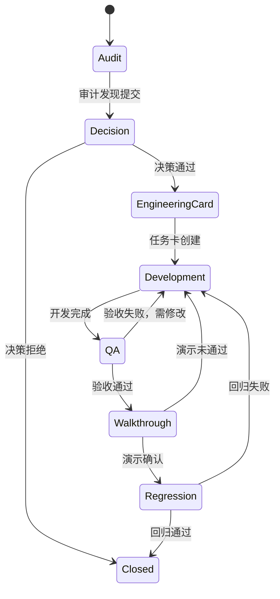

# Issue生命周期地图

## 概述
本文档定义食品溯源系统中Issue的完整生命周期，涵盖从审计发现到关闭的各个阶段，并说明历史审计来源、产品决策池、BLOCKED项及追溯规则。

## 1. Issue生命周期阶段

Issue经历以下8个阶段，状态按顺序流转：

| 阶段 | 名称 | 描述 |
|------|------|------|
| 1 | **Audit** | 审计发现：通过审计活动识别出的潜在问题或缺陷 |
| 2 | **Decision** | 产品决策：产品负责人对审计发现进行评估并做出决策 |
| 3 | **Engineering Card** | 工程任务卡：决策通过后创建的具体工程任务 |
| 4 | **Development** | 开发执行：工程师按照任务卡进行开发实现 |
| 5 | **QA** | 验收测试：QA团队对开发成果进行验收测试 |
| 6 | **Walkthrough** | 演示确认：向相关方演示并确认功能符合要求 |
| 7 | **Regression** | 回归测试：确保修改未引入新问题，进行回归验证 |
| 8 | **Closed** | 关闭：Issue完成所有验证，正式关闭 |

## 2. 历史审计来源

Issue可源自以下审计活动：

| 编号 | 来源 | 说明 |
|------|------|------|
| 1 | **ETM** | 实体表映射审计（107条） |
| 2 | **KL** | 已知限制（KL-001~055+） |
| 3 | **AUDIT** | 前端审计（664文件） |
| 4 | **BFA** | 业务流程分析 |
| 5 | **OBS** | 观察报告 |
| 6 | **GIA** | 全局影响分析 |
| 7 | **CDDR** | 跨域设计审查 |
| 8 | **PADR** | 产品架构决策记录 |

## 3. 产品决策池（PD-001~039）

产品决策池共39个决策项，当前状态：

- **已决策**: 16个
- **待产品**: 7个
- **待评估**: 2个

## 4. BLOCKED项（不纳入Sprint通过数）

以下决策项因各种原因被阻塞，不计入Sprint通过数：

| 编号 | 决策项 | 说明 |
|------|--------|------|
| PD-006 | 裸接口权限归属 | 25个方法 |
| PD-007 | 申诉域归属 | 5个方法 |
| PD-008 | 供应商H5外部认证 | |
| PD-009 | 通用审批权限模型 | |
| PD-010 | 退款审批身份归因 | |
| PD-012 | 自动签名存证 | |
| PD-013 | APK分发模式 | |
| PD-033 | 收款冲正 | |
| PD-034 | 预算审批流归属 | |
| PD-035 | 导出规则 | |

## 5. Issue追溯规则

Issue创建时需遵循以下追溯规则：

- **New**: 全新问题，未在现有Issue中记录
- **Existing Issue**: 已存在相同或类似Issue，需关联而非重复创建
- **Regression**: 因先前修改导致的新问题
- **Legacy**: 遗留问题，历史原因造成

**重要规则**: 禁止重复建Issue。创建新Issue前必须检查是否已有相同或类似问题记录。

## 6. 生命周期流程图

## 7. 状态转换说明

| 当前状态 | 可转换到 | 触发条件 |
|----------|----------|----------|
| Audit | Decision | 审计发现正式提交评审 |
| Decision | EngineeringCard | 产品决策通过，需工程实现 |
| Decision | Closed | 产品决策拒绝或不处理 |
| EngineeringCard | Development | 工程任务卡创建并分配 |
| Development | QA | 开发完成，提交验收 |
| QA | Walkthrough | 验收测试通过 |
| QA | Development | 验收失败，返回开发 |
| Walkthrough | Regression | 演示确认通过 |
| Walkthrough | Development | 演示未通过，需修改 |
| Regression | Closed | 回归测试通过，Issue关闭 |
| Regression | Development | 回归失败，返回开发 |

## 8. 注意事项

1. **BLOCKED项处理**: BLOCKED项需等待阻塞原因解决后才能进入正常流程
2. **决策池管理**: 产品决策池需定期评审，更新决策状态
3. **追溯检查**: 创建新Issue前必须执行追溯检查，避免重复
4. **审计来源记录**: 所有Issue必须记录其审计来源，便于追溯
5. **Sprint计数**: 只有非BLOCKED项且完成Closed状态的Issue才计入Sprint通过数

## 9. 相关文档

- [项目主地图](project-master-map.md)
- [状态机地图](state-machine-map.md)
- [权限数据范围地图](permission-data-scope-map.md)
- [遗留系统地图](legacy-map.md)
