# Data Design Map

> **项目**: 食品溯源系统 (Food Traceability System)
> **生成时间**: 2026-09-09
> **数据来源**: 代码库静态分析 + 地图文件交叉验证

---

## 一、数据模型总览

| 分类 | 表数量 | 核心表 | 状态 |
|------|--------|--------|------|
| 权限与用户体系 | 8 | users, roles, permissions | ✅ VERIFIED |
| 组织架构 | 4 | departments, positions, stores_new | ⚠️ stores 双表 |
| HR人力资源 | 7 | employees, attendance_record, salary_records | ✅ VERIFIED |
| 产品与菜品体系 | 10+ | foods, material_archives, dish_recipes | ⚠️ food/foods 双表 |
| 库存体系 | 8+ | inventory, store_inventory | ⚠️ 双写风险 |
| 采购体系 | 8+ | suppliers, purchase_orders, purchase_arrivals | ✅ VERIFIED |
| 财务体系 | 12+ | finance_vouchers, payables, receivables | ⚠️ 财务表冗余 |
| 订单与销售 | 6+ | orders, order_items | 🔴 三套状态机 |
| 营销CRM | 8 | members, member_level, member_points_log | ✅ VERIFIED |
| 食品溯源体系 | 6+ | material_trace_code, food_trace_code | ✅ VERIFIED |
| 设备管理 | 4 | devices, device_templates | ⚠️ device_status_log 双表 |
| 资产管理 | 4 | asset_masters_enhanced, asset_flow_records | ✅ VERIFIED |

---

## 二、核心表关系图

```mermaid
erDiagram
    %% 主数据
    suppliers {
        bigint id PK
        varchar name
        varchar contact
        varchar phone
    }
    
    foods {
        bigint id PK
        varchar name
        decimal price
        bigint categoryId FK
    }
    
    material_archives {
        bigint id PK
        varchar name
        varchar code
        bigint supplierId FK
        bigint categoryId FK
    }
    
    employees {
        bigint id PK
        varchar name
        varchar employeeNo
        bigint departmentId FK
        bigint positionId FK
        bigint storeId FK
    }
    
    stores_new {
        bigint id PK
        varchar name
        varchar address
        varchar businessScope
    }
    
    bank_accounts {
        bigint id PK
        varchar accountName
        varchar accountNumber
        varchar bankName
    }

    %% 业务表
    orders {
        bigint id PK
        varchar orderCode
        bigint storeId FK
        bigint customerId FK
        decimal amount
        int order_status
        int payment_status
        int legacy_status
    }
    
    order_items {
        bigint id PK
        bigint orderId FK
        bigint foodId FK
        varchar foodName
        int quantity
        decimal unitPrice
    }
    
    purchase_orders {
        bigint id PK
        bigint supplierId FK
        varchar supplierName
        decimal totalAmount
        int status
    }
    
    purchase_arrivals {
        bigint id PK
        bigint orderId FK
        int status
    }
    
    inventory {
        bigint id PK
        bigint materialId FK
        bigint warehouseId FK
        int quantity
    }
    
    store_inventory {
        bigint id PK
        bigint storeId FK
        bigint foodId FK
        int quantity
    }

    %% 财务表
    finance_vouchers {
        bigint id PK
        varchar voucherNo
        int voucherType
        date voucherDate
        int status
    }
    
    payables {
        bigint id PK
        bigint supplierId FK
        varchar supplierName
        decimal amount
        decimal paidAmount
        int status
    }
    
    receivables {
        bigint id PK
        bigint customerId FK
        decimal amount
        decimal receivedAmount
        int status
    }
    
    payment {
        bigint id PK
        bigint payableId FK
        bigint supplierId FK
        bigint bankAccountId FK
        decimal amount
        int status
    }
    
    receipt {
        bigint id PK
        bigint receivableId FK
        bigint customerId FK
        bigint bankAccountId FK
        decimal amount
        int status
    }
    
    fund_flows {
        bigint id PK
        bigint bankAccountId FK
        decimal amount
        int flowType
    }
    
    finance_records {
        bigint id PK
        bigint voucherId FK
        bigint subjectId FK
        decimal amount
        int recordType
    }
    
    accounting_subjects {
        bigint id PK
        varchar code
        varchar name
        int type
        decimal balance
    }

    %% 溯源表
    material_trace_code {
        bigint id PK
        bigint materialId FK
        bigint supplierId FK
        varchar traceCode
        varchar batchNo
        int status
    }
    
    food_trace_code {
        bigint id PK
        bigint foodId FK
        bigint materialTraceCodeId FK
        varchar traceCode
        int status
    }

    %% 关系定义
    suppliers ||--o{ purchase_orders : "supplies"
    suppliers ||--o{ material_archives : "supplies"
    suppliers ||--o{ payables : "owes"
    suppliers ||--o{ material_trace_code : "traced"
    
    foods ||--o{ order_items : "ordered"
    foods ||--o{ store_inventory : "stocked"
    foods ||--o{ food_trace_code : "traced"
    
    material_archives ||--o{ inventory : "stocked"
    material_archives ||--o{ material_trace_code : "traced"
    
    stores_new ||--o{ orders : "belongs"
    stores_new ||--o{ store_inventory : "stocked"
    stores_new ||--o{ employees : "employs"
    
    employees ||--o{ users : "linked"
    employees ||--o{ attendance_record : "attends"
    employees ||--o{ salary_records : "paid"
    
    orders ||--o{ order_items : "contains"
    orders ||--o{ finance_records : "generates"
    
    purchase_orders ||--o{ purchase_arrivals : "arrives"
    
    payables ||--o{ payment : "settled_by"
    receivables ||--o{ receipt : "collected_by"
    
    bank_accounts ||--o{ payment : "funds"
    bank_accounts ||--o{ receipt : "funds"
    bank_accounts ||--o{ fund_flows : "flows"
    
    finance_vouchers ||--o{ finance_records : "records"
    accounting_subjects ||--o{ finance_vouchers : "classified"
    accounting_subjects ||--o{ finance_records : "classified"
```

---

## 三、字段映射与数据类型

### 3.1 主数据字段映射

#### suppliers 表

| 字段名 | 数据类型 | 约束 | 说明 | 索引 |
|--------|----------|------|------|------|
| id | bigint | PK, AUTO_INCREMENT | 主键 | PK |
| name | varchar(100) | NOT NULL | 供应商名称 | INDEX |
| contact | varchar(50) | | 联系人 | |
| phone | varchar(20) | | 联系电话 | |
| address | varchar(200) | | 地址 | |
| status | int | DEFAULT 1 | 状态 1:启用 0:停用 | INDEX |
| created_at | timestamp | DEFAULT CURRENT_TIMESTAMP | 创建时间 | |
| updated_at | timestamp | | 更新时间 | |

#### foods 表

| 字段名 | 数据类型 | 约束 | 说明 | 索引 |
|--------|----------|------|------|------|
| id | bigint | PK, AUTO_INCREMENT | 主键 | PK |
| name | varchar(100) | NOT NULL | 菜品名称 | INDEX |
| code | varchar(50) | UNIQUE | 菜品编码 | UNIQUE |
| price | decimal(10,2) | NOT NULL | 价格(分) | |
| categoryId | bigint | FK → food_categories.id | 分类ID | INDEX |
| status | int | DEFAULT 1 | 状态 | INDEX |
| stock | int | DEFAULT 0 | 库存 | |
| unit | varchar(20) | DEFAULT '份' | 单位 | |
| created_at | timestamp | DEFAULT CURRENT_TIMESTAMP | 创建时间 | |
| updated_at | timestamp | | 更新时间 | |

#### material_archives 表

| 字段名 | 数据类型 | 约束 | 说明 | 索引 |
|--------|----------|------|------|------|
| id | bigint | PK, AUTO_INCREMENT | 主键 | PK |
| name | varchar(100) | NOT NULL | 物料名称 | INDEX |
| code | varchar(50) | UNIQUE | 物料编码 | UNIQUE |
| categoryId | bigint | FK → material_categories.id | 分类ID | INDEX |
| supplierId | bigint | FK → suppliers.id | 主供应商ID | INDEX |
| unit | varchar(20) | | 单位 | |
| status | int | DEFAULT 1 | 状态 | INDEX |
| created_at | timestamp | DEFAULT CURRENT_TIMESTAMP | 创建时间 | |
| updated_at | timestamp | | 更新时间 | |

#### employees 表

| 字段名 | 数据类型 | 约束 | 说明 | 索引 |
|--------|----------|------|------|------|
| id | bigint | PK, AUTO_INCREMENT | 主键 | PK |
| name | varchar(50) | NOT NULL | 员工姓名 | INDEX |
| employeeNo | varchar(50) | UNIQUE | 员工编号 | UNIQUE |
| departmentId | bigint | FK → departments.id | 部门ID | INDEX |
| positionId | bigint | FK → positions.id | 岗位ID | INDEX |
| storeId | bigint | FK → stores_new.id | 门店ID | INDEX |
| warehouseId | bigint | | 仓库ID | INDEX |
| salary | decimal(10,2) | | 薪资 | |
| status | varchar(20) | DEFAULT 'active' | 状态 | INDEX |
| created_at | timestamp | DEFAULT CURRENT_TIMESTAMP | 创建时间 | |
| updated_at | timestamp | | 更新时间 | |

#### stores_new 表

| 字段名 | 数据类型 | 约束 | 说明 | 索引 |
|--------|----------|------|------|------|
| id | bigint | PK, AUTO_INCREMENT | 主键 | PK |
| name | varchar(100) | NOT NULL | 门店名称 | INDEX |
| address | varchar(200) | | 地址 | |
| businessScope | text | | 经营范围 | |
| status | int | DEFAULT 1 | 状态 | INDEX |
| created_at | timestamp | DEFAULT CURRENT_TIMESTAMP | 创建时间 | |
| updated_at | timestamp | | 更新时间 | |

### 3.2 业务数据字段映射

#### orders 表

| 字段名 | 数据类型 | 约束 | 说明 | 索引 |
|--------|----------|------|------|------|
| id | bigint | PK, AUTO_INCREMENT | 主键 | PK |
| orderCode | varchar(50) | UNIQUE | 订单编号 | UNIQUE |
| storeId | bigint | FK → stores_new.id | 门店ID | INDEX |
| customerId | bigint | FK → members.id | 会员ID | INDEX |
| amount | decimal(10,2) | NOT NULL | 订单金额(分) | |
| order_status | int | DEFAULT 0 | 订单状态 | INDEX |
| payment_status | int | DEFAULT 0 | 支付状态 | INDEX |
| legacy_status | int | | 遗留状态 | |
| created_at | timestamp | DEFAULT CURRENT_TIMESTAMP | 创建时间 | INDEX |
| updated_at | timestamp | | 更新时间 | |

#### order_items 表

| 字段名 | 数据类型 | 约束 | 说明 | 索引 |
|--------|----------|------|------|------|
| id | bigint | PK, AUTO_INCREMENT | 主键 | PK |
| orderId | bigint | FK → orders.id | 订单ID | INDEX |
| foodId | bigint | FK → foods.id | 菜品ID | INDEX |
| foodName | varchar(100) | | 菜品名称(快照) | |
| quantity | int | NOT NULL | 数量 | |
| unitPrice | decimal(10,2) | NOT NULL | 单价(分) | |
| created_at | timestamp | DEFAULT CURRENT_TIMESTAMP | 创建时间 | |

#### purchase_orders 表

| 字段名 | 数据类型 | 约束 | 说明 | 索引 |
|--------|----------|------|------|------|
| id | bigint | PK, AUTO_INCREMENT | 主键 | PK |
| supplierId | bigint | FK → suppliers.id | 供应商ID | INDEX |
| supplierName | varchar(100) | | 供应商名称(快照) | |
| totalAmount | decimal(10,2) | NOT NULL | 总金额(分) | |
| status | int | DEFAULT 0 | 状态 | INDEX |
| created_at | timestamp | DEFAULT CURRENT_TIMESTAMP | 创建时间 | INDEX |
| updated_at | timestamp | | 更新时间 | |

#### inventory 表

| 字段名 | 数据类型 | 约束 | 说明 | 索引 |
|--------|----------|------|------|------|
| id | bigint | PK, AUTO_INCREMENT | 主键 | PK |
| materialId | bigint | FK → material_archives.id | 物料ID | INDEX |
| warehouseId | bigint | | 仓库ID | INDEX |
| quantity | int | DEFAULT 0 | 数量 | |
| batchNo | varchar(50) | | 批次号 | INDEX |
| created_at | timestamp | DEFAULT CURRENT_TIMESTAMP | 创建时间 | |
| updated_at | timestamp | | 更新时间 | |

#### finance_vouchers 表

| 字段名 | 数据类型 | 约束 | 说明 | 索引 |
|--------|----------|------|------|------|
| id | bigint | PK, AUTO_INCREMENT | 主键 | PK |
| voucherNo | varchar(50) | UNIQUE | 凭证编号 | UNIQUE |
| voucherType | varchar(20) | NOT NULL | 凭证类型 | INDEX |
| voucherDate | date | NOT NULL | 凭证日期 | INDEX |
| status | int | DEFAULT 0 | 状态 0-3 | INDEX |
| created_at | timestamp | DEFAULT CURRENT_TIMESTAMP | 创建时间 | |
| updated_at | timestamp | | 更新时间 | |

---

## 四、约束与索引设计

### 4.1 主键约束

| 表名 | 主键字段 | 约束类型 | 说明 |
|------|----------|----------|------|
| 所有表 | id | PK, AUTO_INCREMENT | 自增主键 |

### 4.2 外键约束

| 表名 | 字段 | 引用表 | 引用字段 | 级联操作 |
|------|------|--------|----------|----------|
| order_items | orderId | orders | id | CASCADE |
| order_items | foodId | foods | id | RESTRICT |
| orders | storeId | stores_new | id | RESTRICT |
| orders | customerId | members | id | RESTRICT |
| purchase_orders | supplierId | suppliers | id | RESTRICT |
| purchase_arrivals | orderId | purchase_orders | id | RESTRICT |
| inventory | materialId | material_archives | id | RESTRICT |
| store_inventory | storeId | stores_new | id | RESTRICT |
| store_inventory | foodId | foods | id | RESTRICT |
| payables | supplierId | suppliers | id | RESTRICT |
| receivables | customerId | members | id | RESTRICT |
| payment | payableId | payables | id | RESTRICT |
| payment | bankAccountId | bank_accounts | id | RESTRICT |
| receipt | receivableId | receivables | id | RESTRICT |
| receipt | bankAccountId | bank_accounts | id | RESTRICT |
| fund_flows | bankAccountId | bank_accounts | id | RESTRICT |
| finance_records | voucherId | finance_vouchers | id | RESTRICT |
| finance_records | subjectId | accounting_subjects | id | RESTRICT |
| material_trace_code | materialId | material_archives | id | RESTRICT |
| material_trace_code | supplierId | suppliers | id | RESTRICT |
| food_trace_code | foodId | foods | id | RESTRICT |
| food_trace_code | materialTraceCodeId | material_trace_code | id | RESTRICT |
| users | employeeId | employees | id | SET NULL |
| users | storeId | stores_new | id | SET NULL |
| employees | departmentId | departments | id | RESTRICT |
| employees | positionId | positions | id | RESTRICT |
| employees | storeId | stores_new | id | SET NULL |

### 4.3 唯一约束

| 表名 | 字段 | 约束类型 | 说明 |
|------|------|----------|------|
| suppliers | name | UNIQUE | 供应商名称唯一 |
| foods | code | UNIQUE | 菜品编码唯一 |
| material_archives | code | UNIQUE | 物料编码唯一 |
| employees | employeeNo | UNIQUE | 员工编号唯一 |
| orders | orderCode | UNIQUE | 订单编号唯一 |
| finance_vouchers | voucherNo | UNIQUE | 凭证编号唯一 |
| material_trace_code | traceCode | UNIQUE | 追溯码唯一 |
| food_trace_code | traceCode | UNIQUE | 追溯码唯一 |

### 4.4 索引设计

#### 主键索引 (PK)

| 表名 | 索引名 | 字段 |
|------|--------|------|
| 所有表 | PRIMARY | id |

#### 唯一索引 (UNIQUE)

| 表名 | 索引名 | 字段 |
|------|--------|------|
| foods | uk_foods_code | code |
| material_archives | uk_material_code | code |
| employees | uk_employee_no | employeeNo |
| orders | uk_order_code | orderCode |
| finance_vouchers | uk_voucher_no | voucherNo |
| material_trace_code | uk_trace_code | traceCode |
| food_trace_code | uk_food_trace_code | traceCode |

#### 普通索引 (INDEX)

| 表名 | 索引名 | 字段 | 说明 |
|------|--------|------|------|
| orders | idx_orders_store | storeId | 门店查询 |
| orders | idx_orders_customer | customerId | 客户查询 |
| orders | idx_orders_status | order_status | 状态筛选 |
| orders | idx_orders_date | created_at | 日期范围查询 |
| order_items | idx_order_items_order | orderId | 订单关联 |
| order_items | idx_order_items_food | foodId | 菜品关联 |
| purchase_orders | idx_purchase_supplier | supplierId | 供应商查询 |
| purchase_orders | idx_purchase_status | status | 状态筛选 |
| inventory | idx_inventory_material | materialId | 物料查询 |
| inventory | idx_inventory_warehouse | warehouseId | 仓库查询 |
| store_inventory | idx_store_inv_store | storeId | 门店查询 |
| store_inventory | idx_store_inv_food | foodId | 菜品查询 |
| payables | idx_payables_supplier | supplierId | 供应商查询 |
| payables | idx_payables_status | status | 状态筛选 |
| receivables | idx_receivables_customer | customerId | 客户查询 |
| receivables | idx_receivables_status | status | 状态筛选 |
| finance_vouchers | idx_voucher_type | voucherType | 类型筛选 |
| finance_vouchers | idx_voucher_date | voucherDate | 日期查询 |
| finance_records | idx_finance_voucher | voucherId | 凭证关联 |
| finance_records | idx_finance_subject | subjectId | 科目关联 |
| fund_flows | idx_fund_bank | bankAccountId | 账户查询 |
| material_trace_code | idx_trace_material | materialId | 物料查询 |
| material_trace_code | idx_trace_supplier | supplierId | 供应商查询 |
| food_trace_code | idx_food_trace_food | foodId | 菜品查询 |

---

## 五、设计问题识别

### 5.1 高风险设计问题

| # | 问题类型 | 问题描述 | 涉及表 | 严重程度 | 修复建议 |
|---|----------|----------|--------|----------|----------|
| 1 | 双写冲突 | food/foods 双表写入 | food, foods | 🔴 P0 | 完成迁移废弃 food 表 |
| 2 | 双写冲突 | inventory/store_inventory 双写 | inventory, store_inventory | 🟡 P1 | 确保同一事务 |
| 3 | 字段冗余 | product_id vs material_id 语义冲突 | purchase_orders | 🔴 P0 | 新代码使用 material_id |
| 4 | 状态机冲突 | 订单三套状态机并存 | orders | 🔴 P0 | 统一状态机或建立映射 |
| 5 | 金额单位 | 新表分，legacy元，跨表JOIN差100倍 | 多表 | 🔴 P0 | 统一金额单位 |
| 6 | Schema冲突 | schema.sql vs Flyway迁移链 | 全局 | 🟡 P1 | 统一Schema管理 |
| 7 | 数据破坏 | V20260717_030 TRUNCATE | 全局 | 🔴 P0 | 禁止TRUNCATE操作 |

### 5.2 中风险设计问题

| # | 问题类型 | 问题描述 | 涉及表 | 严重程度 | 修复建议 |
|---|----------|----------|--------|----------|----------|
| 8 | 双表并存 | stores/stores_new 双表 | stores, stores_new | 🟡 P1 | 完成迁移废弃旧表 |
| 9 | 双表并存 | device_status_log/device_status_logs | device_status_log, device_status_logs | 🟡 P1 | 完成迁移废弃旧表 |
| 10 | 状态错位 | 凭证前后端状态码错位 | finance_vouchers | 🟡 P1 | 已在adapter层封装 |
| 11 | 双表并存 | finance_record/finance_records | finance_record, finance_records | 🟡 P1 | 完成迁移废弃旧表 |
| 12 | 缺失主源 | 仓库信息无独立Canonical Source | inventory, employees | 🟡 P1 | 建立独立仓库主数据 |

### 5.3 低风险设计问题

| # | 问题类型 | 问题描述 | 涉及表 | 严重程度 | 修复建议 |
|---|----------|----------|--------|----------|----------|
| 13 | 快照传播 | supplierName/storeName 为创建时快照 | orders, purchase_orders | 🟢 P2 | 可接受，记录快照 |
| 14 | 状态风格不一 | 库存单据状态命名风格不统一 | 多表 | 🟡 P1 | 统一使用数字状态码 |
| 15 | 零消费API | 多个API端点无前端消费 | api-map | 🟢 P2 | 评估是否保留 |

---

## 六、数据类型规范

### 6.1 主键类型

| 规范 | 说明 |
|------|------|
| 类型 | bigint |
| 策略 | AUTO_INCREMENT |
| 命名 | id |

### 6.2 外键字段类型

| 规范 | 说明 |
|------|------|
| 类型 | bigint |
| 命名 | {关联表名}Id (如 supplierId, foodId) |
| 约束 | FK → {关联表}.id |

### 6.3 金额字段类型

| 规范 | 说明 |
|------|------|
| 类型 | decimal(10,2) |
| 单位 | 分 (新表) / 元 (legacy) |
| 命名 | amount / unitPrice / totalAmount |

### 6.4 状态字段类型

| 规范 | 说明 |
|------|------|
| 类型 | int |
| 编码 | 0, 1, 2, 3... (数字编码) |
| 命名 | status / order_status / payment_status |

### 6.5 时间字段类型

| 规范 | 说明 |
|------|------|
| 类型 | timestamp |
| 命名 | created_at / updated_at |
| 默认值 | DEFAULT CURRENT_TIMESTAMP |

---

## 七、数据设计治理建议

| # | 建议 | 优先级 | 涉及表 |
|---|------|--------|--------|
| 1 | 完成 food/foods 双写清理，废弃 food 表写入 | P0 | food, foods |
| 2 | 统一金额单位（全链路分），修正 tax_record/account_balance | P0 | 全局 |
| 3 | 新代码一律使用 material_id 语义，逐步清理 product_id | P0 | purchase_orders |
| 4 | 订单状态机统一或建立明确映射表 | P0 | orders |
| 5 | 建立独立的仓库主数据表，明确 warehouseId Canonical Source | P1 | inventory, employees |
| 6 | 完成 stores/stores_new 迁移，废弃 stores 表 | P1 | stores, stores_new |
| 7 | 完成 device_status_log/device_status_logs 迁移 | P1 | device_status_log, device_status_logs |
| 8 | 完成 finance_record/finance_records 迁移 | P1 | finance_record, finance_records |
| 9 | 统一库存单据状态码为数字编码 | P2 | 多表 |
| 10 | 清理零消费API端点 | P2 | api-map |
| 11 | 为每张表添加COMMENT，明确用途 | P2 | 全局 |
| 12 | 建立数据字典，统一管理表结构变更历史 | P3 | 全局 |

---

## 八、迁移文件版本时间线

| 版本 | 说明 | 状态 |
|------|------|------|
| schema.sql | 初始schema定义 | ⚠️ 与Flyway冲突 |
| V1.0.0.100 | 基础表结构建立 | ✅ 已执行 |
| V20260717_030 | ⚠️ TRUNCATE数据破坏事件 | 🔴 已破坏 |
| V6.0.0 | 大规模重构，覆盖多张表 | ✅ 已执行 |

---

*生成时间: 2026-09-09*
*数据来源: 代码库静态分析 + 地图文件交叉验证*
