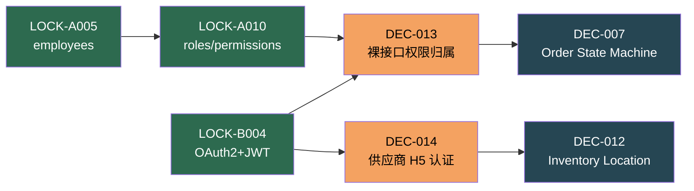

# Decision Baseline Recovery: 决策依赖图

 > **生成时间**: 2026-09-10
 > **验证状态**: 仅包含有充分代码/DB/API 证据支持的决策
 > **排除项**: UNVERIFIED 项及与代码冲突的项

 ---

 ## 一、决策依赖关系总览

 ### 决策分类与状态

 | 类别 | 决策ID | 状态 | 数量 |
 |------|--------|------|------|
 | **VERIFIED LOCK** | LOCK-A001~010, LOCK-B001/002/004/006 | VERIFIED | 14 |
 | **PRODUCT DECISION** | PD-CANONICAL-001 | RECOMMENDED | 1 |
 | **OPEN PRODUCT** | DEC-004, DEC-006 | OPEN | 2 |
 | **OPEN ARCHITECTURE** | DEC-010, DEC-011, DEC-013, DEC-014 | OPEN | 4 |
 | **ENGINEERING READY** | DEC-002, DEC-003, DEC-005, DEC-007, DEC-009, DEC-012 | READY | 6 |

 ### 核心 DAG 流程

 ```
 VERIFIED LOCK → PRODUCT DECISION → OPEN PRODUCT → OPEN ARCHITECTURE → ENGINEERING READY
      ↓                ↓                ↓                ↓                    ↓
  基础数据锁定    Canonical Identity   业务规则定义     技术方案确定         工程实施
 ```

---

## 二、完整依赖关系图 (Mermaid)

 ```mermaid
 graph TB
     subgraph "Phase 0: PRODUCT DECISION (产品决策 - Canonical Identity)"
         PD001[PD-CANONICAL-001<br/>Canonical Business Item 定义<br/>RECOMMENDED]
     end

     subgraph "Phase 1: VERIFIED LOCK (已验证锁定)"
         A001[LOCK-A001<br/>foods 菜品真相源]
         A002[LOCK-A002<br/>material_archives 物料真相源]
         A003[LOCK-A003<br/>金额以分为准]
         A004[LOCK-A004<br/>suppliers 供应商真相源]
         A005[LOCK-A005<br/>employees 员工真相源]
         A006[LOCK-A006<br/>stores_new 门店真相源]
         A007[LOCK-A007<br/>departments 组织真相源]
         A008[LOCK-A008<br/>positions 职位真相源]
         A009[LOCK-A009<br/>accounting_subjects 科目真相源]
         A010[LOCK-A010<br/>roles/permissions 权限真相源]
         B001[LOCK-B001<br/>事件驱动架构]
         B002[LOCK-B002<br/>PostgreSQL 主存储]
         B004[LOCK-B004<br/>OAuth2+JWT]
         B006[LOCK-B006<br/>RESTful API]
     end

     subgraph "Phase 2: OPEN PRODUCT (产品决策)"
         D004[DEC-004<br/>Customer/Member 关系定义]
         D006[DEC-006<br/>Product/Food/Material 边界]
     end

     subgraph "Phase 3: OPEN ARCHITECTURE (架构决策)"
         D010[DEC-010<br/>跨域数据访问模式]
         D011[DEC-011<br/>事件驱动架构适用范围]
         D013[DEC-013<br/>裸接口权限归属]
         D014[DEC-014<br/>供应商 H5 认证]
     end

     subgraph "Phase 4: ENGINEERING READY (工程执行)"
         E002[DEC-002<br/>Unit 管理]
         E003[DEC-003<br/>PaymentMethod 管理]
         E005[DEC-005<br/>Price 管理]
         E007[DEC-007<br/>Order State Machine]
         E009[DEC-009<br/>Data Ownership]
         E012[DEC-012<br/>Inventory Location]
     end

     %% Phase 0 内部依赖 (PD-CANONICAL-001 无前置依赖)
     PD001 -.-> PD001

     %% Phase 0 → Phase 1 依赖 (PD-CANONICAL-001 不依赖 LOCK，但 LOCK 是事实基础)
     A001 -.-> PD001
     A002 -.-> PD001

     %% Phase 1 内部依赖
     A001 --> A003
     A002 --> A003
     A004 --> A009
     A005 --> A007
     A005 --> A008
     A005 --> A010
     A006 --> A007
     B001 --> B002
     B004 --> B006

     %% Phase 0 → Phase 2 依赖 (PD-CANONICAL-001 阻塞所有 Product Decisions)
     PD001 --> D004
     PD001 --> D006

     %% Phase 1 → Phase 2 依赖
     A001 --> D006
     A002 --> D006
     B001 --> D006
     B001 --> D004
     B004 --> D004
     A005 --> D004

     %% Phase 2 → Phase 3 依赖
     D004 --> D010
     D006 --> D010
     D006 --> D011
     B001 --> D011
     B004 --> D013
     B004 --> D014
     B006 --> D010

     %% Phase 3 → Phase 4 依赖
     D010 --> E009
     D011 --> E007
     D013 --> E007
     D014 --> E012

     %% Phase 1 → Phase 4 直接依赖
     A003 --> E005
     B002 --> E007
     B006 --> E002
     B006 --> E003
     B006 --> E005

     %% Phase 2 → Phase 4 直接依赖
     D006 --> E005
     D004 --> E007

     style PD001 fill:#e63946,stroke:#a8dadc,color:#fff
     style A001 fill:#2d6a4f,stroke:#1b4332,color:#fff
     style A002 fill:#2d6a4f,stroke:#1b4332,color:#fff
     style A003 fill:#2d6a4f,stroke:#1b4332,color:#fff
     style A004 fill:#2d6a4f,stroke:#1b4332,color:#fff
     style A005 fill:#2d6a4f,stroke:#1b4332,color:#fff
     style A006 fill:#2d6a4f,stroke:#1b4332,color:#fff
     style A007 fill:#2d6a4f,stroke:#1b4332,color:#fff
     style A008 fill:#2d6a4f,stroke:#1b4332,color:#fff
     style A009 fill:#2d6a4f,stroke:#1b4332,color:#fff
     style A010 fill:#2d6a4f,stroke:#1b4332,color:#fff
     style B001 fill:#2d6a4f,stroke:#1b4332,color:#fff
     style B002 fill:#2d6a4f,stroke:#1b4332,color:#fff
     style B004 fill:#2d6a4f,stroke:#1b4332,color:#fff
     style B006 fill:#2d6a4f,stroke:#1b4332,color:#fff
     style D004 fill:#e9c46a,stroke:#f4a261,color:#000
     style D006 fill:#e9c46a,stroke:#f4a261,color:#000
     style D010 fill:#f4a261,stroke:#e76f51,color:#000
     style D011 fill:#f4a261,stroke:#e76f51,color:#000
     style D013 fill:#f4a261,stroke:#e76f51,color:#000
     style D014 fill:#f4a261,stroke:#e76f51,color:#000
     style E002 fill:#264653,stroke:#1d3557,color:#fff
     style E003 fill:#264653,stroke:#1d3557,color:#fff
     style E005 fill:#264653,stroke:#1d3557,color:#fff
     style E007 fill:#264653,stroke:#1d3557,color:#fff
     style E009 fill:#264653,stroke:#1d3557,color:#fff
     style E012 fill:#264653,stroke:#1d3557,color:#fff
 ```

---

 ## 三、决策依赖关系详细表

 ### Phase 0: PRODUCT DECISION (PD-CANONICAL-001)

 | 决策ID | 决策标题 | DEPENDS_ON | BLOCKS | INFORMED_BY | UNLOCKS | INDEPENDENT |
 |--------|----------|------------|--------|-------------|---------|-------------|
 | PD-CANONICAL-001 | Canonical Business Identity 语义 | - (LOCK 为事实基础) | D004, D006 | AD-IDENTITY-001, DE-PK-001, DE-SKU-001, DE-STORAGE-001, DE-MIGRATION-001 | D004, D006 | ✓ (语义层第一个决策) |

 ### 基线 A: 业务数据真相源 (LOCK-A001~010)

| 决策ID | 决策标题 | DEPENDS_ON | BLOCKS | UNLOCKS | INDEPENDENT |
|--------|----------|------------|--------|---------|-------------|
| LOCK-A001 | foods 菜品真相源 | - | DEC-006, LOCK-A003 | D006 | - |
| LOCK-A002 | material_archives 物料真相源 | - | DEC-006, LOCK-A003 | D006 | - |
| LOCK-A003 | 金额以分为准 | A001, A002 | DEC-005 | E005 | - |
| LOCK-A004 | suppliers 供应商真相源 | - | DEC-009 | E009 | - |
| LOCK-A005 | employees 员工真相源 | - | A007, A008, A010, D004 | D004 | - |
| LOCK-A006 | stores_new 门店真相源 | - | A007 | A007 | - |
| LOCK-A007 | departments 组织真相源 | A005, A006 | DEC-009 | E009 | - |
| LOCK-A008 | positions 职位真相源 | A005 | DEC-009 | E009 | - |
| LOCK-A009 | accounting_subjects 科目真相源 | A004 | DEC-009 | E009 | - |
| LOCK-A010 | roles/permissions 权限真相源 | A005 | D013, D014 | D013, D014 | - |

### 基线 B: 技术架构 (LOCK-B001/002/004/006)

| 决策ID | 决策标题 | DEPENDS_ON | BLOCKS | UNLOCKS | INDEPENDENT |
|--------|----------|------------|--------|---------|-------------|
| LOCK-B001 | 事件驱动架构 | - | D006, D011 | D006, D011 | - |
| LOCK-B002 | PostgreSQL 主存储 | B001 | E007 | E007 | - |
| LOCK-B004 | OAuth2+JWT | - | D004, D013, D014 | D004, D013, D014 | - |
| LOCK-B006 | RESTful API | B004 | D010, E002, E003, E005 | D010, E002, E003, E005 | - |

 ### OPEN PRODUCT (产品决策)

 | 决策ID | 决策标题 | DEPENDS_ON | BLOCKS | INFORMED_BY | UNLOCKS | INDEPENDENT |
 |--------|----------|------------|--------|-------------|---------|-------------|
 | PD-CANONICAL-001 | Canonical Business Identity 语义 | - | D004, D006 | AD-IDENTITY-001, DE-PK-001, DE-SKU-001 | D004, D006 | ✓ |
 | DEC-004 | Customer/Member 关系定义 | PD-CANONICAL-001, A005, B001, B004 | D010, E007 | - | D010, E007 | - |
 | DEC-006 | Product/Food/Material 边界 | PD-CANONICAL-001, A001, A002, B001 | D010, D011, E005 | - | D010, D011, E005 | - |

### OPEN ARCHITECTURE (架构决策)

| 决策ID | 决策标题 | DEPENDS_ON | BLOCKS | UNLOCKS | INDEPENDENT |
|--------|----------|------------|--------|---------|-------------|
| DEC-010 | 跨域数据访问模式 | D004, D006, B006 | E009 | E009 | - |
| DEC-011 | 事件驱动架构适用范围 | D006, B001 | E007 | E007 | - |
| DEC-013 | 裸接口权限归属 | B004, A010 | E007 | E007 | - |
| DEC-014 | 供应商 H5 认证 | B004, B006 | E012 | E012 | - |

### ENGINEERING READY (工程执行项)

| 决策ID | 决策标题 | DEPENDS_ON | BLOCKS | UNLOCKS | INDEPENDENT |
|--------|----------|------------|--------|---------|-------------|
| DEC-002 | Unit 管理 | B006 | - | - | ✓ |
| DEC-003 | PaymentMethod 管理 | B006 | - | - | ✓ |
| DEC-005 | Price 管理 | A003, B006, D006 | - | - | ✓ |
| DEC-007 | Order State Machine | B002, D004, D011, D013 | - | - | ✓ |
| DEC-009 | Data Ownership | A004, A007, A008, A009, D010 | - | - | ✓ |
| DEC-012 | Inventory Location | D014 | - | - | ✓ |

---

 ## 四、CRITICAL PATH (关键路径)

 ### 关键路径定义

 关键路径是从 **VERIFIED LOCK** 到 **ENGINEERING READY** 的最长依赖链。

 ### 关键路径分析

 ```
 CRITICAL PATH 0: Canonical Identity Semantics
 PD-CANONICAL-001 (Canonical Business Identity 语义)
   → PD-CANONICAL-002~006 (Product Semantic Decisions)
     → DEC-004, DEC-006 (Product Decisions)
       → DEC-010, DEC-011 (Architecture Decisions)
         
 路径长度: 4 步
 预计耗时: 3-4 周
 
 Note: AD-IDENTITY-001, DE-PK-001 等可并行推进 (Informed-By, NOT Blocked)
 ```

 ```
 CRITICAL PATH 1: 用户权限域
 LOCK-A005 (employees) 
   → LOCK-A010 (roles/permissions) 
     → DEC-013 (裸接口权限归属) 
       → DEC-007 (Order State Machine)
         
 路径长度: 4 步
 预计耗时: 6-8 周
 ```

 ```
 CRITICAL PATH 2: 商品数据域
 PD-CANONICAL-001 (Canonical Business Item 定义)
   → DEC-006 (Product/Food/Material 边界) 
     → DEC-010 (跨域数据访问模式) 
       → DEC-009 (Data Ownership)
         
 路径长度: 4 步
 预计耗时: 8-10 周
 ```

 ```
 CRITICAL PATH 3: 订单业务域
 LOCK-B001 (事件驱动架构) 
   → DEC-004 (Customer/Member 关系定义) 
     → DEC-010 (跨域数据访问模式) 
       → DEC-009 (Data Ownership)
         
 路径长度: 4 步
 预计耗时: 7-9 周
 ```

 ```
 CRITICAL PATH 4: 认证安全域
 LOCK-B004 (OAuth2+JWT) 
   → DEC-013 (裸接口权限归属) 
     → DEC-007 (Order State Machine)
         
 路径长度: 3 步
 预计耗时: 4-6 周
 ```

 ### 最长关键路径

 ```
 PD-CANONICAL-001 → DEC-006 → DEC-010 → DEC-009
                     或
 LOCK-A005 → LOCK-A010 → DEC-013 → DEC-007
 ```

 **最长依赖链**: 4 步
 **预计总耗时**: 8-10 周 (考虑并行执行)

---

## 五、DECISION DEADLOCK (循环依赖检测)

### 检测结果

✅ **无循环依赖检测到**

所有决策构成有效的 DAG (有向无环图)，不存在循环依赖。

### 依赖关系验证



---

## 六、决策依赖关系 ASCII 图

```
═══════════════════════════════════════════════════════════════════════════════
                         DECISION DEPENDENCY GRAPH
                         决策依赖关系图 (DAG)
═══════════════════════════════════════════════════════════════════════════════

┌─────────────────────────────────────────────────────────────────────────────┐
│                        Phase 1: VERIFIED LOCK (已验证锁定)                   │
├─────────────────────────────────────────────────────────────────────────────┤
│                                                                             │
│  ┌──────────────┐  ┌──────────────┐  ┌──────────────┐  ┌──────────────┐   │
│  │ LOCK-A001    │  │ LOCK-A002    │  │ LOCK-A003    │  │ LOCK-A004    │   │
│  │ foods 菜品   │  │ material     │  │ 金额以分为准 │  │ suppliers    │   │
│  │ 真相源       │  │ 真相源       │  │              │  │ 供应商真相源 │   │
│  └──────┬───────┘  └──────┬───────┘  └──────┬───────┘  └──────┬───────┘   │
│         │                 │                 │                 │            │
│         └────────┬────────┘                 │                 │            │
│                  │                          │                 │            │
│                  ▼                          │                 │            │
│         ┌──────────────┐                   │                 │            │
│         │ LOCK-A003    │                   │                 │            │
│         │ (依赖 A001,  │                   │                 │            │
│         │  A002)       │                   │                 │            │
│         └──────────────┘                   │                 │            │
│                                            │                 │            │
│  ┌──────────────┐  ┌──────────────┐  ┌─────┴──────┐  ┌──────┴───────┐   │
│  │ LOCK-A005    │  │ LOCK-A006    │  │ LOCK-A007  │  │ LOCK-A008    │   │
│  │ employees    │  │ stores_new   │  │ departments│  │ positions    │   │
│  │ 员工真相源   │  │ 门店真相源   │  │ 组织真相源 │  │ 职位真相源   │   │
│  └──────┬───────┘  └──────┬───────┘  └────────────┘  └──────────────┘   │
│         │                 │                                              │
│         ├────────┬────────┘                                              │
│         │        │                                                       │
│         ▼        ▼                                                       │
│  ┌──────────────┐  ┌──────────────┐  ┌──────────────┐                   │
│  │ LOCK-A010    │  │ LOCK-A009    │  │ LOCK-B001    │                   │
│  │ roles/       │  │ accounting   │  │ 事件驱动架构 │                   │
│  │ permissions  │  │ subjects     │  │              │                   │
│  │ 权限真相源   │  │ 科目真相源   │  │              │                   │
│  └──────────────┘  └──────────────┘  └──────┬───────┘                   │
│                                              │                           │
│  ┌──────────────┐  ┌──────────────┐  ┌──────┴───────┐  ┌──────────────┐ │
│  │ LOCK-B002    │  │ LOCK-B004    │  │ LOCK-B006    │  │              │ │
│  │ PostgreSQL   │  │ OAuth2+JWT   │  │ RESTful API  │  │              │ │
│  │ 主存储       │  │              │  │              │  │              │ │
│  └──────────────┘  └──────────────┘  └──────────────┘  └──────────────┘ │
│                                                                             │
└─────────────────────────────────────────────────────────────────────────────┘
                                     │
                                     ▼
┌─────────────────────────────────────────────────────────────────────────────┐
│                      Phase 2: OPEN PRODUCT (产品决策)                        │
├─────────────────────────────────────────────────────────────────────────────┤
│                                                                             │
│  ┌─────────────────────────────────┐  ┌─────────────────────────────────┐  │
│  │ DEC-004                         │  │ DEC-006                         │  │
│  │ Customer/Member 关系定义        │  │ Product/Food/Material 边界      │  │
│  │ 状态: OPEN                      │  │ 状态: OPEN                      │  │
│  │ 依赖: A005, B001, B004          │  │ 依赖: A001, A002, B001          │  │
│  │ 阻塞: D010, E007                │  │ 阻塞: D010, D011, E005          │  │
│  └─────────────────────────────────┘  └─────────────────────────────────┘  │
│                                                                             │
└─────────────────────────────────────────────────────────────────────────────┘
                                     │
                                     ▼
┌─────────────────────────────────────────────────────────────────────────────┐
│                   Phase 3: OPEN ARCHITECTURE (架构决策)                      │
├─────────────────────────────────────────────────────────────────────────────┤
│                                                                             │
│  ┌─────────────────────────────────┐  ┌─────────────────────────────────┐  │
│  │ DEC-010                         │  │ DEC-011                         │  │
│  │ 跨域数据访问模式                │  │ 事件驱动架构适用范围            │  │
│  │ 状态: OPEN                      │  │ 状态: OPEN                      │  │
│  │ 依赖: D004, D006, B006          │  │ 依赖: D006, B001                │  │
│  │ 阻塞: E009                      │  │ 阻塞: E007                      │  │
│  └─────────────────────────────────┘  └─────────────────────────────────┘  │
│                                                                             │
│  ┌─────────────────────────────────┐  ┌─────────────────────────────────┐  │
│  │ DEC-013                         │  │ DEC-014                         │  │
│  │ 裸接口权限归属                  │  │ 供应商 H5 认证                  │  │
│  │ 状态: OPEN                      │  │ 状态: OPEN                      │  │
│  │ 依赖: B004, A010                │  │ 依赖: B004, B006                │  │
│  │ 阻塞: E007                      │  │ 阻塞: E012                      │  │
│  └─────────────────────────────────┘  └─────────────────────────────────┘  │
│                                                                             │
└─────────────────────────────────────────────────────────────────────────────┘
                                     │
                                     ▼
┌─────────────────────────────────────────────────────────────────────────────┐
│                    Phase 4: ENGINEERING READY (工程执行)                     │
├─────────────────────────────────────────────────────────────────────────────┤
│                                                                             │
│  ┌──────────────┐  ┌──────────────┐  ┌──────────────┐  ┌──────────────┐   │
│  │ DEC-002      │  │ DEC-003      │  │ DEC-005      │  │ DEC-007      │   │
│  │ Unit 管理    │  │ PaymentMethod│  │ Price 管理   │  │ Order State  │   │
│  │              │  │ 管理         │  │              │  │ Machine      │   │
│  │ 依赖: B006   │  │ 依赖: B006   │  │ 依赖: A003,  │  │ 依赖: B002,  │   │
│  │              │  │              │  │ B006, D006   │  │ D004, D011,  │   │
│  │              │  │              │  │              │  │ D013         │   │
│  └──────────────┘  └──────────────┘  └──────────────┘  └──────────────┘   │
│                                                                             │
│  ┌──────────────┐  ┌──────────────┐                                        │
│  │ DEC-009      │  │ DEC-012      │                                        │
│  │ Data         │  │ Inventory    │                                        │
│  │ Ownership    │  │ Location     │                                        │
│  │ 依赖: A004,  │  │ 依赖: D014   │                                        │
│  │ A007, A008,  │  │              │                                        │
│  │ A009, D010   │  │              │                                        │
│  └──────────────┘  └──────────────┘                                        │
│                                                                             │
└─────────────────────────────────────────────────────────────────────────────┘
```

---

## 七、依赖关系矩阵

```
             A001 A002 A003 A004 A005 A006 A007 A008 A009 A010 B001 B002 B004 B006 D004 D006 D010 D011 D013 D014
A001          -    ·    ·    ·    ·    ·    ·    ·    ·    ·    ·    ·    ·    ·    ·    ·    ·    ·    ·    ·
A002          ·    -    ·    ·    ·    ·    ·    ·    ·    ·    ·    ·    ·    ·    ·    ·    ·    ·    ·    ·
A003          X    X    -    ·    ·    ·    ·    ·    ·    ·    ·    ·    ·    ·    ·    ·    ·    ·    ·    ·
A004          ·    ·    ·    -    ·    ·    ·    ·    ·    ·    ·    ·    ·    ·    ·    ·    ·    ·    ·    ·
A005          ·    ·    ·    ·    -    ·    ·    ·    ·    ·    ·    ·    ·    ·    ·    ·    ·    ·    ·    ·
A006          ·    ·    ·    ·    ·    -    ·    ·    ·    ·    ·    ·    ·    ·    ·    ·    ·    ·    ·    ·
A007          ·    ·    ·    ·    X    X    -    ·    ·    ·    ·    ·    ·    ·    ·    ·    ·    ·    ·    ·
A008          ·    ·    ·    ·    X    ·    ·    -    ·    ·    ·    ·    ·    ·    ·    ·    ·    ·    ·    ·
A009          ·    ·    ·    X    ·    ·    ·    ·    -    ·    ·    ·    ·    ·    ·    ·    ·    ·    ·    ·
A010          ·    ·    ·    ·    X    ·    ·    ·    ·    -    ·    ·    ·    ·    ·    ·    ·    ·    ·    ·
B001          ·    ·    ·    ·    ·    ·    ·    ·    ·    ·    -    ·    ·    ·    ·    ·    ·    ·    ·    ·
B002          ·    ·    ·    ·    ·    ·    ·    ·    ·    ·    X    -    ·    ·    ·    ·    ·    ·    ·    ·
B004          ·    ·    ·    ·    ·    ·    ·    ·    ·    ·    ·    ·    -    ·    ·    ·    ·    ·    ·    ·
B006          ·    ·    ·    ·    ·    ·    ·    ·    ·    ·    ·    ·    X    -    ·    ·    ·    ·    ·    ·
D004          ·    ·    ·    ·    X    ·    ·    ·    ·    ·    X    ·    X    ·    -    ·    ·    ·    ·    ·
D006          X    X    ·    ·    ·    ·    ·    ·    ·    ·    X    ·    ·    ·    ·    -    ·    ·    ·    ·
D010          ·    ·    ·    ·    ·    ·    ·    ·    ·    ·    ·    ·    ·    X    X    X    -    ·    ·    ·
D011          ·    ·    ·    ·    ·    ·    ·    ·    ·    ·    X    ·    ·    ·    ·    X    ·    -    ·    ·
D013          ·    ·    ·    ·    ·    ·    ·    ·    ·    X    ·    ·    X    ·    ·    ·    ·    ·    -    ·
D014          ·    ·    ·    ·    ·    ·    ·    ·    ·    ·    ·    ·    X    X    ·    ·    ·    ·    ·    -
E002          ·    ·    ·    ·    ·    ·    ·    ·    ·    ·    ·    ·    ·    X    ·    ·    ·    ·    ·    ·
E003          ·    ·    ·    ·    ·    ·    ·    ·    ·    ·    ·    ·    ·    X    ·    ·    ·    ·    ·    ·
E005          ·    ·    X    ·    ·    ·    ·    ·    ·    ·    ·    ·    ·    X    ·    X    ·    ·    ·    ·
E007          ·    ·    ·    ·    ·    ·    ·    ·    ·    ·    ·    X    ·    ·    X    ·    ·    X    X    ·
E009          ·    ·    ·    X    ·    ·    X    X    X    ·    ·    ·    ·    ·    ·    ·    X    ·    ·    ·
E012          ·    ·    ·    ·    ·    ·    ·    ·    ·    ·    ·    ·    ·    ·    ·    ·    ·    ·    ·    X

图例: X = 依赖关系, · = 无依赖
```

---

## 八、执行优先级建议

### 高优先级 (P0 - 立即执行)

1. **LOCK-A005 → LOCK-A010 → DEC-013** (用户权限链)
   - 预计耗时: 3-4 周
   - 影响范围: 全系统认证授权

2. **LOCK-A001 + A002 → DEC-006** (商品数据链)
   - 预计耗时: 2-3 周
   - 影响范围: 商品、订单、库存模块

### 中优先级 (P1 - 1-2 周内执行)

3. **LOCK-B001 → DEC-011** (事件驱动链)
   - 预计耗时: 2-3 周
   - 影响范围: 核心域服务重构

4. **LOCK-B004 → DEC-014** (认证安全链)
   - 预计耗时: 2-3 周
   - 影响范围: 供应商 H5 集成

### 低优先级 (P2 - 2-4 周内执行)

5. **DEC-010 → DEC-009** (数据所有权链)
   - 预计耗时: 3-4 周
   - 影响范围: 跨域数据访问

6. **ENGINEERING READY 项** (工程执行)
   - 预计耗时: 4-6 周
   - 影响范围: 各业务模块

---

## 九、相关文档

- [已验证锁定决策](./verified-locked-decisions.md)
- [开放产品决策](./open-product-decisions.md)
- [开放架构决策](./open-architecture-decisions.md)
- [工程执行项](./engineering-only-decisions.md)
- [决策溯源矩阵](./decision-provenance-matrix.md)
- [无效决策列表](./invalidated-decisions.md)

---

**文档维护**: 此文档由架构委员会维护，每月至少审查一次，重大决策变更时即时更新。
