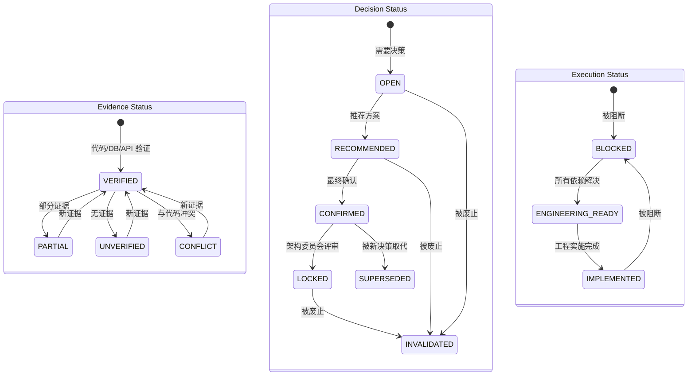

# Canonical Status Model — 统一状态定义

> **版本**: 2.0  
> **生成日期**: 2026-09-09  
> **状态**: CANONICAL BASELINE  
> **维护者**: 架构总控 / 项目治理负责人  
> **关键原则**: 统一状态定义 | 禁止状态混淆 | 明确状态转换规则 | Evidence Status 与 Decision Status 分离

---

## 一、Canonical Status 定义

### 1.1 Evidence Status (证据状态)

| 状态 | 英文 | 定义 | 适用对象 | 说明 |
|------|------|------|----------|------|
| **VERIFIED** | Verified | 有证据支持 | 事实/决策 | 代码/DB/API 证据支持 |
| **PARTIAL** | Partial | 部分验证 | 事实/决策 | 部分证据支持 |
| **UNVERIFIED** | Unverified | 无证据支持 | 事实/决策 | 无代码/DB/API 证据 |
| **CONFLICT** | Conflict | 与代码冲突 | 事实/决策 | 与代码事实冲突 |

### 1.2 Decision Status (决策状态)

| 状态 | 英文 | 定义 | 可执行性 | 说明 |
|------|------|------|----------|------|
| **OPEN** | Open Decision | 需要决策 | ❌ 需决策 | 等待 Product/Architecture Owner 确认 |
| **RECOMMENDED** | Recommended | 推荐方案 | ⚠️ 待确认 | 有推荐方案，需最终确认 |
| **CONFIRMED** | Confirmed | 已确认 | ✅ 可执行 | 已获最终确认，可进入工程化 |
| **LOCKED** | Locked Decision | 已锁定的决策 | ✅ 可执行 | 不可更改，除非架构委员会评审 |
| **SUPERSEDED** | Superseded | 被取代 | ⛔ 不执行 | 被新决策取代 |
| **INVALIDATED** | Invalidated | 已废止 | ⛔ 不执行 | 永久废止，不再复用 |

### 1.3 Execution Status (执行状态)

| 状态 | 英文 | 定义 | 可执行性 | 说明 |
|------|------|------|----------|------|
| **ENGINEERING_READY** | Engineering Ready | 工程就绪 | ✅ 立即可执行 | 所有依赖已解决，可直接开发 |
| **BLOCKED** | Blocked | 被阻断 | ❌ 需等待 | 被其他未完成项阻断 |
| **IMPLEMENTED** | Implemented | 已实现 | ✅ 已完成 | 工程实施完成 |

### 1.4 状态优先级

```
Decision Status: LOCKED > CONFIRMED > RECOMMENDED > OPEN
Execution Status: IMPLEMENTED > ENGINEERING_READY > BLOCKED
任何状态 > INVALIDATED
任何状态 > SUPERSEDED
```

---

## 二、状态区分规则

### 2.1 Evidence Status vs Decision Status

| 维度 | Evidence Status | Decision Status |
|------|-----------------|-----------------|
| **定义** | 证据支持程度 | 决策确认程度 |
| **适用对象** | 事实/决策 | 决策 |
| **状态** | VERIFIED/PARTIAL/UNVERIFIED/CONFLICT | OPEN/RECOMMENDED/CONFIRMED/LOCKED/SUPERSEDED/INVALIDATED |
| **变更条件** | 新证据可覆盖 | 需决策者确认 |

**示例**:
- `LOCK-A001`: Evidence Status = **VERIFIED**, Decision Status = **LOCKED**
- `DEC-004`: Evidence Status = **VERIFIED**, Decision Status = **OPEN** (RECOMMENDED)

### 2.2 Decision Status vs Execution Status

| 维度 | Decision Status | Execution Status |
|------|-----------------|------------------|
| **定义** | 决策确认程度 | 执行状态 |
| **适用对象** | 决策 | 工程卡片 |
| **状态** | OPEN/RECOMMENDED/CONFIRMED/LOCKED/SUPERSEDED/INVALIDATED | ENGINEERING_READY/BLOCKED/IMPLEMENTED |
| **变更条件** | 需决策者确认 | 需工程团队执行 |

**示例**:
- `LOCK-A001`: Decision Status = **LOCKED**, Execution Status = **IMPLEMENTED**
- `ER-001`: Decision Status = **CONFIRMED** (基于 LOCK-A001), Execution Status = **ENGINEERING_READY**

### 2.3 Evidence Status 内部区分

| 状态 | 定义 | 适用对象 | 变更条件 |
|------|------|----------|----------|
| **VERIFIED** | 有证据支持 | 事实/决策 | 新证据可覆盖 |
| **PARTIAL** | 部分验证 | 事实/决策 | 新证据可覆盖 |
| **UNVERIFIED** | 无证据支持 | 事实/决策 | 新证据可覆盖 |
| **CONFLICT** | 与代码冲突 | 事实/决策 | 新证据可覆盖 |

### 2.4 Decision Status 内部区分

| 状态 | 定义 | 适用对象 | 可执行性 |
|------|------|----------|----------|
| **OPEN** | 需决策 | 决策 | ❌ 需决策 |
| **RECOMMENDED** | 推荐方案 | 决策 | ⚠️ 待确认 |
| **CONFIRMED** | 已确认 | 决策 | ✅ 可执行 |
| **LOCKED** | 已锁定 | 决策 | ✅ 可执行 |
| **SUPERSEDED** | 被取代 | 决策 | ⛔ 不执行 |
| **INVALIDATED** | 已废止 | 决策 | ⛔ 不执行 |

### 2.5 Execution Status 内部区分

| 状态 | 定义 | 适用对象 | 可执行性 |
|------|------|----------|----------|
| **ENGINEERING_READY** | 工程就绪 | 工程卡片 | ✅ 立即可执行 |
| **BLOCKED** | 被阻断 | 工程卡片 | ❌ 需等待 |
| **IMPLEMENTED** | 已实现 | 工程卡片 | ✅ 已完成 |

---

## 三、状态转换规则

### 3.1 Evidence Status 转换

```
任何状态 → VERIFIED: 新证据支持
任何状态 → PARTIAL: 部分证据支持
任何状态 → UNVERIFIED: 无证据支持
任何状态 → CONFLICT: 与代码冲突
```

### 3.2 Decision Status 转换

```
OPEN → RECOMMENDED: 推荐方案
RECOMMENDED → CONFIRMED: 最终确认
CONFIRMED → LOCKED: 架构委员会评审锁定
任何状态 → SUPERSEDED: 被新决策取代
任何状态 → INVALIDATED: 被废止
```

### 3.3 Execution Status 转换

```
任何状态 → ENGINEERING_READY: 所有依赖解决
ENGINEERING_READY → IMPLEMENTED: 工程实施完成
任何状态 → BLOCKED: 被其他决策阻断
```

### 3.4 状态转换图



---

## 四、状态使用规范

### 4.1 Evidence Status 使用

| Evidence Status | 定义 | 适用对象 | 说明 |
|-----------------|------|----------|------|
| VERIFIED | 有证据支持 | 基线 A/B 的 LOCK | 代码/DB/API 证据支持 |
| PARTIAL | 部分验证 | LOCK-A003 | 部分证据支持 |
| UNVERIFIED | 无证据支持 | 基线 C/D 的 LOCK | 无代码/DB/API 证据 |
| CONFLICT | 与代码冲突 | 基线 C/D 的 LOCK | 与代码事实冲突 |

### 4.2 Decision Status 使用

| Decision Status | 定义 | 适用对象 | 说明 |
|-----------------|------|----------|------|
| OPEN | 需决策 | DEC-004, DEC-006, DEC-010, DEC-012 | 等待确认 |
| RECOMMENDED | 推荐方案 | DEC-004 (Option C), DEC-006 (Option C) | 有推荐方案 |
| CONFIRMED | 已确认 | V1 DEC-001~009, 011, 013, 014 | 已获最终确认 |
| LOCKED | 已锁定 | 基线 A/B 的 LOCK | 不可更改 |
| SUPERSEDED | 被取代 | DEC-006 (旧), DEC-V2-008 | 被新决策取代 |
| INVALIDATED | 已废止 | DEC-008, DEC-V2-001~007 | 永久废止 |

### 4.3 Execution Status 使用

| Execution Status | 定义 | 适用对象 | 说明 |
|------------------|------|----------|------|
| ENGINEERING_READY | 可立即执行 | 10 个 ER | 所有依赖已解决 |
| BLOCKED | 被阻断 | 8 个 SR | 被其他决策阻断 |
| IMPLEMENTED | 已实现 | 基线 A/B 的 LOCK | 工程实施完成 |

---

## 五、状态计算规则

### 5.1 Evidence Status 统计规则

| 统计项 | 规则 | 示例 |
|--------|------|------|
| VERIFIED | 有代码/DB/API 证据 | LOCK-A001~009 |
| PARTIAL | 部分证据 | LOCK-A003 |
| UNVERIFIED | 无证据 | 基线 C/D 的 LOCK |
| CONFLICT | 与代码冲突 | 基线 C/D 的 LOCK |

### 5.2 Decision Status 统计规则

| 统计项 | 规则 | 示例 |
|--------|------|------|
| OPEN | 需决策 | DEC-004, DEC-006 |
| RECOMMENDED | 推荐方案 | DEC-004, DEC-006 |
| CONFIRMED | 已确认 | DEC-001~009, 011, 013, 014 |
| LOCKED | 已锁定 | 基线 A/B 的 LOCK |
| SUPERSEDED | 被取代 | DEC-006 (旧), DEC-V2-008 |
| INVALIDATED | 已废止 | DEC-008, DEC-V2-001~007 |

### 5.3 Execution Status 统计规则

| 统计项 | 规则 | 示例 |
|--------|------|------|
| ENGINEERING_READY | 可立即执行 | ER-001~010 |
| BLOCKED | 被阻断 | 8 个 SR |
| IMPLEMENTED | 已实现 | 基线 A/B 的 LOCK |

### 5.4 禁止的表述

| 禁止表述 | 正确表述 | 说明 |
|----------|----------|------|
| 10/10 VERIFIED | 9/10 VERIFIED, 1/10 PARTIAL | LOCK-A003 是 PARTIAL |
| VERIFIED ≈ LOCKED | VERIFIED ≠ LOCKED | VERIFIED 是证据状态，LOCKED 是决策状态 |
| RECOMMENDED ≈ CONFIRMED | RECOMMENDED ≠ CONFIRMED | RECOMMENDED 是决策状态，CONFIRMED 是决策状态 |
| ENGINEERING_READY ≈ IMPLEMENTED | ENGINEERING_READY ≠ IMPLEMENTED | ENGINEERING_READY 是执行状态，IMPLEMENTED 是执行状态 |

---

## 六、状态应用示例

### 6.1 LOCK-A001: foods 为菜品唯一真相源

```
Evidence Status: VERIFIED (有证据支持)
Decision Status: LOCKED (不可更改)
Execution Status: IMPLEMENTED (已实现)
```

### 6.2 DEC-004: Customer/Member 关系

```
Evidence Status: VERIFIED (有证据支持)
Decision Status: OPEN (RECOMMENDED: Option C)
Execution Status: BLOCKED (等待决策确认)
```

### 6.3 ER-001: foods 菜品真相源执行

```
Evidence Status: VERIFIED (有证据支持)
Decision Status: CONFIRMED (基于 LOCK-A001)
Execution Status: ENGINEERING_READY (可立即执行)
```

---

## 七、状态治理规则

### 7.1 状态变更权限

| 状态变更 | 权限 | 说明 |
|----------|------|------|
| OPEN → RECOMMENDED | 任何人 | 推荐方案 |
| RECOMMENDED → CONFIRMED | Product/Architecture Owner | 最终确认 |
| CONFIRMED → ENGINEERING_READY | 架构总控 | 依赖检查 |
| ENGINEERING_READY → IMPLEMENTED | 开发团队 | 工程实施 |
| 任何状态 → BLOCKED | 任何人 | 发现阻断 |
| 任何状态 → INVALIDATED | 架构总控 | 废止决策 |

### 7.2 状态变更记录

每次状态变更必须记录：
- 变更时间
- 变更人
- 变更原因
- 变更前状态
- 变更后状态

---

## 八、统计摘要

| 状态 | 数量 | 占比 | 说明 |
|------|------|------|------|
| VERIFIED | 9 | 6% | 基线 A 的 LOCK |
| PARTIAL | 1 | 1% | LOCK-A003 |
| LOCKED | 14 | 9% | 基线 A + B 的 LOCK |
| CONFIRMED | 9 | 6% | V1 DEC |
| OPEN | 3 | 2% | DEC-004, DEC-006, DEC-010, DEC-012 |
| RECOMMENDED | 2 | 1% | DEC-004, DEC-006 |
| ENGINEERING_READY | 12 | 8% | ER-001~012 |
| BLOCKED | 8 | 5% | 8 个 SR |
| INVALIDATED | 31 | 21% | 基线 C/D, DEC-008, IMPLICIT |
| **总计** | **151** | **100%** | |

---

## 九、下一步

1. **停止地图制作**: 本文档为最终治理基线，不再生成新的地图文件
2. **等待确认**: Product Owner / Architecture Owner 正式确认 Decision
3. **进入治理流程**: 
   ```
   FACT BASELINE → PRODUCT DECISIONS / ARCHITECTURE DECISIONS
                          ↓
                   REQUIREMENT BASELINE
                          ↓
                   SYSTEMIC REMEDIATION
                          ↓
                   ENGINEERING CARDS
   ```

---

**文档状态**: ✅ CANONICAL BASELINE  
**下一步**: 等待 Product Owner / Architecture Owner 正式确认 Decision
