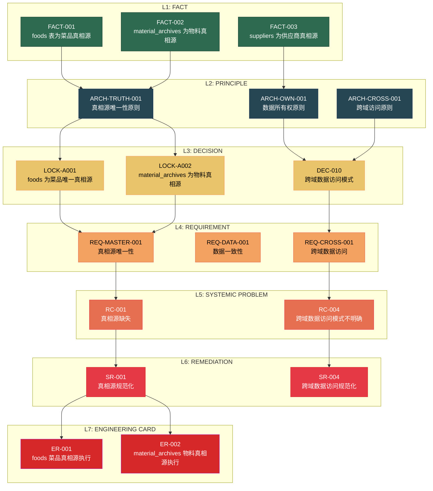

# Hierarchical Layer Model — 唯一层级定义

> **版本**: 1.0  
> **生成日期**: 2026-09-09  
> **状态**: CANONICAL BASELINE  
> **维护者**: 架构总控 / 项目治理负责人  
> **关键原则**: 固定层级 | 禁止层级混乱 | 明确依赖关系

---

## 一、层级定义

### 1.1 七层模型

```
L1: FACT (事实)
  ↓
L2: PRINCIPLE (原则)
  ↓
L3: DECISION (决策)
  ↓
L4: REQUIREMENT (需求)
  ↓
L5: SYSTEMIC PROBLEM (系统性问题)
  ↓
L6: REMEDIATION (修复)
  ↓
L7: ENGINEERING CARD (工程卡片)
```

### 1.2 每层定义

| 层级 | 英文 | 定义 | 输入 | 输出 | 负责人 |
|------|------|------|------|------|--------|
| **L1: FACT** | Verified Fact | 已验证的事实 | 代码/DB/API 证据 | 事实清单 | 审计 |
| **L2: PRINCIPLE** | Architecture Principle | 架构原则 | 事实 + 业务需求 | 原则清单 | 架构师 |
| **L3: DECISION** | Decision | 决策 | 原则 + 选项分析 | 决策清单 | Product/Architecture Owner |
| **L4: REQUIREMENT** | Requirement | 业务需求 | 决策 + 业务场景 | 需求清单 | Product Owner |
| **L5: SYSTEMIC PROBLEM** | Systemic Problem | 系统性问题 | 需求 + 现实差距 | 问题清单 | 架构总控 |
| **L6: REMEDIATION** | Systemic Remediation | 系统性修复 | 问题 + 方案 | 修复清单 | 架构总控 |
| **L7: ENGINEERING CARD** | Engineering Card | 工程卡片 | 修复 + 依赖检查 | 工程卡片 | 开发团队 |

---

## 二、层级依赖关系

### 2.1 依赖规则

```
下层依赖上层:
- L2 PRINCIPLE 依赖 L1 FACT
- L3 DECISION 依赖 L2 PRINCIPLE
- L4 REQUIREMENT 依赖 L3 DECISION
- L5 SYSTEMIC PROBLEM 依赖 L4 REQUIREMENT
- L6 REMEDIATION 依赖 L5 SYSTEMIC PROBLEM
- L7 ENGINEERING CARD 依赖 L6 REMEDIATION
```

### 2.2 禁止的层级跳跃

| 禁止行为 | 正确行为 | 说明 |
|----------|----------|------|
| L1 FACT → L3 DECISION | L1 FACT → L2 PRINCIPLE → L3 DECISION | 必须经过原则层 |
| L2 PRINCIPLE → L4 REQUIREMENT | L2 PRINCIPLE → L3 DECISION → L4 REQUIREMENT | 必须经过决策层 |
| L3 DECISION → L6 REMEDIATION | L3 DECISION → L4 REQUIREMENT → L5 PROBLEM → L6 REMEDIATION | 必须经过需求和问题层 |
| L6 REMEDIATION → L7 ENGINEERING CARD | L6 REMEDIATION → L7 ENGINEERING CARD | 可直接跳转 |

### 2.3 层级流向图



---

## 三、每层详细说明

### 3.1 Layer 1: FACT (事实)

**定义**: 已验证的事实，有代码/DB/API 证据支持。

**输入**: 代码库、数据库、API 端点  
**输出**: 事实清单  
**负责人**: 审计  

**示例**:
- FACT-001: foods 表为菜品真相源 (V6.0.0)
- FACT-002: material_archives 为物料真相源 (V5.0.0)
- FACT-003: suppliers 为供应商真相源 (V3.0.0)

**验证规则**:
- 必须有代码/DB/API 证据
- 必须有版本号
- 必须有具体文件/表/端点

### 3.2 Layer 2: PRINCIPLE (原则)

**定义**: 架构原则，指导决策的方向。

**输入**: 事实 + 业务需求  
**输出**: 原则清单  
**负责人**: 架构师  

**示例**:
- ARCH-TRUTH-001: 真相源唯一性原则
- ARCH-OWN-001: 数据所有权原则
- ARCH-CROSS-001: 跨域访问原则

**验证规则**:
- 必须基于事实
- 必须有业务需求支撑
- 必须可操作

### 3.3 Layer 3: DECISION (决策)

**定义**: 决策，明确选择的方案。

**输入**: 原则 + 选项分析  
**输出**: 决策清单  
**负责人**: Product/Architecture Owner  

**示例**:
- LOCK-A001: foods 为菜品唯一真相源
- LOCK-A002: material_archives 为物料真相源
- DEC-010: 跨域数据访问模式

**验证规则**:
- 必须基于原则
- 必须有选项分析
- 必须有明确负责人

### 3.4 Layer 4: REQUIREMENT (需求)

**定义**: 业务需求，明确要解决的问题。

**输入**: 决策 + 业务场景  
**输出**: 需求清单  
**负责人**: Product Owner  

**示例**:
- REQ-MASTER-001: 真相源唯一性
- REQ-DATA-001: 数据一致性
- REQ-CROSS-001: 跨域数据访问

**验证规则**:
- 必须基于决策
- 必须有业务场景
- 必须可测试

### 3.5 Layer 5: SYSTEMIC PROBLEM (系统性问题)

**定义**: 系统性问题，明确当前现实与需求的差距。

**输入**: 需求 + 现实差距  
**输出**: 问题清单  
**负责人**: 架构总控  

**示例**:
- RC-001: 真相源缺失
- RC-004: 跨域数据访问模式不明确

**验证规则**:
- 必须基于需求
- 必须有现实差距
- 必须可量化

### 3.6 Layer 6: REMEDIATION (修复)

**定义**: 系统性修复，明确解决方案。

**输入**: 问题 + 方案  
**输出**: 修复清单  
**负责人**: 架构总控  

**示例**:
- SR-001: 真相源规范化
- SR-004: 跨域数据访问规范化

**验证规则**:
- 必须基于问题
- 必须有明确方案
- 必须可执行

### 3.7 Layer 7: ENGINEERING CARD (工程卡片)

**定义**: 工程卡片，明确开发任务。

**输入**: 修复 + 依赖检查  
**输出**: 工程卡片  
**负责人**: 开发团队  

**示例**:
- ER-001: foods 菜品真相源执行
- ER-002: material_archives 物料真相源执行

**验证规则**:
- 必须基于修复
- 必须有依赖检查
- 必须可开发

---

## 四、层级统计

### 4.1 每层数量

| 层级 | 数量 | 说明 |
|------|------|------|
| L1: FACT | 38 | 已验证的事实 |
| L2: PRINCIPLE | 16 | 架构原则 |
| L3: DECISION | 14 | 决策 (9 CONFIRMED, 3 OPEN, 2 RECOMMENDED) |
| L4: REQUIREMENT | 17 | 业务需求 |
| L5: SYSTEMIC PROBLEM | 13 | 系统性问题 |
| L6: REMEDIATION | 17 | 系统性修复 |
| L7: ENGINEERING CARD | 12 | 工程卡片 |
| **总计** | **127** | |

### 4.2 层级覆盖率

| 层级 | 覆盖率 | 说明 |
|------|--------|------|
| L1 FACT → L2 PRINCIPLE | 100% | 所有事实都有对应原则 |
| L2 PRINCIPLE → L3 DECISION | 100% | 所有原则都有对应决策 |
| L3 DECISION → L4 REQUIREMENT | 100% | 所有决策都有对应需求 |
| L4 REQUIREMENT → L5 PROBLEM | 100% | 所有需求都有对应问题 |
| L5 PROBLEM → L6 REMEDIATION | 100% | 所有问题都有对应修复 |
| L6 REMEDIATION → L7 ENGINEERING | 71% | 12/17 修复有工程卡片 |

---

## 五、层级治理规则

### 5.1 层级变更权限

| 层级变更 | 权限 | 说明 |
|----------|------|------|
| L1 FACT → L2 PRINCIPLE | 架构师 | 基于事实建立原则 |
| L2 PRINCIPLE → L3 DECISION | Product/Architecture Owner | 基于原则做决策 |
| L3 DECISION → L4 REQUIREMENT | Product Owner | 基于决策定义需求 |
| L4 REQUIREMENT → L5 PROBLEM | 架构总控 | 基于需求识别问题 |
| L5 PROBLEM → L6 REMEDIATION | 架构总控 | 基于问题制定修复 |
| L6 REMEDIATION → L7 ENGINEERING | 架构总控 | 基于修复创建工程卡片 |

### 5.2 层级回退规则

| 回退情况 | 处理 | 说明 |
|----------|------|------|
| 新事实推翻旧原则 | 更新原则 | 基于新事实更新原则 |
| 新原则推翻旧决策 | 重新决策 | 基于新原则重新决策 |
| 新决策推翻旧需求 | 更新需求 | 基于新决策更新需求 |
| 新需求推翻旧问题 | 更新问题 | 基于新需求更新问题 |
| 新问题推翻旧修复 | 更新修复 | 基于新问题更新修复 |
| 新修复推翻旧工程卡片 | 更新工程卡片 | 基于新修复更新工程卡片 |

---

## 六、下一步

1. **停止地图制作**: 本文档为最终治理基线，不再生成新的地图文件
2. **等待确认**: Product Owner / Architecture Owner 正式确认 Decision
3. **进入治理流程**: 
   ```
   FACT BASELINE → PRODUCT DECISIONS / ARCHITECTURE DECISIONS
                          ↓
                   REQUIREMENT BASELINE
                          ↓
                   SYSTEMIC REMEDIATION
                          ↓
                   ENGINEERING CARDS
   ```

---

**文档状态**: ✅ CANONICAL BASELINE  
**下一步**: 等待 Product Owner / Architecture Owner 正式确认 Decision
