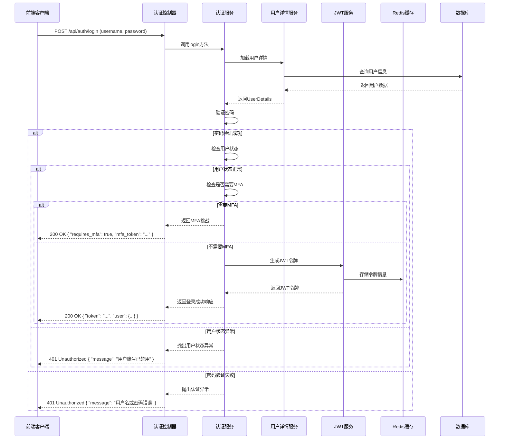
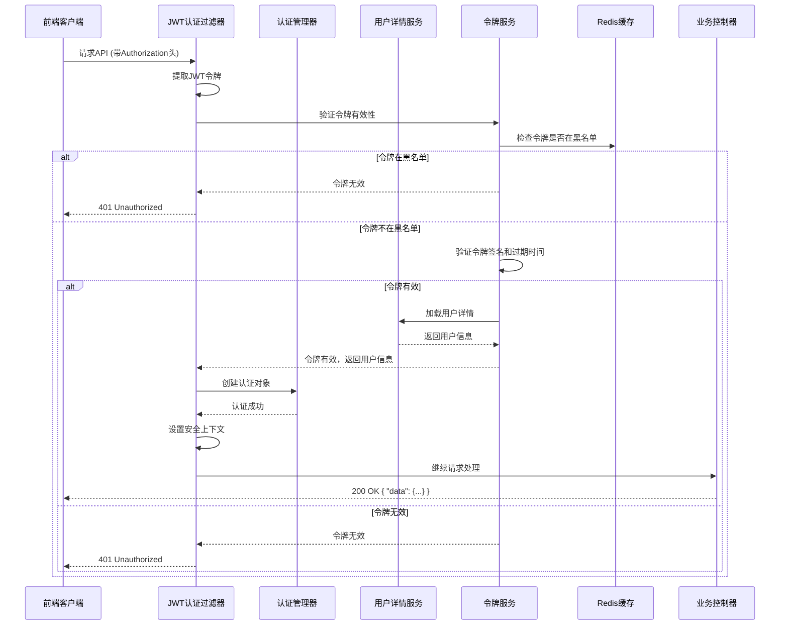

# 食品溯源系统认证模块架构设计

## 1. 架构概述

### 1.1 设计目标
- 基于Spring Security 6.2.0和JWT实现安全、高效的认证系统
- 支持RBAC权限模型，实现细粒度的权限控制
- 集成多因素认证，提升系统安全性
- 优化JWT认证机制，提高性能和可靠性
- 提供完整的用户信息管理功能
- 确保与其他模块的无缝集成

### 1.2 技术栈
| 技术/依赖 | 版本 | 用途 |
|----------|------|------|
| Spring Boot | 3.2.0 | 核心框架 |
| Spring Security | 6.2.0 | 安全框架 |
| JWT | 0.11.5 | 认证机制 |
| Redis | 7.0+ | 令牌管理和缓存 |
| PostgreSQL | 18 | 用户数据存储（生产） |
| H2 | 2.2.224 | 用户数据存储（开发，MODE=PostgreSQL） |
| BCrypt | - | 密码加密 |
| Google Authenticator | - | 多因素认证 |

## 2. 系统架构设计

### 2.1 模块结构
```
security/
├── config/
│   ├── SecurityConfig.java          # Spring Security配置
│   ├── JwtConfig.java               # JWT相关配置
│   └── MfaConfig.java               # 多因素认证配置
├── filter/
│   ├── JwtAuthenticationFilter.java # JWT认证过滤器
│   ├── MfaAuthenticationFilter.java # 多因素认证过滤器
│   └── RateLimitFilter.java         # 速率限制过滤器
├── service/
│   ├── AuthenticationService.java   # 认证服务接口
│   ├── UserDetailsService.java      # 用户详情服务接口
│   ├── TokenService.java            # 令牌服务接口
│   ├── MfaService.java              # 多因素认证服务接口
│   └── impl/                        # 服务实现类
├── provider/
│   ├── JwtAuthenticationProvider.java # JWT认证提供者
│   └── MfaAuthenticationProvider.java # 多因素认证提供者
├── handler/
│   ├── AuthenticationSuccessHandler.java    # 认证成功处理器
│   ├── AuthenticationFailureHandler.java    # 认证失败处理器
│   └── AccessDeniedHandler.java             # 访问拒绝处理器
├── model/
│   ├── SecurityUser.java            # 安全用户模型
│   ├── JwtToken.java                # JWT令牌模型
│   └── MfaToken.java                # 多因素认证令牌模型
├── utils/
│   ├── JwtUtils.java                # JWT工具类
│   ├── PasswordUtils.java           # 密码工具类
│   └── MfaUtils.java                # 多因素认证工具类
└── annotation/
    ├── RequiresPermissions.java     # 权限注解
    ├── RequiresRoles.java           # 角色注解
    └── RequiresMfa.java             # 多因素认证注解
```

### 2.2 核心流程图

#### 2.2.1 用户登录流程


#### 2.2.2 JWT认证流程


## 3. 核心组件设计

### 3.1 Spring Security配置 (SecurityConfig.java)

**配置要点：**
- 使用Spring Security 6.2.0的新配置方式
- 配置HTTP安全策略
- 配置认证提供者
- 配置过滤器链
- 配置方法级安全

**关键代码：**
```java
@Configuration
@EnableWebSecurity
@EnableMethodSecurity(prePostEnabled = true)
public class SecurityConfig {

    @Bean
    public SecurityFilterChain filterChain(HttpSecurity http) throws Exception {
        http
            .cors(Customizer.withDefaults())
            .csrf(CsrfConfigurer::disable)
            .sessionManagement(session -> session.sessionCreationPolicy(SessionCreationPolicy.STATELESS))
            .authorizeHttpRequests(authz -> authz
                .requestMatchers("/api/auth/**", "/api/public/**", "/actuator/**").permitAll()
                .anyRequest().authenticated()
            )
            .addFilterBefore(jwtAuthenticationFilter, UsernamePasswordAuthenticationFilter.class)
            .addFilterBefore(mfaAuthenticationFilter, JwtAuthenticationFilter.class)
            .exceptionHandling(exceptions -> exceptions
                .authenticationEntryPoint(authenticationEntryPoint())
                .accessDeniedHandler(accessDeniedHandler())
            );
        
        return http.build();
    }
    
    // 其他Bean配置...
}
```

### 3.2 JWT认证机制优化

**优化要点：**
- 增强令牌安全性
- 实现令牌轮换
- 优化令牌存储
- 实现令牌过期策略

**关键代码：**
```java
public class JwtUtils {
    
    // 生成JWT令牌
    public String generateToken(SecurityUser user) {
        Map<String, Object> claims = new HashMap<>();
        claims.put("userId", user.getUserId());
        claims.put("username", user.getUsername());
        claims.put("roles", user.getRoles());
        claims.put("permissions", user.getPermissions());
        claims.put("mfaEnabled", user.isMfaEnabled());
        claims.put("tokenId", UUID.randomUUID().toString());
        
        return Jwts.builder()
                .setClaims(claims)
                .setSubject(user.getUsername())
                .setIssuedAt(new Date())
                .setExpiration(new Date(System.currentTimeMillis() + expiration))
                .signWith(getSigningKey(), SignatureAlgorithm.HS512)
                .compact();
    }
    
    // 令牌刷新
    public String refreshToken(String token) {
        // 验证令牌有效性
        if (!validateToken(token)) {
            throw new IllegalArgumentException("Invalid token");
        }
        
        // 从令牌中获取用户信息
        Claims claims = getAllClaimsFromToken(token);
        String username = claims.getSubject();
        
        // 生成新令牌
        return generateToken(username);
    }
    
    // 其他方法...
}
```

### 3.3 RBAC权限模型实现

**实现要点：**
- 基于角色的访问控制
- 细粒度的权限管理
- 权限继承机制
- 动态权限分配

**数据模型：**

| 表名 | 描述 |
|------|------|
| `sys_user` | 用户表 |
| `sys_role` | 角色表 |
| `sys_permission` | 权限表 |
| `sys_user_role` | 用户-角色关联表 |
| `sys_role_permission` | 角色-权限关联表 |

**权限验证流程：**
```java
public class CustomPermissionEvaluator implements PermissionEvaluator {
    
    @Autowired
    private PermissionService permissionService;
    
    @Override
    public boolean hasPermission(Authentication authentication, Object targetDomainObject, Object permission) {
        if (authentication == null || !(permission instanceof String)) {
            return false;
        }
        
        SecurityUser user = (SecurityUser) authentication.getPrincipal();
        return permissionService.hasPermission(user.getUserId(), (String) permission);
    }
    
    @Override
    public boolean hasPermission(Authentication authentication, Serializable targetId, String targetType, Object permission) {
        // 实现基于资源ID的权限验证
        return false;
    }
}
```

### 3.4 多因素认证支持

**支持的MFA方式：**
- 基于时间的一次性密码(TOTP) - Google Authenticator
- 短信验证码
- 邮箱验证码

**实现要点：**
- MFA配置管理
- MFA令牌生成和验证
- MFA状态管理
- MFA强制策略

**关键代码：**
```java
public class MfaService {
    
    public boolean verifyMfaCode(String userId, String code, MfaType type) {
        // 获取用户MFA配置
        MfaConfig mfaConfig = mfaConfigRepository.findByUserId(userId);
        if (mfaConfig == null || !mfaConfig.isEnabled()) {
            return false;
        }
        
        // 根据MFA类型验证代码
        switch (type) {
            case TOTP:
                return MfaUtils.verifyTotpCode(mfaConfig.getSecret(), code);
            case SMS:
                return verifySmsCode(userId, code);
            case EMAIL:
                return verifyEmailCode(userId, code);
            default:
                return false;
        }
    }
    
    // 其他方法...
}
```

### 3.5 密码安全加密

**安全要点：**
- 使用BCrypt进行密码哈希
- 密码强度验证
- 密码过期策略
- 密码历史记录
- 账户锁定机制

**关键代码：**
```java
public class PasswordUtils {
    
    private static final BCryptPasswordEncoder encoder = new BCryptPasswordEncoder(12);
    
    public static String encryptPassword(String password) {
        return encoder.encode(password);
    }
    
    public static boolean matches(String rawPassword, String encodedPassword) {
        return encoder.matches(rawPassword, encodedPassword);
    }
    
    public static boolean isValidPassword(String password) {
        // 密码强度验证
        // 至少8位，包含大小写字母、数字和特殊字符
        String pattern = "^(?=.*[a-z])(?=.*[A-Z])(?=.*\\d)(?=.*[@$!%*?&])[A-Za-z\\d@$!%*?&]{8,}$";
        return password.matches(pattern);
    }
    
    // 其他方法...
}
```

### 3.6 用户信息管理

**管理功能：**
- 用户注册
- 用户资料更新
- 密码修改
- 账户状态管理
- 用户权限管理

**关键代码：**
```java
public class UserService {
    
    public User createUser(UserCreateDTO userDto) {
        // 验证用户名和邮箱唯一性
        if (userRepository.existsByUsername(userDto.getUsername())) {
            throw new BusinessException("用户名已存在");
        }
        if (userRepository.existsByEmail(userDto.getEmail())) {
            throw new BusinessException("邮箱已存在");
        }
        
        // 加密密码
        userDto.setPassword(PasswordUtils.encryptPassword(userDto.getPassword()));
        
        // 创建用户
        User user = UserMapper.INSTANCE.toEntity(userDto);
        user.setStatus("1"); // 启用状态
        user.setCreateTime(new Date());
        
        return userRepository.save(user);
    }
    
    // 其他方法...
}
```

### 3.7 与其他模块的集成点

**集成接口：**
- 认证信息获取接口
- 权限验证接口
- 用户信息同步接口
- 安全事件通知接口

**集成示例：**
```java
public interface SecurityIntegrationService {
    
    // 获取当前认证用户
    Optional<SecurityUser> getCurrentUser();
    
    // 验证用户是否有权限
    boolean hasPermission(String permission);
    
    // 验证用户是否有角色
    boolean hasRole(String role);
    
    // 记录安全事件
    void recordSecurityEvent(SecurityEventType type, String details);
    
    // 同步用户信息到其他模块
    void syncUserInfo(User user);
}
```

### 3.8 安全性和性能优化

**安全优化：**
- 防止暴力破解（速率限制）
- 防止SQL注入（参数化查询）
- 防止XSS攻击（输入验证）
- 防止CSRF攻击（令牌验证）
- 防止会话固定（令牌轮换）

**性能优化：**
- 缓存用户信息和权限（Redis）
- 优化数据库查询（索引）
- 减少认证过滤器开销（异步处理）
- 优化JWT验证（无状态设计）
- 批量权限检查（减少数据库查询）

**关键代码：**
```java
public class RateLimitFilter extends OncePerRequestFilter {
    
    @Autowired
    private RedisTemplate<String, Object> redisTemplate;
    
    private static final String KEY_PREFIX = "rate_limit:";
    private static final int MAX_REQUESTS = 100; // 每分钟最大请求数
    private static final int WINDOW_SIZE = 60; // 时间窗口大小（秒）
    
    @Override
    protected void doFilterInternal(HttpServletRequest request, HttpServletResponse response, FilterChain filterChain) 
            throws ServletException, IOException {
        String clientIp = getClientIp(request);
        String key = KEY_PREFIX + clientIp;
        
        // 使用Redis实现滑动窗口速率限制
        long currentTime = System.currentTimeMillis() / 1000;
        long windowStart = currentTime - WINDOW_SIZE;
        
        // 移除窗口外的请求记录
        redisTemplate.opsForZSet().removeRangeByScore(key, 0, windowStart);
        
        // 获取当前窗口内的请求数
        long count = redisTemplate.opsForZSet().size(key);
        
        if (count >= MAX_REQUESTS) {
            response.setStatus(HttpServletResponse.SC_TOO_MANY_REQUESTS);
            response.getWriter().write("Too many requests");
            return;
        }
        
        // 添加当前请求到窗口
        redisTemplate.opsForZSet().add(key, String.valueOf(currentTime), currentTime);
        redisTemplate.expire(key, WINDOW_SIZE, TimeUnit.SECONDS);
        
        filterChain.doFilter(request, response);
    }
    
    // 其他方法...
}
```

## 4. 配置和部署

### 4.1 配置文件

**application.yml配置：**
```yaml
spring:
  security:
    jwt:
      secret: ${JWT_SECRET:your-secret-key}
      expiration: 86400000 # 1天
      refresh-expiration: 2592000000 # 30天
      issuer: food-traceability-system
    mfa:
      enabled: true
      totp:
        time-step: 30
        code-length: 6
      sms:
        enabled: true
      email:
        enabled: true
    rate-limit:
      enabled: true
      max-requests: 100
      window-size: 60

redis:
  host: ${REDIS_HOST:localhost}
  port: ${REDIS_PORT:6379}
  password: ${REDIS_PASSWORD:}
  database: 0
```

### 4.2 部署建议

**生产环境部署：**
1. 使用HTTPS加密传输
2. 配置JWT密钥为环境变量
3. 使用Redis集群存储令牌黑名单
4. 配置适当的速率限制
5. 启用多因素认证
6. 定期轮换JWT密钥
7. 监控认证失败事件
8. 配置安全日志

**高可用部署：**
1. 部署多个认证服务实例
2. 使用Redis集群存储会话数据
3. 配置负载均衡
4. 实现服务健康检查

## 5. 监控和维护

### 5.1 监控指标

**关键监控指标：**
- 认证成功率
- 认证失败率
- 令牌生成速率
- 令牌验证时间
- 多因素认证使用率
- 密码重置频率
- 账户锁定事件
- 安全异常事件

### 5.2 日志记录

**日志级别和内容：**
- ERROR: 认证失败、令牌验证错误、安全异常
- WARN: 密码强度不足、账户锁定、异常登录
- INFO: 认证成功、令牌刷新、权限变更
- DEBUG: 详细的认证流程、权限检查

### 5.3 常见问题排查

**常见问题和解决方案：**
1. **令牌验证失败**
   - 检查令牌是否过期
   - 检查令牌是否在黑名单中
   - 检查JWT密钥是否一致

2. **多因素认证失败**
   - 检查MFA代码是否正确
   - 检查MFA配置是否启用
   - 检查时间同步是否正常

3. **权限验证失败**
   - 检查用户角色和权限
   - 检查权限配置是否正确
   - 检查缓存是否过期

4. **性能问题**
   - 检查Redis连接是否正常
   - 检查数据库索引是否优化
   - 检查令牌验证逻辑是否高效

## 6. 总结

### 6.1 设计优势

- **安全性强**：集成多因素认证、密码安全加密、令牌管理等安全特性
- **可扩展性好**：模块化设计，易于添加新的认证方式和权限类型
- **性能优异**：使用Redis缓存、无状态设计、优化的验证逻辑
- **易于集成**：提供统一的集成接口，方便与其他模块集成
- **可维护性高**：清晰的代码结构、完善的文档、规范的命名

### 6.2 未来展望

- 集成OAuth2.0和OpenID Connect，支持第三方登录
- 实现单点登录(SSO)功能
- 集成生物识别认证（指纹、面部识别）
- 实现风险评估和自适应认证
- 集成安全分析和异常检测系统

### 6.3 结论

本设计方案基于Spring Security 6.2.0和JWT实现了一个安全、高效、可扩展的认证模块架构，支持RBAC权限模型、多因素认证、密码安全加密等核心功能，并提供了与其他模块的集成接口。通过合理的架构设计和性能优化，该认证模块能够满足食品溯源系统的安全需求，为系统的稳定运行提供保障。