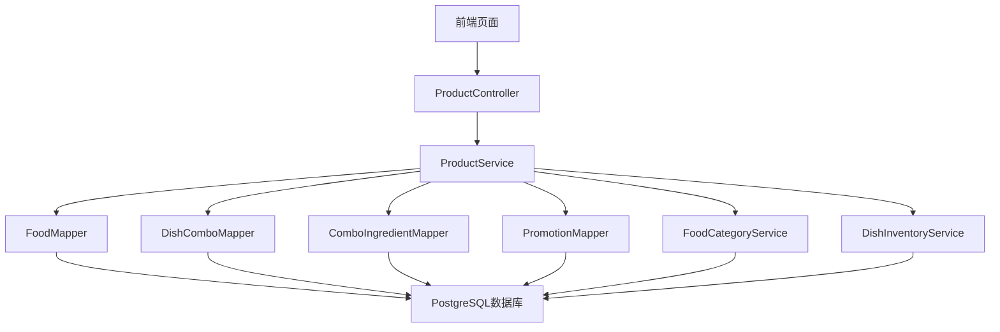

# 食品溯源系统产品管理模块技术方案

## 一、模块概述

### 1. 模块定位
产品管理模块是食品溯源系统的核心功能模块之一，主要负责菜品、分类、套餐的管理，以及菜品定价和成本计算等功能。该模块为餐饮企业提供了完整的产品生命周期管理能力，从菜品创建、分类管理、套餐组合到价格管理和成本计算，实现了产品管理的全流程覆盖。

### 2. 核心功能
- **菜品管理**：菜品的创建、编辑、删除、查询，支持图片上传和规格管理
- **分类管理**：分类的创建、编辑、删除、查询，支持层级结构和排序
- **套餐管理**：套餐的创建、编辑、删除、查询，支持组合菜品和价格策略
- **菜品定价**：菜品和套餐的价格管理，支持促销价和折扣
- **成本管理**：菜品和套餐的成本计算，与库存管理集成
- **库存集成**：与库存管理模块集成，实现菜品和套餐的库存管理

### 3. 技术栈
- **后端框架**：Spring Boot 3.2.0
- **持久层框架**：MyBatis Plus 3.5.5
- **数据库**：PostgreSQL 18（生产）/ H2 MODE=PostgreSQL（开发）
- **安全框架**：Spring Security 3.2.0
- **认证机制**：JWT 0.11.5
- **对象映射**：MapStruct 1.5.5.Final
- **JSON处理**：Fastjson2 2.0.42
- **工具类库**：Hutool 5.8.22

## 二、架构设计

### 1. 模块架构图



### 2. 核心组件
- **ProductController**：处理产品管理相关的REST API请求，包括菜品、套餐、价格等操作
- **ProductService**：产品管理的核心业务逻辑，实现菜品、套餐、价格等管理功能
- **FoodMapper**：菜品数据的持久化操作
- **DishComboMapper**：套餐数据的持久化操作
- **ComboIngredientMapper**：套餐成分数据的持久化操作
- **PromotionMapper**：促销数据的持久化操作
- **FoodCategoryService**：分类管理服务
- **DishInventoryService**：菜品库存管理服务

### 3. 数据流
1. 前端发送请求到ProductController
2. ProductController调用ProductService的相应方法
3. ProductService根据业务逻辑调用相应的Mapper和Service
4. Mapper执行数据库操作，返回数据给ProductService
5. ProductService处理业务逻辑，返回结果给ProductController
6. ProductController将结果封装为JSON响应返回给前端

## 三、功能设计

### 1. 菜品管理

#### 1.1 核心功能
- **菜品创建**：支持创建新菜品，包括菜品名称、分类、描述、价格、成本价、图片等信息
- **菜品编辑**：支持编辑现有菜品的信息
- **菜品删除**：支持删除菜品
- **菜品查询**：支持分页查询菜品，可按名称、分类、状态等条件筛选
- **菜品详情**：支持查看菜品详情
- **图片上传**：支持上传菜品图片
- **规格管理**：支持管理菜品的规格信息

#### 1.2 技术实现
- **数据模型**：使用Food实体类存储菜品信息
- **API接口**：/api/products，支持POST、PUT、DELETE、GET等方法
- **权限控制**：使用Spring Security的@PreAuthorize注解实现权限控制
- **数据验证**：使用Jakarta Validation实现请求数据验证
- **图片处理**：支持上传菜品图片，存储图片URL

#### 1.3 代码结构
```java
// 菜品创建API
@PostMapping
@PreAuthorize("hasAuthority('product:create')")
public Result<FoodResponse> createFood(@Valid @RequestBody FoodRequest foodRequest)

// 菜品编辑API
@PutMapping("/{id}")
@PreAuthorize("hasAuthority('product:update')")
public Result<FoodResponse> updateFood(@PathVariable("id") String foodId, @Valid @RequestBody FoodRequest foodRequest)

// 菜品删除API
@DeleteMapping("/{id}")
@PreAuthorize("hasAuthority('product:delete')")
public Result<Void> deleteFood(@PathVariable("id") String foodId)

// 菜品查询API
@GetMapping
@PreAuthorize("hasAuthority('product:view')")
public Result<PageResult<FoodResponse>> getFoodPage(int page, int size, String foodName, String foodCategory, Integer foodStatus)

// 菜品详情API
@GetMapping("/{id}")
@PreAuthorize("hasAuthority('product:view')")
public Result<FoodResponse> getFoodById(@PathVariable("id") String foodId)
```

### 2. 分类管理

#### 2.1 核心功能
- **分类创建**：支持创建新分类，包括分类名称、编码、描述、父分类等信息
- **分类编辑**：支持编辑现有分类的信息
- **分类删除**：支持删除分类
- **分类查询**：支持查询分类，可按层级结构和状态筛选
- **分类树**：支持获取分类的树形结构
- **分类排序**：支持分类的排序

#### 2.2 技术实现
- **数据模型**：使用FoodCategory实体类存储分类信息
- **API接口**：/api/food-categories，支持POST、PUT、DELETE、GET等方法
- **权限控制**：使用Spring Security的@PreAuthorize注解实现权限控制
- **数据验证**：使用Jakarta Validation实现请求数据验证
- **树形结构**：使用递归算法构建分类的树形结构

#### 2.3 代码结构
```java
// 分类创建API
@PostMapping
@PreAuthorize("hasAuthority('product:create')")
public Result<FoodCategory> createCategory(@Valid @RequestBody FoodCategory category)

// 分类编辑API
@PutMapping("/{id}")
@PreAuthorize("hasAuthority('product:update')")
public Result<FoodCategory> updateCategory(@PathVariable("id") String id, @Valid @RequestBody FoodCategory category)

// 分类删除API
@DeleteMapping("/{id}")
@PreAuthorize("hasAuthority('product:delete')")
public Result<Void> deleteCategory(@PathVariable("id") String id)

// 分类查询API
@GetMapping
@PreAuthorize("hasAuthority('product:view')")
public Result<List<FoodCategory>> getCategories()

// 分类树API
@GetMapping("/tree")
@PreAuthorize("hasAuthority('product:view')")
public Result<List<FoodCategory>> getCategoryTree()
```

### 3. 套餐管理

#### 3.1 核心功能
- **套餐创建**：支持创建新套餐，包括套餐名称、描述、价格、成分等信息
- **套餐编辑**：支持编辑现有套餐的信息
- **套餐删除**：支持删除套餐
- **套餐查询**：支持分页查询套餐，可按名称、状态等条件筛选
- **套餐详情**：支持查看套餐详情，包括套餐成分
- **成分管理**：支持管理套餐的成分，包括菜品和数量

#### 3.2 技术实现
- **数据模型**：使用DishCombo和ComboIngredient实体类存储套餐信息
- **API接口**：/api/products/combos，支持POST、PUT、DELETE、GET等方法
- **权限控制**：使用Spring Security的@PreAuthorize注解实现权限控制
- **数据验证**：使用Jakarta Validation实现请求数据验证
- **事务管理**：使用@Transactional注解实现事务管理，确保套餐和成分的一致性

#### 3.3 代码结构
```java
// 套餐创建API
@PostMapping("/combos")
@PreAuthorize("hasAuthority('product:create')")
public Result<DishCombo> createCombo(@Valid @RequestBody DishComboCreateDTO request)

// 套餐编辑API
@PutMapping("/combos/{id}")
@PreAuthorize("hasAuthority('product:update')")
public Result<DishCombo> updateCombo(@PathVariable("id") String comboId, @Valid @RequestBody DishComboUpdateDTO request)

// 套餐删除API
@DeleteMapping("/combos/{id}")
@PreAuthorize("hasAuthority('product:delete')")
public Result<Void> deleteCombo(@PathVariable("id") String comboId)

// 套餐查询API
@GetMapping("/combos")
@PreAuthorize("hasAuthority('product:view')")
public Result<PageResult<DishCombo>> getComboPage(int page, int size, String comboName, Integer status)

// 套餐详情API
@GetMapping("/combos/{id}")
@PreAuthorize("hasAuthority('product:view')")
public Result<DishCombo> getComboById(@PathVariable("id") String comboId)
```

### 4. 菜品定价

#### 4.1 核心功能
- **价格管理**：支持管理菜品和套餐的价格
- **促销管理**：支持设置菜品和套餐的促销价和折扣
- **价格查询**：支持查询菜品和套餐的当前价格（考虑促销）
- **成本计算**：支持计算菜品和套餐的成本

#### 4.2 技术实现
- **数据模型**：使用Food、DishCombo和Promotion实体类存储价格信息
- **API接口**：/api/products/{id}/price和/api/products/combos/{id}/price，支持GET方法
- **成本计算**：与库存管理模块集成，计算菜品和套餐的成本
- **促销处理**：支持查询有效的促销信息，计算促销后的价格

#### 4.3 代码结构
```java
// 菜品价格API
@GetMapping("/{id}/price")
@PreAuthorize("hasAuthority('product:view')")
public Result<BigDecimal> getCurrentPrice(@PathVariable("id") String foodId)

// 套餐价格API
@GetMapping("/combos/{id}/price")
@PreAuthorize("hasAuthority('product:view')")
public Result<BigDecimal> getCurrentComboPrice(@PathVariable("id") String comboId)

// 菜品成本API
@GetMapping("/{id}/cost")
@PreAuthorize("hasAuthority('product:view')")
public Result<BigDecimal> calculateDishCost(@PathVariable("id") String foodId)

// 套餐成本API
@GetMapping("/combos/{id}/cost")
@PreAuthorize("hasAuthority('product:view')")
public Result<BigDecimal> calculateComboCost(@PathVariable("id") String comboId)
```

### 5. 库存集成

#### 5.1 核心功能
- **库存关联**：将菜品和套餐与库存管理关联
- **成本计算**：基于库存数据计算菜品和套餐的成本
- **库存预警**：当菜品或套餐的库存不足时，发出预警

#### 5.2 技术实现
- **集成方式**：通过DishInventoryService与库存管理模块集成
- **成本计算**：基于库存的原材料价格计算菜品和套餐的成本
- **库存查询**：查询菜品和套餐的库存状态

#### 5.3 代码结构
```java
// 计算菜品成本
@Override
public BigDecimal calculateDishCost(String foodId) {
    return dishInventoryService.calculateDishCost(foodId);
}

// 计算套餐成本
@Override
public BigDecimal calculateComboCost(String comboId) {
    List<ComboIngredient> ingredients = comboIngredientMapper.selectByComboId(comboId);
    BigDecimal totalCost = BigDecimal.ZERO;

    for (ComboIngredient ingredient : ingredients) {
        BigDecimal dishCost = calculateDishCost(ingredient.getDishId());
        totalCost = totalCost.add(dishCost.multiply(new BigDecimal(ingredient.getQuantity())));
    }

    return totalCost;
}
```

## 四、性能优化与缓存策略

### 1. 缓存策略

#### 1.1 Redis缓存
- **分类缓存**：缓存分类树形结构，减少数据库查询
- **菜品缓存**：缓存热门菜品信息，提高查询性能
- **套餐缓存**：缓存热门套餐信息，提高查询性能
- **价格缓存**：缓存菜品和套餐的价格信息，提高查询性能

#### 1.2 缓存实现
```java
// 分类缓存
@Cacheable(value = "foodCategory", key = "#root.methodName")
public List<FoodCategory> getCategoryTree() {
    // 实现分类树构建逻辑
}

// 菜品缓存
@Cacheable(value = "food", key = "#foodId")
public FoodResponse getFoodById(String foodId) {
    // 实现菜品查询逻辑
}

// 套餐缓存
@Cacheable(value = "combo", key = "#comboId")
public DishCombo getComboById(String comboId) {
    // 实现套餐查询逻辑
}

// 价格缓存
@Cacheable(value = "price", key = "'food_' + #foodId")
public BigDecimal getCurrentPrice(String foodId) {
    // 实现价格计算逻辑
}
```

### 2. 数据库优化

#### 2.1 索引优化
- **菜品表索引**：为food_name、food_category、food_status等字段添加索引
- **分类表索引**：为category_name、parent_id、sort_order等字段添加索引
- **套餐表索引**：为combo_name、status等字段添加索引

#### 2.2 SQL优化
- **分页查询优化**：使用MyBatis Plus的分页插件，优化分页查询性能
- **批量操作优化**：使用MyBatis Plus的批量操作方法，减少数据库交互次数
- **关联查询优化**：使用MyBatis Plus的关联查询方法，优化关联查询性能

### 3. 代码优化

#### 3.1 异步处理
- **图片上传**：使用异步处理图片上传，提高用户体验
- **成本计算**：使用异步处理成本计算，提高系统响应速度

#### 3.2 批量处理
- **批量创建**：支持批量创建菜品和分类
- **批量更新**：支持批量更新菜品和分类的状态
- **批量删除**：支持批量删除菜品和分类

## 五、安全性考虑

### 1. 权限控制

#### 1.1 基于角色的权限控制
- **产品管理权限**：product:create、product:update、product:delete、product:view
- **分类管理权限**：category:create、category:update、category:delete、category:view
- **套餐管理权限**：combo:create、combo:update、combo:delete、combo:view

#### 1.2 权限实现
```java
// 菜品创建权限控制
@PostMapping
@PreAuthorize("hasAuthority('product:create')")
public Result<FoodResponse> createFood(@Valid @RequestBody FoodRequest foodRequest)

// 菜品编辑权限控制
@PutMapping("/{id}")
@PreAuthorize("hasAuthority('product:update')")
public Result<FoodResponse> updateFood(@PathVariable("id") String foodId, @Valid @RequestBody FoodRequest foodRequest)

// 菜品删除权限控制
@DeleteMapping("/{id}")
@PreAuthorize("hasAuthority('product:delete')")
public Result<Void> deleteFood(@PathVariable("id") String foodId)

// 菜品查询权限控制
@GetMapping
@PreAuthorize("hasAuthority('product:view')")
public Result<PageResult<FoodResponse>> getFoodPage(int page, int size, String foodName, String foodCategory, Integer foodStatus)
```

### 2. 数据安全

#### 2.1 输入验证
- **请求参数验证**：使用Jakarta Validation实现请求参数验证
- **SQL注入防护**：使用MyBatis Plus的参数化查询，防止SQL注入
- **XSS防护**：使用XssFilter过滤用户输入，防止XSS攻击

#### 2.2 数据加密
- **敏感数据加密**：对敏感数据（如成本价）进行加密存储
- **传输加密**：使用HTTPS协议，确保数据传输安全

### 3. 日志与审计

#### 3.1 操作日志
- **创建操作日志**：记录菜品、分类、套餐的创建操作
- **更新操作日志**：记录菜品、分类、套餐的更新操作
- **删除操作日志**：记录菜品、分类、套餐的删除操作

#### 3.2 审计实现
```java
// 操作日志记录
@Aspect
@Component
public class ProductOperationAspect {
    
    @Autowired
    private OperationLogService operationLogService;
    
    @AfterReturning(pointcut = "execution(* com.example.demo.service.ProductService.create*(..))", returning = "result")
    public void afterCreate(JoinPoint joinPoint, Object result) {
        // 记录创建操作日志
    }
    
    @AfterReturning(pointcut = "execution(* com.example.demo.service.ProductService.update*(..))", returning = "result")
    public void afterUpdate(JoinPoint joinPoint, Object result) {
        // 记录更新操作日志
    }
    
    @AfterReturning(pointcut = "execution(* com.example.demo.service.ProductService.delete*(..))", returning = "result")
    public void afterDelete(JoinPoint joinPoint, Object result) {
        // 记录删除操作日志
    }
}
```

## 六、代码结构与文件组织

### 1. 代码结构

```
backend/src/main/java/com/example/demo/
├── controller/
│   ├── ProductController.java          # 产品管理控制器
│   ├── FoodCategoryController.java      # 分类管理控制器
│   └── DishComboController.java         # 套餐管理控制器
├── service/
│   ├── ProductService.java              # 产品管理服务接口
│   ├── FoodCategoryService.java         # 分类管理服务接口
│   ├── impl/
│   │   ├── ProductServiceImpl.java      # 产品管理服务实现
│   │   └── FoodCategoryServiceImpl.java # 分类管理服务实现
│   └── DishInventoryService.java        # 菜品库存服务
├── mapper/
│   ├── FoodMapper.java                  # 菜品数据访问
│   ├── FoodCategoryMapper.java          # 分类数据访问
│   ├── DishComboMapper.java             # 套餐数据访问
│   ├── ComboIngredientMapper.java       # 套餐成分数据访问
│   └── PromotionMapper.java             # 促销数据访问
├── entity/
│   ├── Food.java                        # 菜品实体
│   ├── FoodCategory.java                # 分类实体
│   ├── DishCombo.java                   # 套餐实体
│   ├── ComboIngredient.java             # 套餐成分实体
│   └── Promotion.java                   # 促销实体
├── dto/
│   ├── FoodRequest.java                 # 菜品请求DTO
│   ├── FoodResponse.java                # 菜品响应DTO
│   ├── DishComboCreateDTO.java          # 套餐创建DTO
│   ├── DishComboUpdateDTO.java          # 套餐更新DTO
│   └── PageResult.java                  # 分页结果DTO
└── config/
    └── RedisConfig.java                 # Redis缓存配置
```

### 2. 文件组织
- **控制器层**：负责处理HTTP请求，实现REST API接口
- **服务层**：负责实现业务逻辑，处理核心功能
- **数据访问层**：负责与数据库交互，实现数据持久化
- **实体层**：负责定义数据模型，映射数据库表结构
- **DTO层**：负责定义请求和响应的数据结构
- **配置层**：负责配置系统参数，如缓存配置

## 七、技术实现细节

### 1. 菜品编码生成

#### 1.1 编码规则
- **菜品编码**：格式为D+00000，例如：D00001
- **套餐编码**：格式为C+00000，例如：C00001

#### 1.2 实现方法
```java
// 生成菜品编码
private String generateFoodCode() {
    String prefix = "D";
    // 获取当前最大编码
    String maxCode = foodMapper.selectMaxFoodCode();
    if (maxCode == null) {
        return prefix + "00001";
    }
    int codeNum = Integer.parseInt(maxCode.substring(1));
    codeNum++;
    return prefix + String.format("%05d", codeNum);
}

// 生成套餐编码
private String generateComboCode() {
    String prefix = "C";
    // 获取当前最大编码
    String maxCode = dishComboMapper.selectMaxComboCode();
    if (maxCode == null) {
        return prefix + "00001";
    }
    int codeNum = Integer.parseInt(maxCode.substring(1));
    codeNum++;
    return prefix + String.format("%05d", codeNum);
}
```

### 2. 分类树构建

#### 2.1 实现方法
```java
// 构建分类树
public List<FoodCategory> buildCategoryTree(List<FoodCategory> categories) {
    Map<String, FoodCategory> categoryMap = new HashMap<>();
    List<FoodCategory> rootCategories = new ArrayList<>();
    
    // 将所有分类放入Map中
    for (FoodCategory category : categories) {
        categoryMap.put(category.getId(), category);
        category.setChildren(new ArrayList<>());
    }
    
    // 构建分类树
    for (FoodCategory category : categories) {
        String parentId = category.getParentId();
        if (parentId == null || parentId.trim().isEmpty()) {
            // 根分类
            rootCategories.add(category);
        } else {
            // 子分类
            FoodCategory parent = categoryMap.get(parentId);
            if (parent != null) {
                parent.getChildren().add(category);
            }
        }
    }
    
    // 对子分类按排序号排序
    for (FoodCategory category : categories) {
        if (category.getChildren() != null && !category.getChildren().isEmpty()) {
            category.getChildren().sort(Comparator.comparingInt(FoodCategory::getSortOrder));
        }
    }
    
    return rootCategories;
}
```

### 3. 成本计算

#### 3.1 菜品成本计算
```java
// 计算菜品成本
public BigDecimal calculateDishCost(String foodId) {
    // 从库存管理模块获取菜品的原材料成本
    return dishInventoryService.calculateDishCost(foodId);
}
```

#### 3.2 套餐成本计算
```java
// 计算套餐成本
public BigDecimal calculateComboCost(String comboId) {
    List<ComboIngredient> ingredients = comboIngredientMapper.selectByComboId(comboId);
    BigDecimal totalCost = BigDecimal.ZERO;

    for (ComboIngredient ingredient : ingredients) {
        BigDecimal dishCost = calculateDishCost(ingredient.getDishId());
        totalCost = totalCost.add(dishCost.multiply(new BigDecimal(ingredient.getQuantity())));
    }

    return totalCost;
}
```

### 4. 价格计算

#### 4.1 菜品价格计算
```java
// 获取菜品当前价格（考虑促销）
public BigDecimal getCurrentPrice(String foodId) {
    Food food = foodMapper.selectById(foodId);
    if (food == null) {
        throw new RuntimeException("菜品不存在");
    }

    // 检查是否有有效的促销
    List<Promotion> promotions = promotionMapper.selectValidPromotionsByProductId(foodId);
    if (!promotions.isEmpty()) {
        // 取最大折扣的促销
        Promotion bestPromotion = promotions.stream()
                .max((p1, p2) -> p1.getDiscountRate().compareTo(p2.getDiscountRate()))
                .orElse(null);
        if (bestPromotion != null) {
            return food.getPrice().multiply(bestPromotion.getDiscountRate());
        }
    }

    return food.getPrice();
}
```

#### 4.2 套餐价格计算
```java
// 获取套餐当前价格（考虑促销）
public BigDecimal getCurrentComboPrice(String comboId) {
    DishCombo combo = dishComboMapper.selectById(comboId);
    if (combo == null) {
        throw new RuntimeException("套餐不存在");
    }

    // 检查是否有有效的促销
    List<Promotion> promotions = promotionMapper.selectValidPromotionsByComboId(comboId);
    if (!promotions.isEmpty()) {
        // 取最大折扣的促销
        Promotion bestPromotion = promotions.stream()
                .max((p1, p2) -> p1.getDiscountRate().compareTo(p2.getDiscountRate()))
                .orElse(null);
        if (bestPromotion != null) {
            return combo.getPrice().multiply(bestPromotion.getDiscountRate());
        }
    }

    return combo.getPrice();
}
```

## 八、总结

### 1. 模块特点
- **功能完整**：实现了产品管理的全流程覆盖，从菜品创建到价格管理和成本计算
- **架构清晰**：采用分层架构，代码结构清晰，易于维护和扩展
- **性能优化**：使用缓存、索引优化、SQL优化等技术，提高系统性能
- **安全可靠**：使用权限控制、数据验证、日志审计等技术，确保系统安全
- **集成性强**：与库存管理模块集成，实现了产品管理和库存管理的无缝衔接

### 2. 技术亮点
- **树形结构**：实现了分类的树形结构管理，支持层级结构和排序
- **成本计算**：与库存管理模块集成，实现了菜品和套餐的成本计算
- **价格管理**：支持菜品和套餐的价格管理，包括促销价和折扣
- **缓存策略**：使用Redis缓存，提高系统性能
- **异步处理**：使用异步处理图片上传和成本计算，提高用户体验

### 3. 未来展望
- **规格管理**：进一步完善菜品的规格管理功能，支持多规格菜品
- **标签管理**：添加菜品和套餐的标签管理功能，支持按标签筛选
- **推荐系统**：基于销售数据，实现菜品和套餐的推荐功能
- **数据分析**：添加产品销售数据分析功能，为企业决策提供数据支持
- **API集成**：提供标准化的API接口，支持与第三方系统集成

## 九、技术实现

### 1. 核心API

#### 1.1 菜品管理API
- **POST /api/products**：创建菜品
- **PUT /api/products/{id}**：更新菜品
- **DELETE /api/products/{id}**：删除菜品
- **GET /api/products/{id}**：获取菜品详情
- **GET /api/products**：分页查询菜品
- **GET /api/products/{id}/price**：获取菜品当前价格
- **GET /api/products/{id}/cost**：计算菜品成本

#### 1.2 分类管理API
- **POST /api/food-categories**：创建分类
- **PUT /api/food-categories/{id}**：更新分类
- **DELETE /api/food-categories/{id}**：删除分类
- **GET /api/food-categories**：查询分类列表
- **GET /api/food-categories/tree**：获取分类树形结构

#### 1.3 套餐管理API
- **POST /api/products/combos**：创建套餐
- **PUT /api/products/combos/{id}**：更新套餐
- **DELETE /api/products/combos/{id}**：删除套餐
- **GET /api/products/combos/{id}**：获取套餐详情
- **GET /api/products/combos**：分页查询套餐
- **GET /api/products/combos/{id}/price**：获取套餐当前价格
- **GET /api/products/combos/{id}/cost**：计算套餐成本

### 2. 核心服务

#### 2.1 ProductService
- **createFood**：创建菜品
- **updateFood**：更新菜品
- **deleteFood**：删除菜品
- **getFoodById**：获取菜品详情
- **getFoodPage**：分页查询菜品
- **createCombo**：创建套餐
- **updateCombo**：更新套餐
- **deleteCombo**：删除套餐
- **getComboById**：获取套餐详情
- **getComboPage**：分页查询套餐
- **getCurrentPrice**：获取菜品当前价格
- **getCurrentComboPrice**：获取套餐当前价格
- **calculateDishCost**：计算菜品成本
- **calculateComboCost**：计算套餐成本

#### 2.2 FoodCategoryService
- **createCategory**：创建分类
- **updateCategory**：更新分类
- **deleteCategory**：删除分类
- **getCategoryById**：获取分类详情
- **getCategoryTree**：获取分类树形结构
- **getRootCategories**：获取所有顶级分类
- **getChildCategories**：根据父ID获取子分类列表

### 3. 核心实体

#### 3.1 Food
- **foodId**：菜品ID
- **foodCode**：菜品编码
- **foodName**：菜品名称
- **foodCategory**：菜品分类
- **foodDescription**：菜品描述
- **price**：菜品价格
- **costPrice**：成本价
- **foodStatus**：菜品状态
- **foodImageUrl**：菜品图片URL

#### 3.2 FoodCategory
- **id**：分类ID
- **categoryName**：分类名称
- **categoryCode**：分类编码
- **description**：分类描述
- **parentId**：父分类ID
- **sortOrder**：排序号
- **status**：状态

#### 3.3 DishCombo
- **comboId**：套餐ID
- **comboCode**：套餐编码
- **comboName**：套餐名称
- **description**：套餐描述
- **price**：套餐价格
- **status**：套餐状态
- **ingredients**：套餐成分列表

#### 3.4 ComboIngredient
- **id**：成分ID
- **comboId**：套餐ID
- **dishId**：菜品ID
- **quantity**：数量

### 4. 核心DTO

#### 4.1 FoodRequest
- **foodName**：菜品名称
- **foodCategory**：菜品分类
- **foodDescription**：菜品描述
- **foodStatus**：菜品状态
- **price**：菜品价格
- **costPrice**：成本价
- **foodImageUrl**：菜品图片URL

#### 4.2 FoodResponse
- **foodId**：菜品ID
- **foodCode**：菜品编码
- **foodName**：菜品名称
- **foodCategory**：菜品分类
- **foodDescription**：菜品描述
- **foodStatus**：菜品状态
- **price**：菜品价格
- **costPrice**：成本价
- **foodImageUrl**：菜品图片URL
- **createTime**：创建时间
- **updateTime**：更新时间

#### 4.3 DishComboCreateDTO
- **comboName**：套餐名称
- **price**：套餐价格
- **description**：套餐描述
- **status**：套餐状态
- **ingredients**：套餐成分列表

#### 4.4 DishComboUpdateDTO
- **comboName**：套餐名称
- **price**：套餐价格
- **description**：套餐描述
- **status**：套餐状态
- **ingredients**：套餐成分列表

## 十、技术实现细节

### 1. 图片上传实现

#### 1.1 配置
```yaml
# 图片上传配置
spring:
  servlet:
    multipart:
      max-file-size: 10MB
      max-request-size: 10MB

# 图片存储路径
file:
  upload:
    path: /uploads/
    url-prefix: /uploads/
```

#### 1.2 实现
```java
// 图片上传API
@PostMapping("/upload")
@PreAuthorize("hasAuthority('product:create')")
public Result<String> uploadImage(@RequestParam("file") MultipartFile file) {
    try {
        // 生成文件名
        String fileName = UUID.randomUUID().toString() + "." + FilenameUtils.getExtension(file.getOriginalFilename());
        // 生成文件路径
        String filePath = uploadPath + "/food/" + fileName;
        // 创建目录
        File directory = new File(uploadPath + "/food/");
        if (!directory.exists()) {
            directory.mkdirs();
        }
        // 保存文件
        file.transferTo(new File(filePath));
        // 返回文件URL
        return Result.success(urlPrefix + "/food/" + fileName, "上传成功");
    } catch (Exception e) {
        return Result.error(500, "上传失败：" + e.getMessage());
    }
}
```

### 2. 缓存实现

#### 2.1 Redis配置
```java
@Configuration
@EnableCaching
public class RedisConfig {

    @Bean
    public RedisTemplate<String, Object> redisTemplate(RedisConnectionFactory redisConnectionFactory) {
        RedisTemplate<String, Object> template = new RedisTemplate<>();
        template.setConnectionFactory(redisConnectionFactory);
        template.setKeySerializer(new StringRedisSerializer());
        template.setValueSerializer(new Jackson2JsonRedisSerializer<>(Object.class));
        return template;
    }

    @Bean
    public CacheManager cacheManager(RedisConnectionFactory redisConnectionFactory) {
        RedisCacheConfiguration config = RedisCacheConfiguration.defaultCacheConfig()
                .entryTtl(Duration.ofMinutes(30))
                .serializeKeysWith(RedisSerializationContext.SerializationPair.fromSerializer(new StringRedisSerializer()))
                .serializeValuesWith(RedisSerializationContext.SerializationPair.fromSerializer(new Jackson2JsonRedisSerializer<>(Object.class)));
        return RedisCacheManager.builder(redisConnectionFactory)
                .cacheDefaults(config)
                .build();
    }
}
```

#### 2.2 缓存使用
```java
// 缓存菜品详情
@Cacheable(value = "food", key = "#foodId")
public FoodResponse getFoodById(String foodId) {
    Food food = foodMapper.selectById(foodId);
    if (food == null) {
        throw new RuntimeException("菜品不存在");
    }

    FoodResponse response = new FoodResponse();
    BeanUtils.copyProperties(food, response);
    if (food.getFoodCategory() != null) {
        FoodCategory category = foodCategoryService.getCategoryById(food.getFoodCategory());
        if (category != null) {
            response.setFoodCategory(category.getCategoryName());
        }
    }

    return response;
}

// 清除缓存
@CacheEvict(value = "food", key = "#foodId")
public FoodResponse updateFood(String foodId, FoodRequest request) {
    // 实现菜品更新逻辑
}
```

### 3. 事务管理

#### 3.1 套餐事务管理
```java
// 创建套餐（包含事务管理）
@Transactional
public DishCombo createCombo(DishComboCreateDTO request) {
    // 生成套餐编码
    String comboCode = generateComboCode();

    DishCombo combo = new DishCombo();
    combo.setComboId(comboCode);
    combo.setComboCode(comboCode);
    combo.setComboName(request.getComboName());
    combo.setDescription(request.getDescription());
    combo.setPrice(request.getPrice());
    combo.setStatus(request.getStatus());
    combo.setCreateTime(LocalDateTime.now());
    combo.setUpdateTime(LocalDateTime.now());

    dishComboMapper.insert(combo);

    // 保存套餐成分
    if (request.getIngredients() != null && !request.getIngredients().isEmpty()) {
        for (ComboIngredient ingredient : request.getIngredients()) {
            ingredient.setComboId(combo.getComboId());
            comboIngredientMapper.insert(ingredient);
        }
    }

    return combo;
}
```

### 4. 异常处理

#### 4.1 全局异常处理
```java
@RestControllerAdvice
public class GlobalExceptionHandler {

    @ExceptionHandler(Exception.class)
    public Result<?> handleException(Exception e) {
        log.error("系统异常：", e);
        return Result.error(500, "系统异常：" + e.getMessage());
    }

    @ExceptionHandler(BusinessException.class)
    public Result<?> handleBusinessException(BusinessException e) {
        log.error("业务异常：", e);
        return Result.error(e.getCode(), e.getMessage());
    }

    @ExceptionHandler(MethodArgumentNotValidException.class)
    public Result<?> handleMethodArgumentNotValidException(MethodArgumentNotValidException e) {
        String message = e.getBindingResult().getFieldErrors().stream()
                .map(FieldError::getDefaultMessage)
                .collect(Collectors.joining(", "));
        return Result.error(400, message);
    }
}
```

### 5. 日志实现

#### 5.1 操作日志
```java
@Aspect
@Component
public class ProductOperationAspect {

    @Autowired
    private OperationLogService operationLogService;

    @AfterReturning(pointcut = "execution(* com.example.demo.service.ProductService.create*(..))", returning = "result")
    public void afterCreate(JoinPoint joinPoint, Object result) {
        OperationLog log = new OperationLog();
        log.setOperationType("CREATE");
        log.setOperationName(joinPoint.getSignature().getName());
        log.setOperationTime(LocalDateTime.now());
        log.setOperator("admin"); // 从上下文中获取当前用户
        log.setResult("SUCCESS");
        operationLogService.save(log);
    }

    @AfterReturning(pointcut = "execution(* com.example.demo.service.ProductService.update*(..))", returning = "result")
    public void afterUpdate(JoinPoint joinPoint, Object result) {
        OperationLog log = new OperationLog();
        log.setOperationType("UPDATE");
        log.setOperationName(joinPoint.getSignature().getName());
        log.setOperationTime(LocalDateTime.now());
        log.setOperator("admin"); // 从上下文中获取当前用户
        log.setResult("SUCCESS");
        operationLogService.save(log);
    }

    @AfterReturning(pointcut = "execution(* com.example.demo.service.ProductService.delete*(..))", returning = "result")
    public void afterDelete(JoinPoint joinPoint, Object result) {
        OperationLog log = new OperationLog();
        log.setOperationType("DELETE");
        log.setOperationName(joinPoint.getSignature().getName());
        log.setOperationTime(LocalDateTime.now());
        log.setOperator("admin"); // 从上下文中获取当前用户
        log.setResult("SUCCESS");
        operationLogService.save(log);
    }
}
```

## 十一、总结

产品管理模块是食品溯源系统的核心功能模块之一，通过本技术方案的实现，为餐饮企业提供了完整的产品生命周期管理能力。该模块采用了分层架构设计，代码结构清晰，易于维护和扩展。同时，通过使用缓存、索引优化、SQL优化等技术，提高了系统性能。此外，通过使用权限控制、数据验证、日志审计等技术，确保了系统安全。

本技术方案的实现，不仅满足了餐饮企业对产品管理的基本需求，还提供了一些高级功能，如分类的树形结构管理、菜品和套餐的成本计算、价格管理和促销等。这些功能的实现，为餐饮企业的产品管理提供了更加便捷、高效、智能的解决方案。

在未来的发展中，我们可以进一步完善产品管理模块的功能，如添加规格管理、标签管理、推荐系统、数据分析等功能，为餐饮企业提供更加全面、智能的产品管理解决方案。同时，我们还可以提供标准化的API接口，支持与第三方系统集成，扩展系统的应用场景。
