# 食品溯源系统 - 业务流程图

> 本文档使用 Mermaid 语法，可在以下工具中查看：
> - VS Code + Mermaid 插件
> - Typora 编辑器
> - https://mermaid.live 在线编辑器

---

## 一、系统模块总览

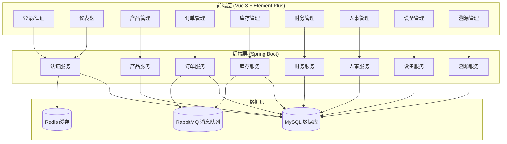

---

## 二、产品管理模块流程

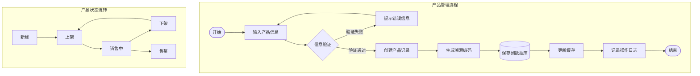

---

## 三、订单管理模块流程

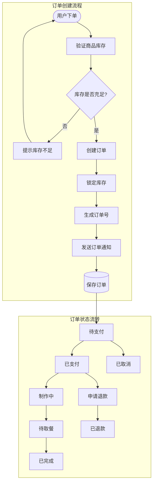

---

## 四、库存管理模块流程

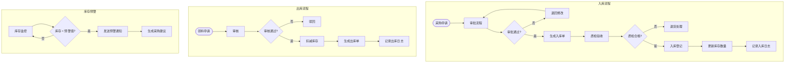

---

## 五、财务管理模块流程

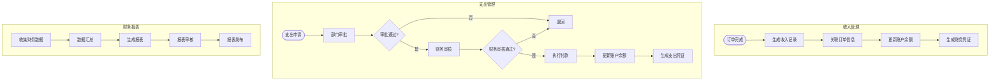

---

## 六、人事管理模块流程

```mermaid
flowchart TD
    subgraph 员工入职流程
        H1([发布招聘需求]) --> H2[简历筛选]
        H2 --> H3[面试安排]
        H3 --> H4{面试通过?}
        H4 -->|否| H5[发送婉拒通知]
        H4 -->|是| H6[发送录用通知]
        H6 --> H7[入职登记]
        H7 --> H8[创建员工档案]
        H8 --> H9[分配岗位权限]
        H9 --> H10[健康证管理]
    end

    subgraph 员工离职流程
        L1([提交离职申请]) --> L2[部门审批]
        L2 --> L3{审批通过?}
        L3 -->|否| L4[驳回申请]
        L3 -->|是| L5[工作交接]
        L5 --> L6[资产归还]
        L6 --> L7[结算薪资]
        L7 --> L8[归档员工档案]
    end

    subgraph 薪资管理
        S1[考勤统计] --> S2[绩效计算]
        S2 --> S3[薪资核算]
        S3 --> S4[薪资审批]
        S4 --> S5[发放薪资]
        S5 --> S6[生成薪资记录]
    end
```

---

## 七、设备管理模块流程

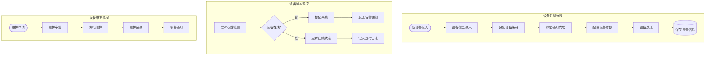

---

## 八、溯源管理模块流程

```mermaid
flowchart TD
    subgraph 溯源码生成
        T1([选择产品]) --> T2[生成溯源编码]
        T2 --> T3[关联产品信息]
        T3 --> T4[关联原料信息]
        T4 --> T5[关联加工信息]
        T5 --> T6[生成溯源标签]
        T6 --> T7[打印/导出]
    end

    subgraph 溯源查询
        Q1([扫描溯源码]) --> Q2[解码查询]
        Q2 --> Q3[获取产品信息]
        Q3 --> Q4[获取原料来源]
        Q4 --> Q5[获取加工记录]
        Q5 --> Q6[获取流通记录]
        Q6 --> Q7[展示溯源信息]
    end

    subgraph 溯源链路
        S1[原料采购] --> S2[入库登记]
        S2 --> S3[加工生产]
        S3 --> S4[成品检验]
        S4 --> S5[出库销售]
        S5 --> S6[消费者查询]
    end
```

---

## 九、系统整体数据流转图

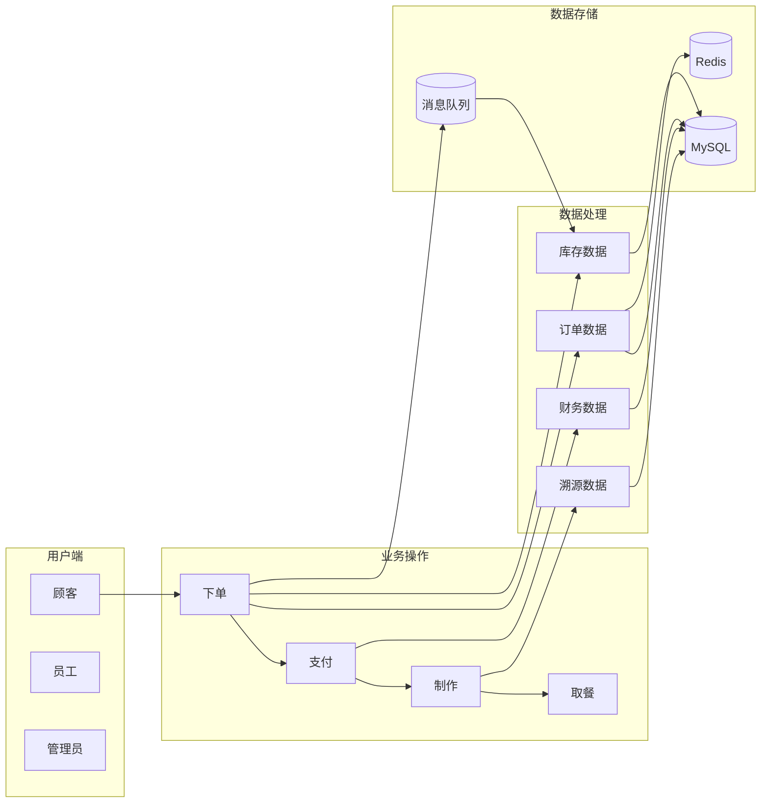

---

## 十、模块间数据联动关系

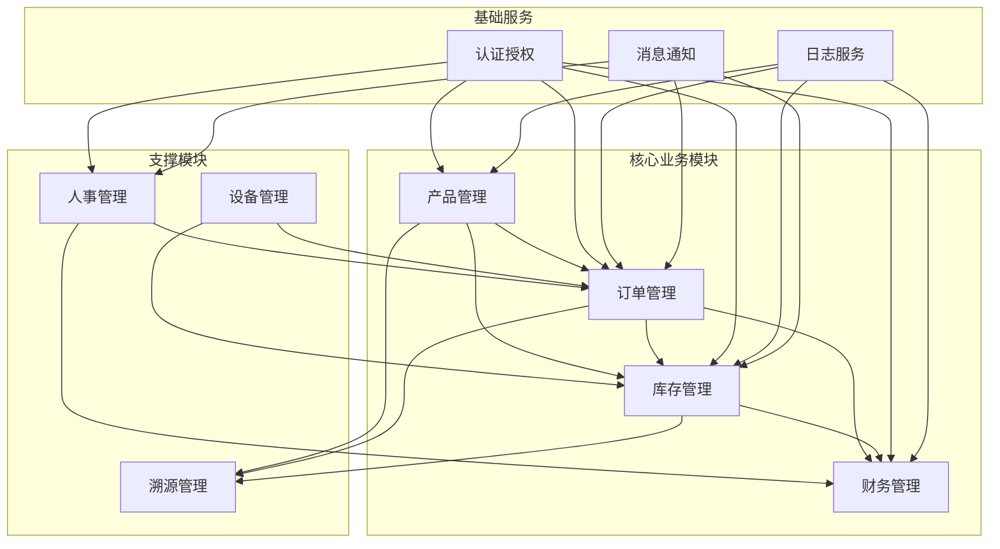

---

## 十一、技术架构图

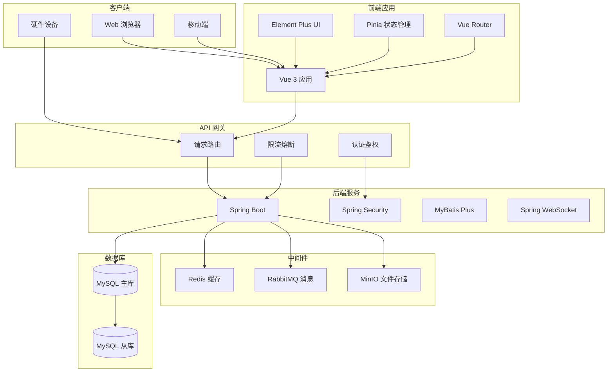

---

## 查看方式

### 方式一：VS Code 查看
1. 安装插件：`Mermaid Markdown Syntax Highlighting` 或 `Markdown Preview Mermaid Support`
2. 打开此文件
3. 按 `Ctrl+Shift+V` 预览

### 方式二：在线工具
1. 访问 https://mermaid.live
2. 复制上面的 Mermaid 代码
3. 粘贴即可查看

### 方式三：Typora 编辑器
1. 用 Typora 打开此文件
2. 自动渲染 Mermaid 图表

### 方式四：导出图片
```bash
# 安装 mermaid-cli
npm install -g @mermaid-js/mermaid-cli

# 生成 PNG 图片
mmdc -i 系统流程图.md -o 系统流程图.png
```
