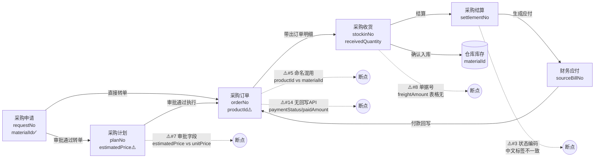
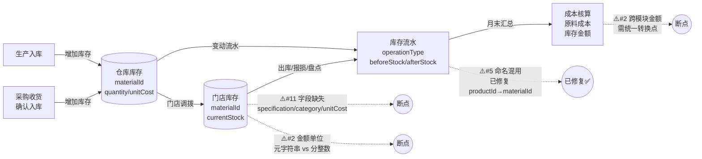
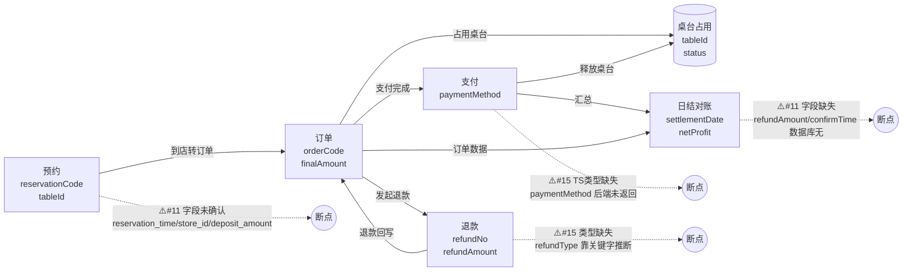
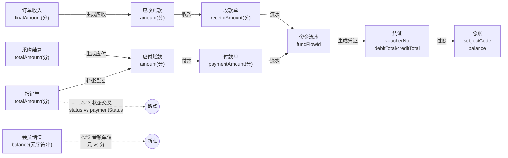
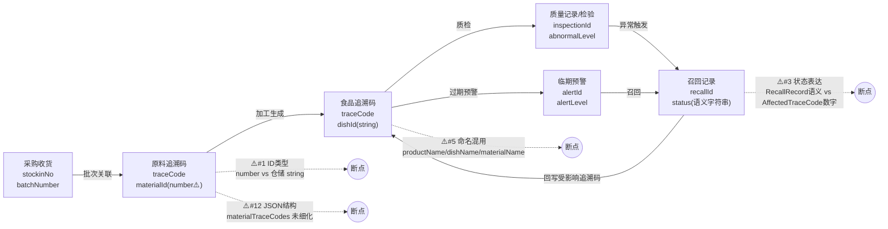
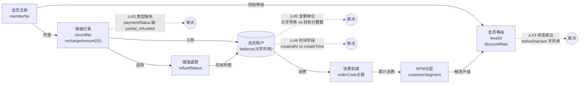

# 数据链路地图（L1 模块链路图）

> 本文档用 Mermaid flowchart 描绘 6 条核心业务链路的数据流向，配合 [frontend-verification-plan.md](./frontend-verification-plan.md)（L2 字段契约表）使用。
> 节点 = 页面/单据（标注关键字段），实线 = 正常流转，红色虚线 = 已识别的断点/风险。
> 断点编号对应 [frontend-verification-plan.md 第 4.3 节共性编号](./frontend-verification-plan.md#43-全模块共性问题汇总)。

---

## 链路 1：采购链（申请 → 订单 → 收货 → 结算 → 应付）

**关键断点**：
- 采购订单 `priority/purchaseType/contractId/budgetId/contactPerson` 后端未返回（converter 提供默认空值）
- 采购订单状态：前端 11 个 vs 后端 7 个，`shipped/received/rejected` 为近似映射
- 物料命名：采购申请已统一 `materialId`，采购订单仍用 `productId`

---

## 链路 2：库存链（入库 → 仓库库存 → 门店库存 → 流水 → 成本）

**关键断点**：
- 门店库存 `specification/category/unitCost/totalCost` 数据库无对应列
- 门店要货申请复用 adjust API，未独立建单
- 库存日志 `productId→materialId` 已统一（converter 处理后端 `foodId`）

---

## 链路 3：订单链（预约 → 下单 → 桌台 → 退款 → 日结）

**关键断点**：
- 退款操作仅提示跳转，无真实退款创建 API
- 预约管理数据库迁移脚本被截断，关键字段未确认
- 日结对账 `refundAmount/confirmTime` 数据库无此列

---

## 链路 4：资金链（收入/支出 → 应收应付 → 收付款 → 凭证 → 总账）

**关键断点**：
- 会员营销用「元字符串」，财务中心用「分整数」，跨模块需统一转换位置
- 报销单 `paymentStatus` 与 `status` 存在并行状态字段，状态机不闭环
- 采购订单 `paidAmount` 后端未返回，被硬编码为 0

---

## 链路 5：追溯链（收货 → 批次 → 追溯码 → 食品追溯 → 质量 → 召回）

**关键断点**：
- 溯源对象使用 number ID，与仓储 string ID 不一致
- `productName/materialName/dishName` 跨模块命名混用
- 召回模块状态字段类型不一致（语义字符串 vs 后端数字）
- `materialTraceCodes/materialDetails` 为 JSON 字符串，结构未在 TS 类型中细化

---

## 链路 6：会员链（注册 → 储值 → 消费 → 退款 → 等级）

**关键断点**：
- 会员余额/充值/消费均使用元字符串，与财务中心分整数不一致
- 会员等级状态使用语义字符串，与通用数字编码不一致
- 储值记录 `paymentStatus` 类型定义缺少 `partial_refunded`
- 时间字段使用 `createdAt/updatedAt`，与项目规范 `createTime/updateTime` 不一致

---

## 断点汇总与优先级

| 编号 | 问题类别 | 影响链路 | 风险等级 | 建议优先级 | 状态（2026-07-31 更新） |
|---|---|---|---|---|---|
| #1 | 主键命名/类型不一致 | 追溯链 | 高 | P0 | ⚠️ 部分修复：`material_trace_code` 三列 bigint→VARCHAR 已修复（V20260731_008），前端追溯码 productId↔后端 materialId 命名差异仍存 |
| #2 | 金额单位不统一 | 库存/资金/会员链 | 高 | P0 | ⚠️ 会员链余额/消费仍断裂（元 vs 分） |
| #3 | 状态字段表达不统一 | 采购/追溯/会员链 | 高 | P0 | ⚠️ 召回状态三套表达、会员 paymentStatus 仍存 |
| #4 | 时间字段命名混用 | 会员链 | 中 | P1 | ⚠️ 仍存 |
| #5 | 物料字段命名混用 | 采购/库存/追溯链 | 高 | P0 | ✅ 采购链路已统一 materialId（converter 映射） |
| #7 | 审批字段命名不统一 | 采购链 | 中 | P1 | ✅ 已统一 createByName/approvedByName |
| #8 | 关联单据号字段命名 | 采购/订单/资金链 | 中 | P1 | ⚠️ 部分 |
| #11 | 数据库字段缺失 | 库存/订单链 | 高 | P0 | ⚠️ 日结 confirm_time 仍缺；门店库存 specification/category 仍缺 |
| #12 | JSON 字段结构未细化 | 追溯链 | 中 | P1 | ⚠️ 仍存 |
| #14 | 字段无回写 API | 采购链 | 中 | P1 | ✅ LK-FINANCE-02 已修复（付款回写） |
| #15 | TS 类型缺失但页面已用 | 订单链 | 中 | P1 | ✅ 设备链 online/ip 已补齐 |

---

## 使用说明

1. **节点点击跳转**：本图为 Markdown 文本，可在 Trae IDE 中编辑节点名链接到具体页面文件
2. **配合 L2 使用**：图中的页面节点 → 对应 [frontend-verification-plan.md](./frontend-verification-plan.md) 第 4.2 节字段契约表
3. **断点编号**：`⚠️#N` 对应 [4.3 节共性汇总](./frontend-verification-plan.md#43-全模块共性问题汇总) 第 N 项
4. **维护方式**：发现新断点时，在图中加红色虚线 + 编号，并在 L2 表中标注状态

---

## 待补充（L3 关键字段血缘卡）

以下高风险字段建议单独画 L3 血缘图（变形记），后续按需补充：

- [ ] `materialId` 命名混用血缘图（DB food_id → Entity foodId → API productId → 前端 materialId）
- [ ] `status` 状态编码血缘图（前端语义字符串 ↔ 后端数字编码 ↔ 数据库 INTEGER）
- [ ] 金额单位血缘图（前端元字符串 ↔ 后端分整数 ↔ 数据库 BIGINT）
- [ ] `approvedBy/approvedTime` 审批字段血缘图
- [ ] 单据号字段血缘图（requestNo/orderNo/stockinNo/settlementNo）
