# 食品溯源系统运转逻辑思维图与分析报告

> **文档目的**：全面梳理系统的全量功能模块、模块间交互逻辑、数据流向、多模式适配机制，识别点对点交互问题、跨模块协作问题，确保系统正确部署上线投入生产环境。
> **覆盖范围**：管理端 + POS端 + 员工端（H5） + 供应商门户 + 硬件设备联动
> **生成时间**：2026-07-13
> **审查状态**：待审查

---

## 一、执行摘要

### 1.1 系统规模

| 维度 | 数量 | 说明 |
|------|------|------|
| 后端 Controller | 200+ | 分布在 17 个子包（pos/kitchen/hardware/schedule/marketing/finance/operations/maintenance/integration/h5/device/websocket/supplier-portal/approval/seal/purchase/trace） |
| 后端 Service | 200+ | 含 dataservice 缓存层 |
| 后端 Entity | 200+ | 覆盖 14 个业务域 |
| 前端路由 | 100+ | 16 个业务模块 |
| 前端 Vue 页面 | 180+ | 含模块级 components |
| RabbitMQ 配置类 | 5 | Trace/Purchase/Warehouse/StoreTableQueue/默认 |
| WebSocket 端点 | 2 | `/ws/device`、`/ws/order` |

### 1.2 4 种运营模式概览

| 模式 | 编码 | 适用规模 | 可见业务域数量 | 隐藏域 |
|------|------|---------|---------------|--------|
| 集中式单店 | `centralized-single` | 1-20人/年营收50万-500万 | 9 | purchase/warehouse/finance/hr/asset |
| 标准连锁 | `standard-chain` | 20-200人/年营收500万-2000万 | 14（全开） | 无 |
| 大型连锁 | `large-chain` | 200+人/年营收2000万+ | 14（全开+全角色） | 无 |
| 自定义 | `custom` | 不限 | 由 admin 自行配置 | 由用户决定 |

### 1.3 4 端入口

| 端 | 入口路径 | 认证方式 | 主要使用者 |
|----|---------|---------|----------|
| 管理端 | `/` (前端 SPA) | JWT (admin/manager/director) | 老板、运营总监、HR、财务、仓管、店长 |
| POS端 | `/v1/pos/auth/login` (后端独立认证) | JWT + terminalId | 收银员 |
| 员工端 H5 | `/portal/sign`、`/h5/*` | 短期 token | 员工入职、供应商签署 |
| 供应商门户 | `/portal/sign` | 签署链接 token | 供应商 |

---

## 二、系统总体架构思维图

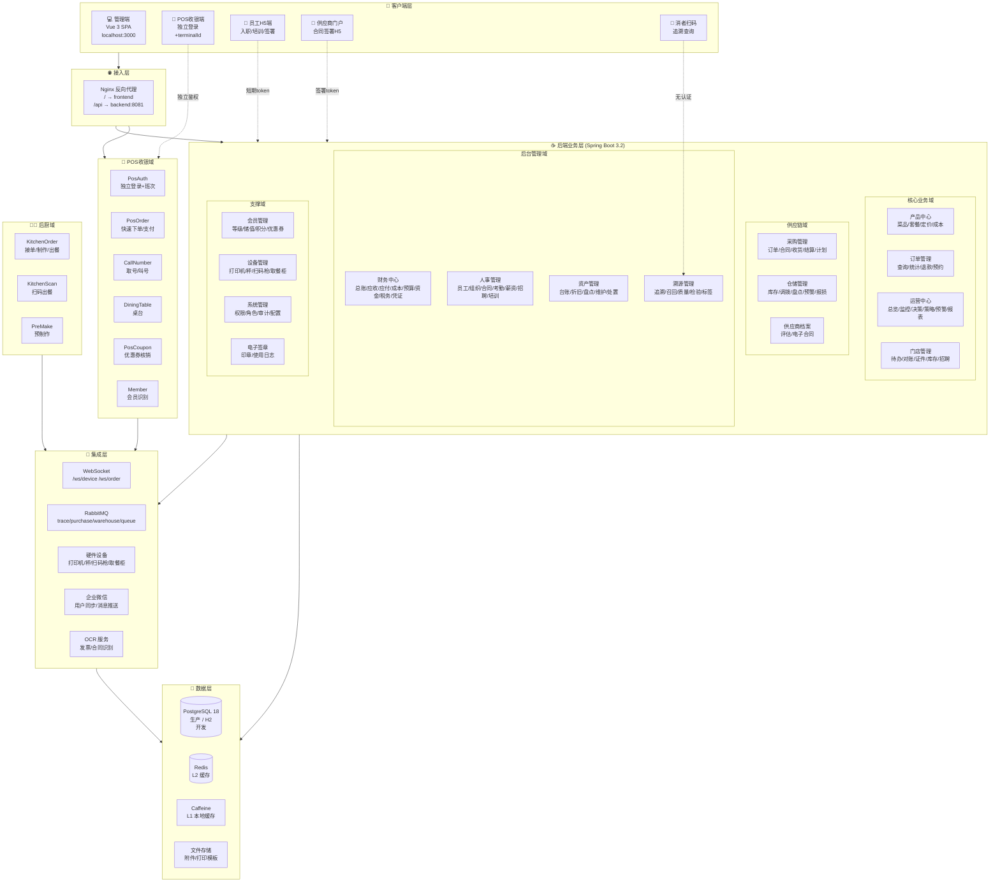

---

## 三、业务模块全量清单

### 3.1 管理端 16 个业务模块

| # | 模块 | 路径前缀 | 子菜单数 | 主要后端 Controller | 角色 |
|---|------|---------|---------|-------------------|------|
| 1 | 工作台 | `/home` | 1 | OperationsDashboardController | 所有角色 |
| 2 | 产品中心 | `/product/*` | 5 | FoodController、PricingController、ProductAnalysisController | admin/owner/ops_director |
| 3 | 订单管理 | `/order/*` | 4 | OrderNewController、OrderTrendsController、TableReservationNewController | admin/owner/ops_director/store_manager |
| 4 | 运营中心 | `/operations/*` | 7 | OperationsDashboardController、DecisionBoardController、LiveMonitorController、ReportConfigController | admin/owner/ops_director |
| 5 | 门店管理 | `/store-management/*` | 9 | StoreManagementTaskController、StoreManagementRecruitmentController、StoreManagementSettlementController、StoreInventoryController | store_manager/team_leader/owner/admin |
| 6 | 采购管理 | `/purchase/*` | 13 | PurchaseOrderController、PurchaseStockinController、PurchaseContractController、PurchaseRequestController、PurchaseSettlementController、PurchasePlanController、PurchaseArchiveController、MaterialRequestController、MaterialCategoryController、SupplierController、PurchaseLedgerController | admin/owner/ops_director/purchaser |
| 7 | 仓储管理 | `/warehouse/*` | 12 | InventoryController、WarehouseController、InventoryCheckController、InventoryTransferController、InventoryOutboundController、InventoryAdjustController、InventoryLossController、InventoryLocationController、InventoryWarningController、InventoryCategoryController、InventoryStatsController | admin/owner/warehouse_keeper |
| 8 | 会员管理 | `/marketing/*` | 6 | MarketingMemberController、MarketingAnalysisController、MemberLevelController、RechargeRecordController、RechargePlanController、RefundController | admin/owner/marketer |
| 9 | 财务中心 | `/finance/*` | 13 | RecordController、VoucherController、ReceivableController、TaxCalculationController、TransferTemplateController、SummaryTemplateController、SubjectController、StandardCostCardController | admin/owner/finance_director |
| 10 | 资产管理 | `/asset/*` | 8 | 资产相关 Controller | admin/owner/finance_director |
| 11 | 人事管理 | `/hr/*` | 21 | UserController、RoleController、PermissionController、SalaryController、RecruitmentRequirementController、ResumeController、InterviewController、TrainingController、HealthCertificateController、OverAgeWorkerController、KnowledgeBaseController、PositionController、PositionLevelController、JobLevelController、OrganizationChangeLogController | admin/owner/hr_director |
| 12 | 溯源管理 | `/traceability/*` | 10 | TraceCodeController、FoodTraceCodeController、MaterialTraceCodeController、SupplierTraceController、RecallController、QualityController、InspectionController、LabelTemplateController | admin/owner/quality_staff |
| 13 | 设备管理 | `/device/*` | 4 | HardwareDeviceController、WeighingDeviceController、ScanDeviceController、TakeoutLockerController、SdkPrinterController、LabelPrinterController、TTSController | admin/owner/device_admin |
| 14 | 电子签章 | `/seal/*` | 1 | SealController | admin/owner |
| 15 | 系统管理 | `/system/*` | 4 | PermissionController、PermissionTemplateController、UserPermissionOverrideController、OperationLogController、SysConfigController、SysSettingController、SysDictController | admin |
| 16 | 个人中心 | `/personal-center` | 1 | UserController (个人相关) | 所有角色 |

### 3.2 POS端独立模块（8 个 Controller）

| Controller | 路径 | 主要功能 |
|-----------|------|---------|
| PosAuthController | `/v1/pos/auth/*` | POS 独立登录、班次开始/结束 |
| PosController | `/v1/pos/orders/*` | 快速下单、支付、退款、交接班、叫号排队 |
| PosOrderController | `/v1/pos/*` | POS 订单详情查询 |
| PosApiController | `/v1/pos/api/*` | POS 通用 API |
| DiningTableController | `/v1/pos/tables/*` | 桌台管理 |
| CallNumberController | `/v1/pos/call-numbers/*` | 取号叫号 |
| PosCouponController | `/v1/pos/coupons/*` | 优惠券核销 |
| MemberController | `/v1/pos/members/*` | 会员识别、积分查询 |

### 3.3 后厨端模块

| Controller | 路径 | 主要功能 |
|-----------|------|---------|
| KitchenOrderController | `/v1/kitchen/orders/*` | 接单、开始制作、出餐、状态推送 |
| KitchenScanController | `/v1/kitchen/scan/*` | 扫码出餐、追溯码绑定 |
| KitchenNotifyController | `/v1/kitchen/notify/*` | 后厨通知 |
| PreMakeController | `/v1/kitchen/pre-make/*` | 预制作任务 |

### 3.4 H5 供应商端 / 员工端 APP

> **设计调整（2026-07-13）**：员工端定位从 H5 调整为 **APP**（技术选型暂未决定，先记录需求）；供应商合同签署保留 H5 形态。

#### 3.4.1 H5 供应商端（保留）

| Controller | 路径 | 主要功能 |
|-----------|------|---------|
| OnboardingInvitationController | `/onboarding/invitation/*` | 入职邀请链接 |
| OnboardingRecordController | `/onboarding/records/*` | 入职记录 |
| OnboardingArchiveController | `/onboarding/archives/*` | 入职档案 |
| MiniProgramController | `/h5/mini-program/*` | 小程序入口 |
| SupplierPortalController | `/supplier-portal/*` | 供应商合同签署 |

#### 3.4.2 员工端 APP（待实现，技术选型待定）

| 维度 | 需求 |
|------|------|
| **形态** | 原生 APP（非 H5） |
| **目标用户** | 门店员工（厨师、收银员、服务员）、店长 |
| **核心场景** | 接班/交接班、订单接单（厨师）、扫码出餐（厨师）、库存查询、考勤打卡、培训学习、薪资查询、排班查看 |
| **关键技术能力** | 推送通知（FCM/APNs/厂商通道）、扫码（摄像头）、离线缓存、定位（考勤）、生物识别登录 |
| **技术选型候选** | uni-app（推荐，与现有 Vue 栈一致）/ React Native / Flutter / 原生双端开发 — **待用户决策** |
| **后端接口复用** | 复用 `/v1/kitchen/*`、`/v1/pos/auth/*`、`/v1/employees/*`、`/v1/attendance/*` 等 |
| **新增接口需求** | APP 推送注册（`/v1/app/push/register`）、离线消息同步（`/v1/app/sync`）、APP 配置下发（`/v1/app/config`） |
| **认证方式** | 复用 JWT，但需要 APP 专用 token（含端标识 `client_type=app`） |
| **数据隔离** | 与管理端共用同一套数据，但接口层做端隔离（避免 APP 直接调用管理端接口） |

**待用户决策事项**：
1. 员工端 APP 的技术选型（uni-app / RN / Flutter / 原生）
2. APP 是否需要离线模式（厨师在厨房网络不稳定场景）
3. APP 推送服务的选型（自建推送 / 厂商推送 / 第三方推送）
4. APP 是否上架应用商店，还是企业证书分发

---

## 四、多端协同思维图

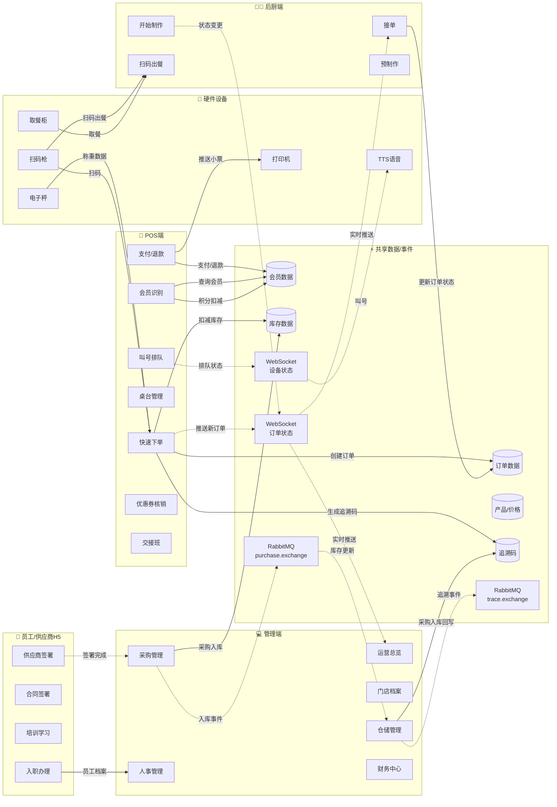

---

## 五、关键业务流程数据流向

### 5.1 POS 下单 → 后厨出餐 → 追溯码 生成（核心闭环）

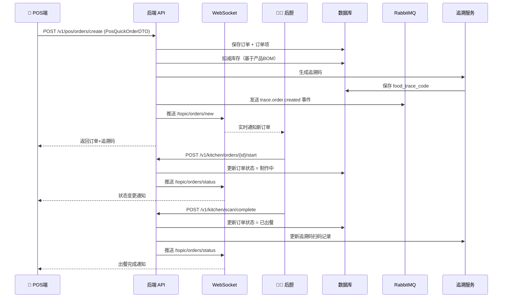

### 5.2 采购入库 → 库存更新 → 追溯链 生成

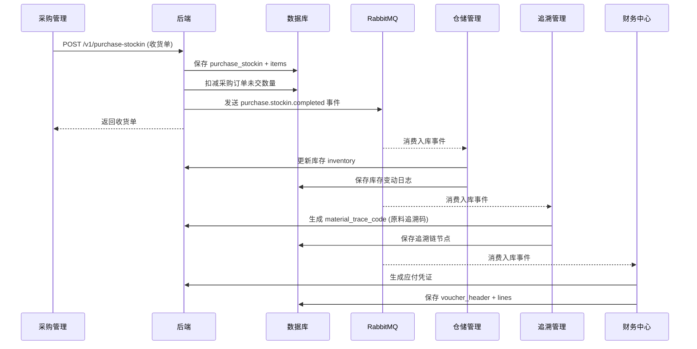

### 5.3 门店库存 ↔ 仓储库存 双向流通

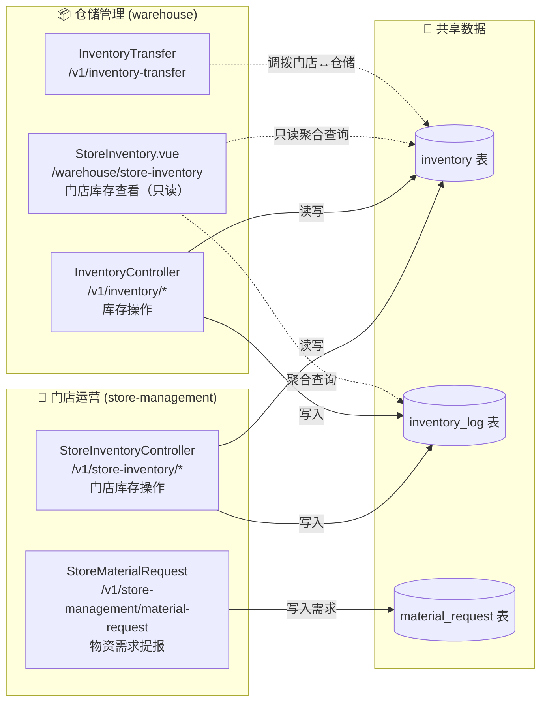

**关键设计原则**：
1. 门店库存与仓储库存共用 `inventory` 表
2. 仓储模块的"门店库存查看"是只读聚合视图，不写入
3. 门店运营模块的"门店库存"可写入（盘点、调整）
4. 门店库存 4 个"功能开发中"占位（盘点/要货/调整/报损）需对接到 `InventoryCheckController/InventoryAdjustController/InventoryLossController`

---

## 六、多模式适配矩阵

### 6.1 4 种模式 × 14 业务域可见性

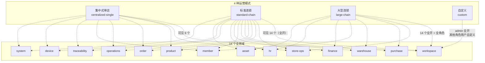

### 6.2 模式 × 角色 × 业务域 三维矩阵（详表）

| 模式 | 角色 | 可见域 | 备注 |
|------|------|--------|------|
| centralized-single | admin | workspace/store-ops/product/order/operations/member/traceability/device/system | 9 个核心域 |
| centralized-single | owner | 同 admin | 9 个核心域 |
| centralized-single | hr_director | workspace/hr | （hr 域被隐藏，矛盾见 §8.2） |
| centralized-single | finance_director | workspace | （finance 域被隐藏，矛盾见 §8.2） |
| centralized-single | ops_director | workspace/store-ops/order/operations | 4 个域 |
| centralized-single | employee | workspace | 仅工作台 |
| standard-chain | admin | 全部 14 个 | |
| standard-chain | owner | 全部 14 个 | |
| standard-chain | hr_director | workspace/hr | |
| standard-chain | finance_director | workspace/finance | |
| standard-chain | ops_director | workspace/store-ops/order/operations/purchase/warehouse | 6 个域 |
| standard-chain | employee | workspace | |
| large-chain | admin | 全部 14 个 | |
| large-chain | owner | 全部 14 个 | |
| large-chain | hr_director | workspace/hr | |
| large-chain | finance_director | workspace/finance/asset | 3 个域（多了 asset） |
| large-chain | ops_director | workspace/store-ops/order/operations/purchase/warehouse/member/traceability | 8 个域 |
| large-chain | employee | workspace | |
| custom | admin | 全部 14 个 | 其他角色需用户手动配置 |

### 6.3 模式适配实现机制

```mermaid
graph LR
    subgraph INIT["系统初始化"]
        I1[BaseDatabaseInitializer<br/>insertPermissionTemplates]
        I2[permission_templates 表<br/>4 条记录]
        I3[role_config JSON<br/>每种模式的角色-域映射]
    end

    subgraph RUNTIME["运行时"]
        R1[用户登录]
        R2[SecurityUser.getAuthorities<br/>展开为 AdminPermissions.ALL]
        R3[PermissionStore 加载<br/>用户角色+模式]
        R4[registerMenuGroup<br/>按模式可见性过滤菜单]
        R5[router beforeEach 守卫<br/>检查 meta.domain]
    end

    subgraph UI["前端 UI"]
        U1[菜单按 visibleRoles 过滤]
        U2[路由按 domain 检查]
        U3[页面元素按权限码控制]
    end

    INIT --> RUNTIME
    RUNTIME --> UI
```

---

## 七、跨模块协作机制

### 7.1 RabbitMQ 消息流

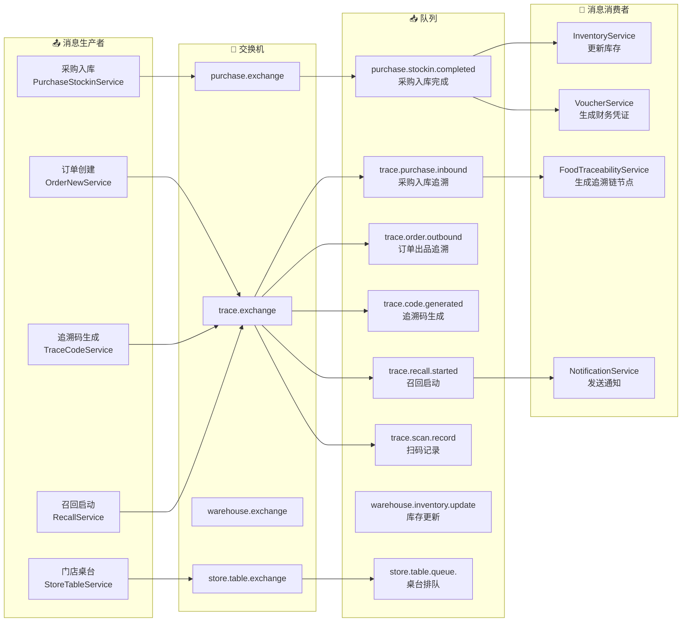

### 7.2 WebSocket 实时通信

| 端点 | 用途 | 推送主题 | 订阅者 |
|------|------|---------|--------|
| `/ws/device` | 设备状态 | `/topic/device/status` | 管理端、POS端 |
| `/ws/order` | 订单状态 | `/topic/orders/new`、`/topic/orders/status` | 后厨端、POS端、管理端 |

### 7.3 Service 间依赖关系（关键链路）

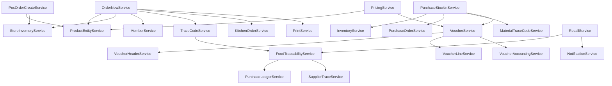

---

## 八、关键问题分析

### 8.1 点对点交互问题

#### 问题 P-01：门店库存 4 个"功能开发中"占位（已知）
- **现象**：门店运营模块"门店库存"页面的"库存盘点/批量要货/批量调整/批量报损"4 个按钮显示"功能开发中"
- **根因**：前端 `StoreInventory.vue` 的 `handleStockCheck/handleBatchMaterialRequest/handleBatchAdjust/handleBatchScrap` 4 个函数仅 `ElMessage.info('xxx功能开发中')`
- **影响**：门店运营人员无法在门店端直接进行库存操作，需要切换到仓储管理模块
- **建议方案**：
  - 方案 A1（最小改动）：将按钮改为引导跳转链接，跳转到 `/warehouse/check`、`/warehouse/adjust`、`/warehouse/inventory-loss` 等已有页面
  - 方案 A2（中等工作量）：直接调用 `InventoryCheckController/InventoryAdjustController/InventoryLossController` 的 API，在门店端实现简化版
  - 方案 A3（完整方案）：在 `StoreInventoryController` 中新增门店端专用接口，自动注入当前门店 storeId
- **详细方案**：见 [docs/design/store-ops-pending-features.md](./store-ops-pending-features.md)

#### 问题 P-02：集中式单店模式缺少"简洁采购入库"模块
- **现象**：集中式单店模式下 `purchase` 域被隐藏，门店无法进行采购入库
- **用户需求**：在集中式单店模式下，门店运营模块应拥有"采购收货入库"的简洁运行模块，库存与仓储模块保持同一大分类
- **建议方案**：
  - 方案 B1：在 `store-management` 模块下新增 `/store-management/quick-stockin` 路由，对接 `QuickStockInController`（已存在）
  - 方案 B2：在 `store-management` 模块下新增"采购收货"子菜单，对接 `PurchaseStockinController` 的简化版接口
- **详细方案**：见 [docs/design/store-ops-pending-features.md](./store-ops-pending-features.md)

### 8.2 跨模块协作问题

#### 问题 C-01：集中式单店模式下 hr_director/finance_director 角色配置矛盾
- **现象**：`centralized-single` 模式下，`hr_director` 被分配 `workspace/hr` 两个域，但 `hr` 域在该模式下对 admin 不可见（被隐藏）
- **根因**：`BaseDatabaseInitializer.insertPermissionTemplates()` 中 `centralizedSingle` 字符串的 role_config 为 hr_director 分配了 hr 域，但 admin 角色的可见域列表中不含 hr
- **影响**：admin 看不到 hr 模块，但 hr_director 角色被分配了 hr 域 — 配置语义矛盾
- **建议修复**：
  - 方案 1：在集中式单店模式下，hr_director/finance_director 角色的可见域改为 `workspace`（仅工作台），与 employee 一致
  - 方案 2：在集中式单店模式下，admin 也开放 hr/finance 域，但限制只读权限
- **优先级**：中（影响模式语义一致性）

#### 问题 C-02：菜品管理新增/编辑关联采购入库原料功能未完整对接
- **现象**：用户描述"菜品管理/套餐管理中的新增、编辑功能对话框的明细是可以关联到采购入库的原料"
- **当前实现**：
  - `FoodManagement.vue` 的 `BomReportDialog` 组件已存在 BOM 关联逻辑
  - `DishCombo.vue` 的 `DishComboDialog` 已支持关联已有菜品
- **问题**：需要确认 BOM 关联的原料是否来自 `purchase_archive`（采购入库的原料档案）
- **建议**：审查 [FoodManagement.vue](file:///p:/my-new-project/frontend/src/views/product/FoodManagement.vue) 中的 `BomReportDialog` 与 [PurchaseArchiveController](file:///p:/my-new-project/backend/src/main/java/com/foodtraceability/controller/purchase/PurchaseArchiveController.java) 的对接情况

#### 问题 C-03：门店库存与仓储库存的双向流通路径不清晰
- **现象**：用户描述"门店的库存既可以在统筹数据中查看，门店的库存也可以根据入库的数据来拉取成本等数据，使得数据是双向流通"
- **当前实现**：
  - 门店库存操作：`/store-management/store-inventory` → `StoreInventoryController` → `inventory` 表
  - 仓储门店库存查看：`/warehouse/store-inventory` → `InventoryController` → `inventory` 表（只读聚合）
  - 成本拉取：`PricingService` 通过 `ProductEntityService` 获取成本价
- **潜在问题**：
  - 门店库存和仓储库存共用 `inventory` 表，但缺少 `store_id` 隔离字段（需验证）
  - 门店库存的成本数据如何回写到菜品定价的成本价（`ProductPricingHistory.costPrice`）
- **建议**：审查 `inventory` 表结构，确认是否有 `store_id` 字段做门店隔离

### 8.3 多模式适配问题

#### 问题 M-01：模式切换未提供入口
- **现象**：系统初始化时插入 4 种权限模板，但前端未提供模式切换/查看入口
- **影响**：用户无法在前端切换模式，需要直接修改数据库
- **建议**：在 `权限中心` 中新增"模式切换"Tab，对接 `PermissionTemplateController`

#### 问题 M-02：模式与组织架构（Department.type）未联动
- **现象**：
  - `Department.type` 支持 `company/department/store/team/office/group`
  - `Store.store_type` 支持 `single/chain`
  - 但模式切换时未自动设置组织架构的 type
- **影响**：用户选择"集中式单店模式"后，组织架构中可能仍存在多个 store 节点
- **建议**：在模式切换时校验组织架构，或反向根据组织架构自动推荐模式

#### 问题 M-03：员工端入口缺失
- **现象**：用户提到"员工端等辅助联动"，但前端 `views/` 下未发现独立的员工端页面
- **当前实现**：
  - `/portal/sign` 是供应商签署 H5 页面
  - `/h5/mini-program/*` 是小程序入口
  - 员工相关功能（入职、培训、合同签署）通过 H5 链接进入
- **建议**：明确"员工端"的定义，是独立 SPA 还是 H5 子页面

### 8.4 数据一致性问题

#### 问题 D-01：菜单显示与权限域不一致
- **现象**：菜单按 `visibleRoles` 过滤，路由按 `meta.domain` 检查，两套机制可能不一致
- **影响**：某些角色可能在菜单中看不到但通过 URL 能访问
- **建议**：审查 `guards.ts` 中的域权限检查逻辑，确保与菜单可见性一致

#### 问题 D-02：权限命名混用 `:read` 和 `:view`
- **现象**：项目中 `hr:position:read`（已修复为 `:view`）和 `system:permission:read`（在 AdminPermissions.ALL 中存在）混用
- **影响**：可能引发类似的 401 错误（如本次修复的 PositionLevelController 问题）
- **建议**：进行全项目权限命名一致性审计，统一使用 `:view`

### 8.5 "系统繁忙"问题诊断框架

> **核心发现**：`GlobalExceptionHandler` 将 `NullPointerException`、`RuntimeException`、`Exception` 三类异常统一转换为 `"系统繁忙，请稍后重试（追踪ID：xxx，请联系运维排查）"`，无法区分错误类型。任何未显式 catch 的异常都会变成"系统繁忙"。

#### 8.5.1 错误处理机制现状

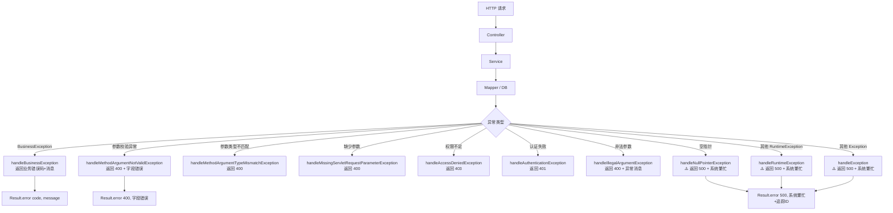

**关键文件**：[GlobalExceptionHandler.java](file:///p:/my-new-project/backend/src/main/java/com/foodtraceability/common/exception/GlobalExceptionHandler.java)

#### 8.5.2 已知"系统繁忙"案例（已修复）

| 案例 | 追踪ID | 根因 | 修复方案 |
|------|--------|------|---------|
| 部门删除 500 | - | `employees.department_id` (VARCHAR) 与 `QueryWrapper.eq("department_id", Long)` 类型不匹配 | 改用自定义 @Select + jdbcType=VARCHAR |
| 新增顶级组织 | - | `Department.status` 上的 `@NotNull` 在 @Valid 时触发，但前端未传 | 移除 @NotNull，由 Service 层默认值兜底 |
| 岗位管理页面 | eaeae0509a04 | `PositionMapper` SQL 中 `d.id` 应为 `d.department_id` | 修复 3 处 SQL 字段名 |
| "按职级"切换 | 46895bfa85d8 | `@PreAuthorize` 使用 `hr:position:read`，但 AdminPermissions.ALL 只有 `hr:position:view` | 4 处权限码改为 `hr:position:view` |
| 菜品定价调价 | f212c9ed5f67 | `WebConfig` 手动 new ObjectMapper() 覆盖默认配置，未知字段反序列化失败 + DTO 缺少 productName 字段 | 显式 disable FAIL_ON_UNKNOWN_PROPERTIES + DTO 添加字段 |

#### 8.5.3 全量点对点审计范围

针对"系统繁忙"问题的全量审计分为 6 类：

| 审计类别 | 已知风险点 | 审计目标 | 优先级 |
|---------|----------|---------|--------|
| **A. 类型不匹配** | QueryWrapper.eq 中字段类型与参数类型不匹配 | 全量检查所有 Service 中使用 QueryWrapper 的位置 | P0 |
| **B. 权限命名一致性** | `:read` 与 `:view` 混用 | 全量检查所有 @PreAuthorize 注解 | P0 |
| **C. NPE 风险** | `.get()` 不判空、Optional 误用、链式调用未判空 | 全量检查所有 Controller 和 Service | P0 |
| **D. 事务边界** | Service 方法的事务注解、自调用导致事务失效 | 全量检查所有 @Transactional 方法 | P1 |
| **E. Jackson 配置** | 手动 new ObjectMapper() 覆盖默认配置 | 全量检查所有 ObjectMapper 实例化位置 | P1 |
| **F. 数据库字段类型** | VARCHAR 字段与字面量比较、JSON 字段反序列化 | 全量检查 entity 与数据库 schema | P2 |

#### 8.5.4 异常处理改造方向

**方向1：细化异常分类（推荐）**

将 `GlobalExceptionHandler` 中的 `handleRuntimeException` 拆分为多个子类型：

```java
@ExceptionHandler(org.springframework.dao.DataAccessException.class)
public Result<?> handleDataAccessException(DataAccessException e) {
    String traceId = generateTraceId();
    logServerError(e, traceId, "DataAccessException");
    // 数据库异常：可能是类型不匹配、约束违反等
    return Result.error(500, "数据访问异常（追踪ID：" + traceId + "）");
}

@ExceptionHandler(org.springframework.http.converter.HttpMessageNotReadableException.class)
public Result<?> handleHttpMessageNotReadableException(HttpMessageNotReadableException e) {
    String traceId = generateTraceId();
    logServerError(e, traceId, "HttpMessageNotReadableException");
    // JSON 反序列化失败
    return Result.error(400, "请求体格式错误（追踪ID：" + traceId + "）");
}

@ExceptionHandler(java.util.NoSuchElementException.class)
public Result<?> handleNoSuchElementException(NoSuchElementException e) {
    String traceId = generateTraceId();
    logServerError(e, traceId, "NoSuchElementException");
    // Optional.get() 未判空
    return Result.error(404, "资源不存在（追踪ID：" + traceId + "）");
}
```

**方向2：增强异常日志（最小改动）**

保留"系统繁忙"统一文案，但日志中输出：
- 完整堆栈
- 请求方法 + URI + 参数
- 用户上下文（用户ID、角色、门店ID）
- 异常类型 + 异常消息

便于运维根据追踪ID快速定位。**当前实现已具备此能力**（见 `logServerError` 方法）。

#### 8.5.5 全量审计报告（独立文档）

详细的点对点审计结果将记录在独立文档中：
- [system-error-audit.md](./system-error-audit.md) — 全量点对点审计报告（待生成）

审计将逐个检查所有 Controller 的所有接口，识别：
- 每个接口的入参类型与数据库字段类型是否匹配
- 每个接口的 @PreAuthorize 权限码是否在 AdminPermissions.ALL 中存在
- 每个接口的 Service 调用链中是否存在 NPE 风险
- 每个接口的事务边界是否正确

#### 8.5.6 用户原则约束

> **重要约束**：用户明确要求"不要注入数据这种破坏业务逻辑的行为来乐观的完成任务，需要通过前端来完成所有操作，只有有问题的情况下再来修改文件"。

这意味着：
1. **验证方式**：所有 BUG 修复必须通过前端 UI 操作验证，不能直接调用后端 API 或修改数据库
2. **修改原则**：仅在确实存在问题时才修改代码文件，不做预防性重构
3. **数据生成**：不通过 SQL 注入测试数据，必须通过前端表单提交

---

## 九、部署上线检查清单

### 9.1 上线前必须修复（P0）

- [ ] **问题 P-01**：门店库存 4 个"功能开发中"占位 — 选择方案 A1/A2/A3 之一实施
- [ ] **问题 P-02**：集中式单店模式简洁采购入库 — 选择方案 B1/B2 之一实施
- [ ] **问题 C-01**：集中式单店模式下 hr_director/finance_director 角色配置矛盾
- [ ] 验证 `inventory` 表是否有 `store_id` 字段做门店隔离（问题 C-03）

### 9.2 上线前建议修复（P1）

- [ ] **问题 C-02**：审查菜品 BOM 与采购入库原料的对接完整性
- [ ] **问题 M-01**：在权限中心新增"模式切换"Tab
- [ ] **问题 M-03**：明确员工端定义并实现
- [ ] **问题 D-01**：审查菜单可见性与路由域权限一致性
- [ ] **问题 D-02**：全项目权限命名一致性审计

### 9.3 已验证可用功能（P2）

- [x] 4 种权限模板已正确初始化到 `permission_templates` 表
- [x] POS 端独立认证 + 班次管理
- [x] WebSocket 订单状态实时推送
- [x] RabbitMQ 跨模块消息流（trace.exchange + purchase.exchange）
- [x] 硬件设备联动（打印机/电子秤/扫码枪/取餐柜/TTS）
- [x] 供应商门户 H5 签署
- [x] 员工 H5 入职办理

### 9.4 部署配置要点

| 配置项 | 开发环境 | 生产环境 | 备注 |
|--------|---------|---------|------|
| 数据库 | H2（MODE=PostgreSQL） | PostgreSQL 18 | 必须切换 |
| 缓存 | Caffeine 单机 | Redis 哨兵集群 | 必须配置 Redis |
| 消息队列 | NoOpRabbitConfig | RabbitMQ 镜像队列 | 必须配置 RabbitMQ |
| 文件存储 | 本地 | Nginx 静态资源 / 对象存储 | 需要规划 |
| WebSocket | 单机 | Nginx sticky session / Redis | 多实例需要处理 |
| JWT 密钥 | application.yml | 环境变量 / Vault | 必须更换 |
| 跨域 | `*` | 指定域名 | 必须收紧 |

---

## 十、思维图汇总（一页全览）

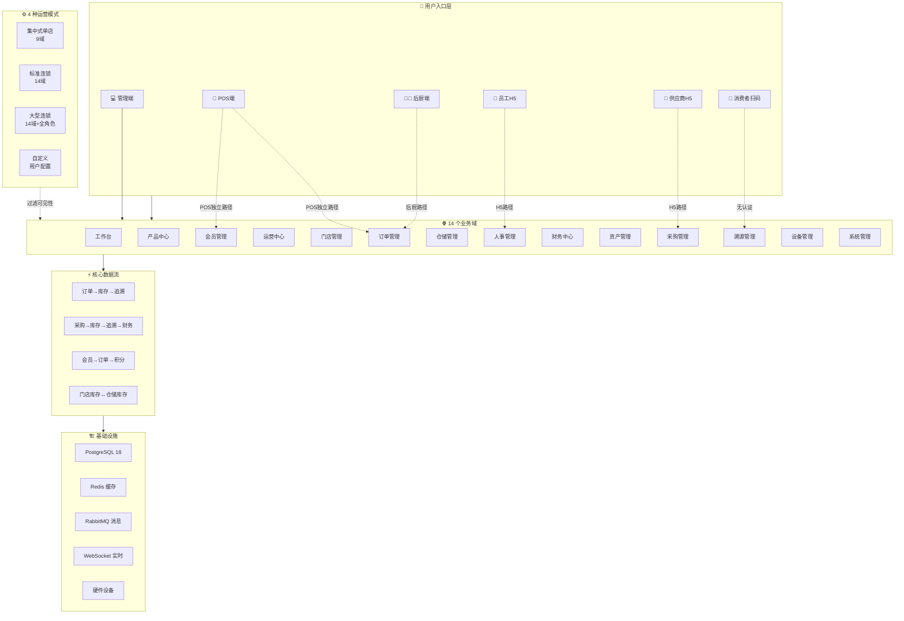

---

## 十一、待审查事项与下一步建议

### 11.1 待用户确认事项

1. **门店库存 4 个占位功能**：选择方案 A1（引导跳转，最小改动）/ A2（直接调用仓储 API）/ A3（门店端独立实现）？
2. **集中式单店模式简洁采购入库**：选择方案 B1（QuickStockInController）/ B2（简化版 PurchaseStockinController）？
3. **员工端定义**：是独立 SPA 还是 H5 子页面集合？
4. **门店库存与仓储库存隔离**：是否在 `inventory` 表新增 `store_id` 字段？

### 11.2 建议的实施优先级

| 优先级 | 任务 | 预估工作量 | 风险等级 |
|--------|------|----------|---------|
| P0 | 修复集中式单店模式 hr/finance_director 角色配置矛盾 | 1 小时 | 低 |
| P0 | 验证 inventory 表 store_id 字段 | 30 分钟 | 中 |
| P1 | 门店库存 4 个占位功能（方案 A1） | 2 小时 | 低 |
| P1 | 集中式单店模式简洁采购入库（方案 B1） | 4 小时 | 中 |
| P1 | 权限命名一致性审计 | 4 小时 | 低 |
| P2 | 权限中心新增"模式切换"Tab | 8 小时 | 中 |
| P2 | 明确员工端定位并实现 | 16+ 小时 | 高 |

### 11.3 文档维护

- 本文档应随系统迭代持续更新
- 每次新增/删除模块时同步更新 §3 业务模块清单
- 每次新增跨模块消息流时同步更新 §7.1 RabbitMQ 消息流图
- 模式配置变更时同步更新 §6 多模式适配矩阵

---

## 附录 A：相关代码索引

### A.1 后端关键文件

| 类别 | 文件路径 |
|------|---------|
| 权限模板初始化 | [BaseDatabaseInitializer.java](file:///p:/my-new-project/backend/src/main/java/com/foodtraceability/config/initializer/BaseDatabaseInitializer.java) |
| 权限模板实体 | [PermissionTemplate.java](file:///p:/my-new-project/backend/src/main/java/com/foodtraceability/entity/PermissionTemplate.java) |
| 权限模板 Controller | [PermissionTemplateController.java](file:///p:/my-new-project/backend/src/main/java/com/foodtraceability/controller/PermissionTemplateController.java) |
| 管理员权限常量 | [AdminPermissions.java](file:///p:/my-new-project/backend/src/main/java/com/foodtraceability/security/constants/AdminPermissions.java) |
| 安全用户模型 | [SecurityUser.java](file:///p:/my-new-project/backend/src/main/java/com/foodtraceability/security/model/SecurityUser.java) |
| RabbitMQ 追溯配置 | [TraceRabbitMQConfig.java](file:///p:/my-new-project/backend/src/main/java/com/foodtraceability/config/TraceRabbitMQConfig.java) |
| RabbitMQ 采购配置 | [PurchaseRabbitConfig.java](file:///p:/my-new-project/backend/src/main/java/com/foodtraceability/config/PurchaseRabbitConfig.java) |
| WebSocket 设备配置 | [DeviceWebSocketConfig.java](file:///p:/my-new-project/backend/src/main/java/com/foodtraceability/config/device/DeviceWebSocketConfig.java) |
| WebSocket 订单推送 | [OrderWebSocketController.java](file:///p:/my-new-project/backend/src/main/java/com/foodtraceability/controller/websocket/OrderWebSocketController.java) |
| POS 端认证 | [PosAuthController.java](file:///p:/my-new-project/backend/src/main/java/com/foodtraceability/controller/pos/PosAuthController.java) |
| POS 端核心 | [PosController.java](file:///p:/my-new-project/backend/src/main/java/com/foodtraceability/controller/pos/PosController.java) |
| 后厨订单 | [KitchenOrderController.java](file:///p:/my-new-project/backend/src/main/java/com/foodtraceability/controller/kitchen/KitchenOrderController.java) |
| 门店库存 | [StoreInventoryController.java](file:///p:/my-new-project/backend/src/main/java/com/foodtraceability/controller/StoreInventoryController.java) |
| 快速入库 | [QuickStockInController.java](file:///p:/my-new-project/backend/src/main/java/com/foodtraceability/controller/QuickStockInController.java) |

### A.2 前端关键文件

| 类别 | 文件路径 |
|------|---------|
| 路由配置 | [router/index.ts](file:///p:/my-new-project/frontend/src/router/index.ts) |
| 路由守卫 | [router/guards.ts](file:///p:/my-new-project/frontend/src/router/guards.ts) |
| 模块注册入口 | [modules/index.ts](file:///p:/my-new-project/frontend/src/modules/index.ts) |
| 权限 Store | [stores/permission.ts](file:///p:/my-new-project/frontend/src/stores/permission.ts) |
| 门店管理菜单 | [modules/store-management/menu.ts](file:///p:/my-new-project/frontend/src/modules/store-management/menu.ts) |
| 运营中心菜单 | [modules/operations/menu.ts](file:///p:/my-new-project/frontend/src/modules/operations/menu.ts) |
| 工作台菜单 | [modules/workspace/menu.ts](file:///p:/my-new-project/frontend/src/modules/workspace/menu.ts) |
| 门店库存页面 | [views/store-ops/StoreInventory.vue](file:///p:/my-new-project/frontend/src/views/store-ops/StoreInventory.vue) |
| 仓储门店库存查看 | [views/warehouse/StoreInventory.vue](file:///p:/my-new-project/frontend/src/views/warehouse/StoreInventory.vue) |

### A.3 设计文档

| 文档 | 路径 |
|------|------|
| 门店运营待落地功能 | [docs/design/store-ops-pending-features.md](./store-ops-pending-features.md) |
| 项目规范（总览） | [.trae/rules/project_rules.md](file:///p:/my-new-project/.trae/rules/project_rules.md) |
| 系统架构规范 | [docs/spec/04-系统架构.md](file:///p:/my-new-project/docs/spec/04-系统架构.md) |
| 数据库设计规范 | [docs/spec/05-数据库设计.md](file:///p:/my-new-project/docs/spec/05-数据库设计.md) |
| API 接口设计规范 | [docs/spec/06-API接口设计.md](file:///p:/my-new-project/docs/spec/06-API接口设计.md) |
| 前端页面设计 | [docs/spec/07-前端页面设计.md](file:///p:/my-new-project/docs/spec/07-前端页面设计.md) |
| 认证与安全 | [docs/spec/09-认证与安全.md](file:///p:/my-new-project/docs/spec/09-认证与安全.md) |

---

**文档结束**

请审查本文档并反馈修改意见。重点关注：
1. §8 关键问题分析中的 P0/P1 问题是否需要立即修复
2. §11.1 待确认事项的决策
3. 思维图中是否有遗漏的模块或数据流
