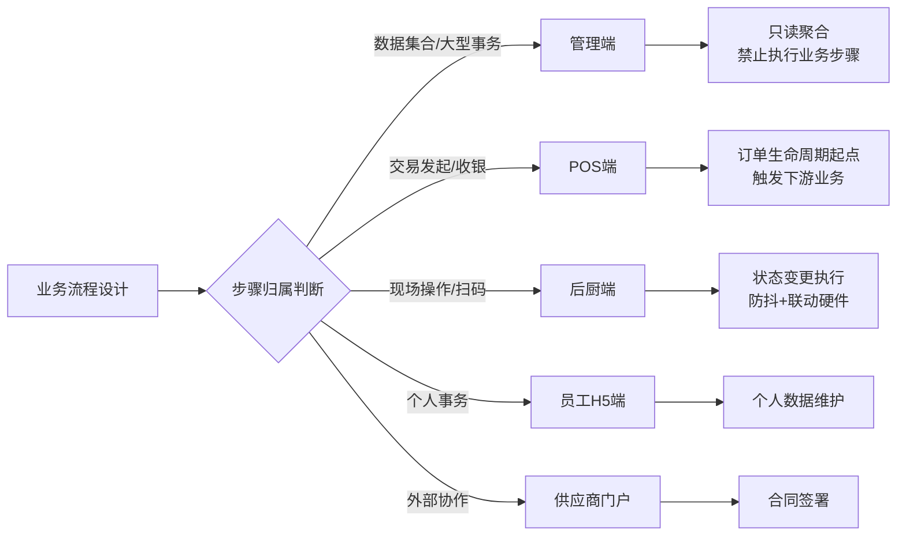
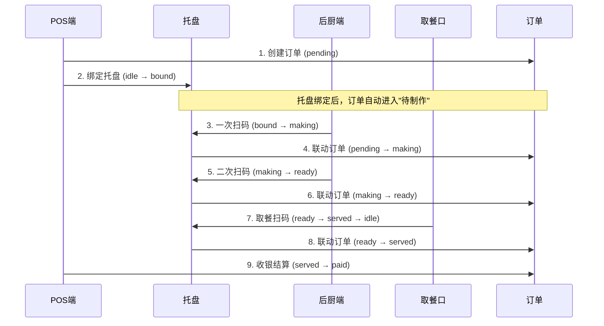

# 系统端权责分离规范

> **文档目的**：明确各业务端的权责边界，防止端越权操作，特别是托盘状态机这类需要严格按业务流程执行的端协作场景。
> **核心原则**：每个业务步骤由**唯一**的端发起，其他端只能查看结果或参与协作，禁止跨端执行业务流程的关键状态变更。
> **生成时间**：2026-07-13
> **审查状态**：待审查

---

## 一、端权责总览

### 1.1 5 端入口定义

| 端 | 入口路径 | 认证方式 | 主要使用者 | 当前实现状态 |
|----|---------|---------|----------|------------|
| 管理端 | `/`（前端 SPA） | JWT (admin/manager/director) | 老板、运营总监、HR、财务、仓管、店长 | ✅ 已实现（100+ 路由） |
| POS收银端 | `/v1/pos/auth/login`（后端独立认证） | JWT + terminalId | 收银员 | ❌ 前端 UI 未实现，后端 API 部分就绪 |
| 后厨端 | `/v1/tray/scan-kitchen-in`、`/scan-kitchen-out` | JWT + scanDeviceCode | 厨师、出餐员 | ❌ 前端 UI 未实现，后端 API 已就绪 |
| 员工 H5 端 | `/portal/sign`、`/h5/*` | 短期 token | 员工入职、培训、签署 | ⚠️ 部分实现 |
| 供应商门户 | `/portal/sign` | 签署链接 token | 供应商 | ⚠️ 部分实现 |

### 1.2 端权责核心原则



### 1.3 端越权禁止清单

| 端 | 禁止行为 | 替代方案 |
|----|---------|---------|
| 管理端 | ❌ 直接执行订单状态变更（绑定托盘、出餐确认） | 仅查看订单列表/统计/退款审批 |
| 管理端 | ❌ 直接修改托盘状态机（idle→bound→making→ready） | 仅查看托盘统计数据 |
| 管理端 | ❌ 直接调用 `/v1/tray/scan-kitchen-in` 或 `scan-kitchen-out` | 这些 API 由后厨端扫码设备触发 |
| POS 端 | ❌ 直接修改订单为"制作中"或"出餐完成" | 通过托盘绑定间接触发后厨流程 |
| 后厨端 | ❌ 创建订单、收银结算 | 仅通过扫码改变托盘状态 |
| 员工 H5 端 | ❌ 修改他人数据、查看敏感信息 | 仅维护个人档案 |

---

## 二、托盘状态机端权责矩阵（核心）

### 2.1 托盘 5 状态机定义

```
                          POS端                  后厨端              后厨端              取餐口
                          绑定订单              一次扫码            二次扫码            确认出餐
                           ↓                     ↓                  ↓                  ↓
  ┌─────┐  bind-order  ┌──────┐  scan-kitchen-in  ┌─────┐  scan-kitchen-out  ┌──────┐  scan-serve  ┌──────┐
  │ IDLE│ ──────────→  │ BOUND│ ──────────────→ │MAKING│ ───────────────→ │ READY│ ──────────→ │SERVED│
  └─────┘              └──────┘                  └─────┘                   └──────┘              └──────┘
     ↑                      ↓                       ↓                         ↓                     ↓
     │                  释放托盘                 防抖≥3s                   防抖≥5s              自动归零
     │                  （异常）              联动摄像头+YOLO            联动摄像头+YOLO          ↓
     │                                                                          ┌─────────┐
     └──────────────────────────────────────────────────────────────────────│ CLEANING│
                                                                              └─────────┘
```

### 2.2 托盘状态变更端权责表（强约束）

| 状态变更 | API 端点 | 唯一执行端 | 防抖时间 | 联动硬件 | 管理端权限 |
|---------|---------|----------|---------|---------|----------|
| `idle → bound` | `POST /v1/tray/bind-order` | **POS 端** | - | - | ❌ 禁止 |
| `bound → making` | `POST /v1/tray/scan-kitchen-in` | **后厨端**（一次扫码） | ≥3s | 扫码枪 | ❌ 禁止 |
| `making → ready` | `POST /v1/tray/scan-kitchen-out` | **后厨端**（二次扫码） | ≥5s | 扫码枪+摄像头+YOLO | ❌ 禁止 |
| `ready → served → idle` | `POST /v1/tray/scan-serve` | **取餐口** | ≥2s | 扫码枪 | ❌ 禁止 |
| `served → cleaning` | `POST /v1/tray/start-cleaning` | **清洁工位** | - | - | ⚠️ 仅查看 |
| `cleaning → idle` | `POST /v1/tray/finish-cleaning` | **清洁工位** | - | - | ⚠️ 仅查看 |
| `* → idle`（异常释放） | `POST /v1/tray/release` | 管理端（异常处理） | - | - | ✅ 允许（仅异常场景） |

### 2.3 管理端的托盘权责（仅查询/聚合）

管理端**仅有以下只读权限**：

| 接口 | 用途 |
|------|------|
| `GET /v1/tray/list` | 查看所有托盘（用于托盘档案管理） |
| `GET /v1/tray/idle` | 查看空闲托盘（用于托盘调度参考） |
| `GET /v1/tray/stats` | 查看 5 状态机统计（运营大屏） |
| `GET /v1/tray/{trayCode}` | 查询托盘详情（异常排查） |

**管理端禁止的写操作**（由 POS/后厨端执行）：
- ❌ `POST /v1/tray/bind-order`（POS 端职责）
- ❌ `POST /v1/tray/scan-kitchen-in`（后厨端职责）
- ❌ `POST /v1/tray/scan-kitchen-out`（后厨端职责）
- ❌ `POST /v1/tray/scan-serve`（取餐口职责）
- ❌ `POST /v1/tray/start-cleaning`、`finish-cleaning`（清洁工位职责）

**例外**：`POST /v1/tray/release` 允许管理端调用，用于处理异常托盘（如损坏、丢失、被卡住等）。

### 2.4 防抖机制（防止误触/扫码抖动）

| 扫码动作 | 最小间隔 | 业务理由 |
|---------|---------|---------|
| 后厨一次扫码（bound → making） | ≥3s | 防止同一托盘重复触发"开始制作" |
| 后厨二次扫码（making → ready） | ≥5s | 防止厨师未完成制作就提前出餐，需配合摄像头+YOLO 视觉复核 |
| 取餐口确认出餐（ready → served） | ≥2s | 防止取餐员连续误触 |

**实现位置**：[TrayServiceImpl.scanKitchenIn()](file:///p:/my-new-project/backend/src/main/java/com/foodtraceability/service/impl/TrayServiceImpl.java) 内通过 `lastScanTime` 字段比对。

---

## 三、订单状态机端权责矩阵

### 3.1 订单状态机定义

```
   POS端创建订单        后厨端开始制作        后厨端出餐完成       取餐口确认         POS端结算
       ↓                  ↓                    ↓                  ↓                ↓
  ┌─────────┐         ┌─────────┐         ┌─────────┐        ┌─────────┐    ┌─────────┐
  │ PENDING │ ──────→ │ MAKING  │ ──────→ │ READY   │ ─────→ │ SERVED  │ ─→│ PAID    │
  └─────────┘         └─────────┘         └─────────┘        └─────────┘    └─────────┘
       ↓                  ↑                    ↑                  ↑
   通过托盘            托盘 idle→bound       托盘 bound→making   托盘 making→ready
   绑定触发            （bind-order）       （scan-kitchen-in） （scan-kitchen-out）
```

### 3.2 订单状态变更端权责表

| 状态变更 | 触发方式 | 唯一执行端 | 备注 |
|---------|---------|----------|------|
| `→ pending`（创建） | `POST /v1/orders` | **POS 端** | 同时调用 `bind-order` 绑定托盘 |
| `pending → making` | 托盘 `bound → making` 联动 | **后厨端**（通过托盘扫码） | 不直接修改订单状态 |
| `making → ready` | 托盘 `making → ready` 联动 | **后厨端**（通过托盘扫码） | 不直接修改订单状态 |
| `ready → served` | 托盘 `ready → served` 联动 | **取餐口** | 不直接修改订单状态 |
| `served → paid` | `POST /v1/orders/{id}/pay` | **POS 端** | 收银结算 |
| `* → refunded` | `POST /v1/orders/{id}/refund` | **管理端**（审批后） | 退款需审批 |

### 3.3 关键原则：托盘是订单状态的承载物

> **核心设计**：托盘不是独立的实体，而是订单状态的**承载物**。订单状态变更通过托盘扫码间接触发，而不是直接调用订单状态修改 API。



---

## 四、当前项目实现状态审计

### 4.1 端实现完整度

| 端 | 前端 UI | 后端 API | 集成测试 | 缺口 |
|----|---------|---------|---------|------|
| 管理端 | ✅ 100+ 路由 | ✅ 200+ Controller | ✅ 已验证 | 无 |
| POS 端 | ❌ 未实现 | ⚠️ 部分就绪（OrderNewController、SalesOrderController） | ❌ 未测试 | 前端 UI、独立认证流程 |
| 后厨端 | ❌ 未实现 | ✅ TrayController 完整 | ❌ 未测试 | 前端 UI、扫码设备对接 |
| 员工 H5 端 | ⚠️ 部分实现 | ⚠️ 部分就绪 | ❌ 未测试 | 入职/培训流程 |
| 供应商门户 | ⚠️ 部分实现 | ⚠️ 部分就绪 | ❌ 未测试 | 合同签署 H5 |

### 4.2 已就绪的后厨端 API（等待前端 UI 对接）

以下 API 已在后端 [TrayController.java](file:///p:/my-new-project/backend/src/main/java/com/foodtraceability/controller/TrayController.java) 实现完毕，等待后厨端前端 UI 接入：

| API | 用途 | 端权责 |
|-----|------|--------|
| `POST /v1/tray/scan-kitchen-in` | 后厨一次扫码 | 后厨端专属 |
| `POST /v1/tray/scan-kitchen-out` | 后厨二次扫码 | 后厨端专属 |
| `POST /v1/tray/scan-serve` | 取餐口确认 | 取餐口专属 |

### 4.3 缺失的前端页面（需补齐）

| 页面 | 路径建议 | 主要功能 | 优先级 |
|------|---------|---------|--------|
| 后厨大屏 | `/kitchen/dashboard` | 显示当前制作中的订单+托盘 | P0 |
| 后厨扫码页 | `/kitchen/scan` | 输入托盘码触发一次/二次扫码 | P0 |
| 取餐口扫码页 | `/counter/scan` | 输入托盘码确认出餐 | P0 |
| 托盘档案管理 | `/asset/tray` | 管理托盘基础信息（CRUD） | P1 |
| 托盘运营大屏 | `/operations/tray-monitor` | 5 状态机实时统计 | P1 |
| POS 收银台 | `/pos/cashier` | 创建订单+绑定托盘+结算 | P0 |

---

## 五、设计原则与防越权实施

### 5.1 后端 API 防越权设计

#### 5.1.1 通过角色限制（已有机制）

```java
@PostMapping("/scan-kitchen-in")
@PreAuthorize("hasAuthority('kitchen:scan:in') or hasAuthority('*')")  // 后厨端角色
@Operation(summary = "后厨一次扫码（托盘 bound → making，防抖≥3s）")
public Result<Tray> scanKitchenIn(...) { ... }
```

#### 5.1.2 通过 terminalId 限制（待实现）

POS 端和后厨端登录时携带 `terminalId`，后端校验：
- POS 端 terminalId 类型 = `POS`
- 后厨端 terminalId 类型 = `KITCHEN_DISPLAY`
- 取餐口 terminalId 类型 = `COUNTER_DISPLAY`

#### 5.1.3 通过扫码设备 ID 限制（待实现）

后厨端 API 强制要求 `scanDeviceCode`，校验：
- 扫码设备必须登记为"后厨用途"
- 扫码设备所属门店必须与托盘门店一致

### 5.2 前端 UI 防越权设计

#### 5.2.1 管理端菜单只读

管理端托盘相关页面**只显示统计数据和列表**，不提供"扫码"、"绑定订单"按钮：

```vue
<!-- ✅ 管理端正确做法：只读展示 -->
<StatCard title="制作中" :value="stats.making" />
<DataTable :data="trays" :columns="['trayCode', 'status', 'boundOrderId']" />

<!-- ❌ 管理端错误做法：提供业务操作 -->
<el-button @click="scanKitchenIn">扫码制作</el-button>  <!-- 禁止 -->
```

#### 5.2.2 业务端独立部署

POS 端、后厨端建议**独立部署**为单独的 SPA，避免与管理端代码混淆：
- 管理端：`/` 路径，独立 Vue 项目（当前 `frontend/`）
- POS 端：`/pos/` 路径，独立 Vue 项目（建议 `pos-frontend/`）
- 后厨端：`/kitchen/` 路径，独立 Vue 项目（建议 `kitchen-frontend/`）

### 5.3 数据流防越权审计

| 数据流向 | 允许 | 禁止 |
|---------|------|------|
| 管理端 → 查询订单/托盘 | ✅ | ❌ 管理端 → 修改订单/托盘状态 |
| POS 端 → 创建订单/绑定托盘 | ✅ | ❌ POS 端 → 修改订单为"制作中" |
| 后厨端 → 扫码改变托盘状态 | ✅ | ❌ 后厨端 → 创建订单/收银 |
| 取餐口 → 扫码确认出餐 | ✅ | ❌ 取餐口 → 修改订单为"已支付" |

---

## 六、与现有规范的关系

### 6.1 与 [system-logic-mind-map.md](./system-logic-mind-map.md) 的关系

- `system-logic-mind-map.md`：描述系统整体架构、4 端入口、4 种运营模式
- 本文档：聚焦端权责分离，特别是托盘状态机的端协作

### 6.2 与 [system-error-audit.md](./system-error-audit.md) 的关系

- `system-error-audit.md`：审计代码层面的 BUG（NPE、类型不匹配、事务边界）
- 本文档：审计**业务设计层面**的端越权风险

### 6.3 与 [store-ops-pending-features.md](./store-ops-pending-features.md) 的关系

- `store-ops-pending-features.md`：描述门店运营待落地功能
- 本文档：定义端权责规范，作为待落地功能的设计依据

---

## 七、后续推进计划

### 7.1 短期（本次任务范围内）

1. ✅ 已完成 PositionServiceImpl + PositionMapper id 映射 BUG 修复
2. ✅ 已完成托盘 5 状态机后端 API（TrayController + TrayServiceImpl）
3. ⏳ 继续推进更多管理端页面的深度检测（见 system-error-audit.md 章节十二）

### 7.2 中期（待用户决策）

1. 后厨端前端 UI 实现（`/kitchen/dashboard`、`/kitchen/scan`）
2. 取餐口前端 UI 实现（`/counter/scan`）
3. POS 端独立项目搭建（`/pos/cashier`）
4. terminalId 防越权机制实现

### 7.3 长期

1. 多端集成测试（POS → 后厨 → 取餐口 → 管理端 数据流）
2. 扫码设备硬件对接（Honeywell Scanner Driver 已注册）
3. 摄像头+YOLO 视觉复核（YoloVerificationService 预留接口）

---

**文档结束**

本规范作为系统端权责分离的权威依据，所有新增功能必须遵循本文档定义的端权责边界。
