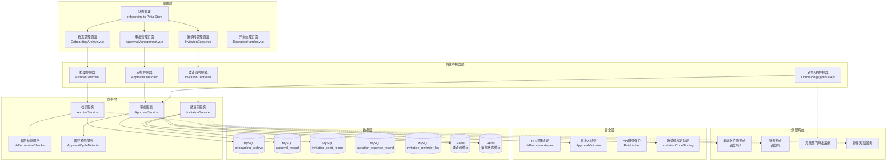
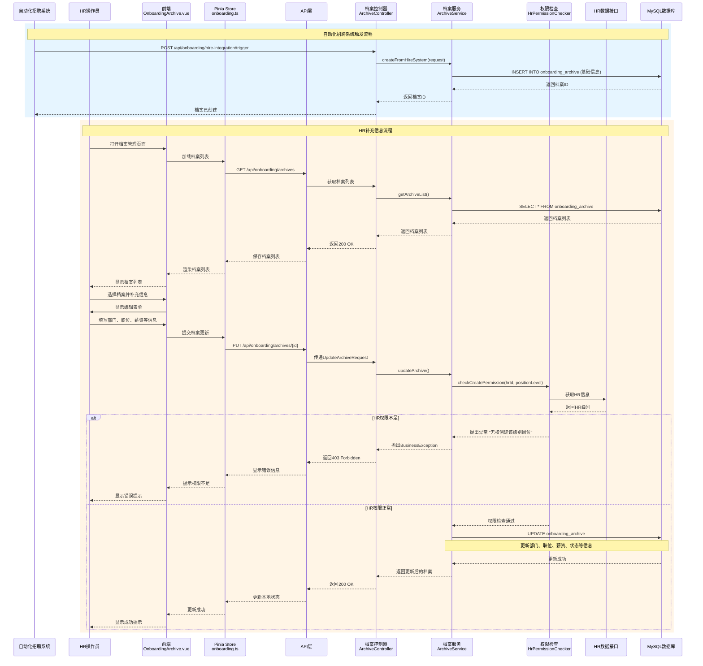
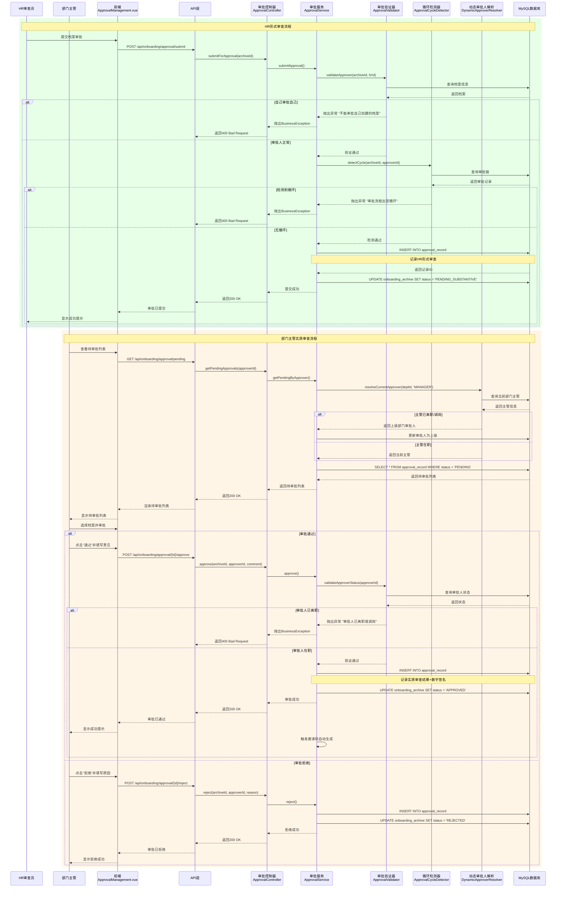
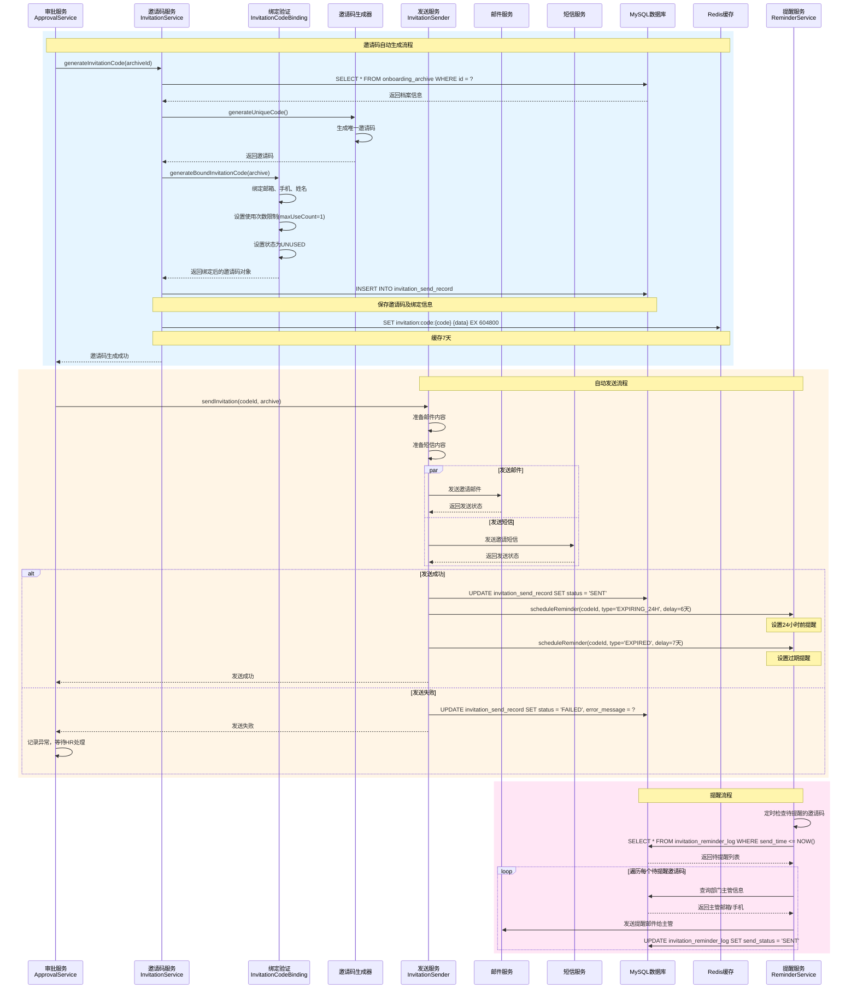
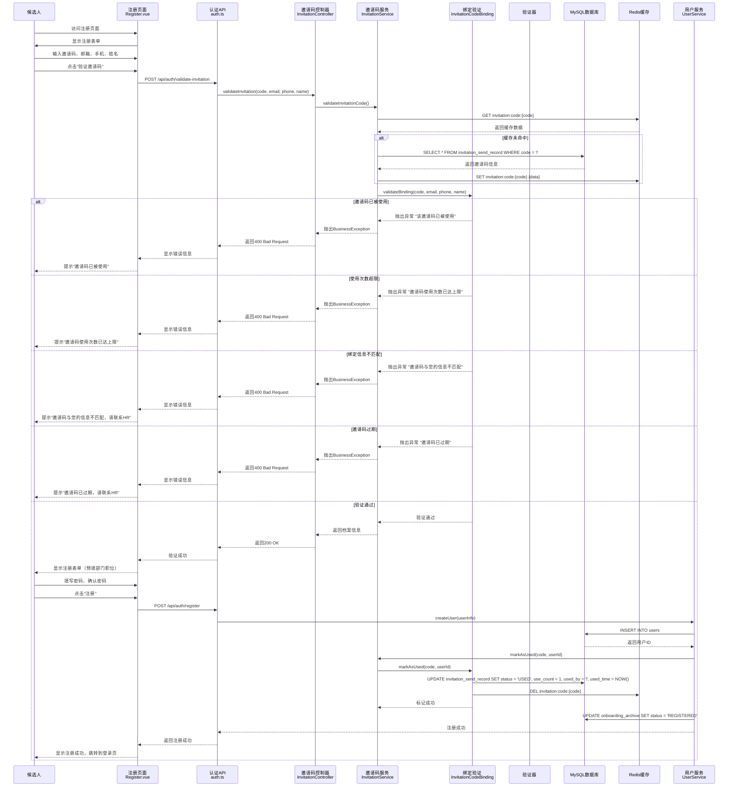
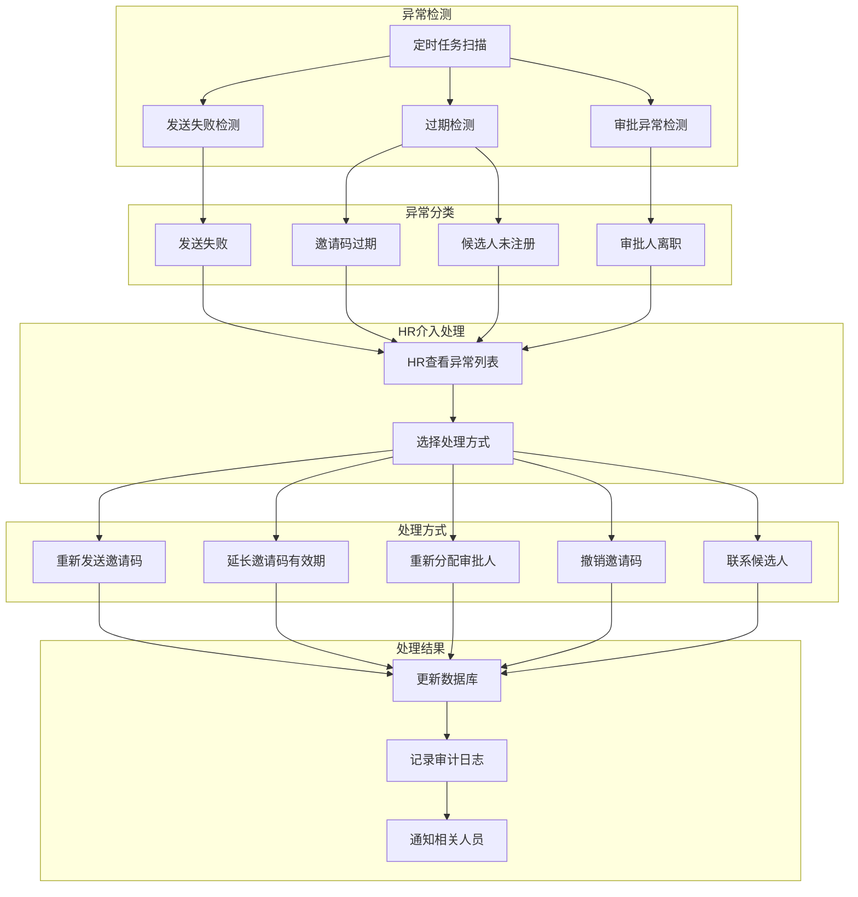
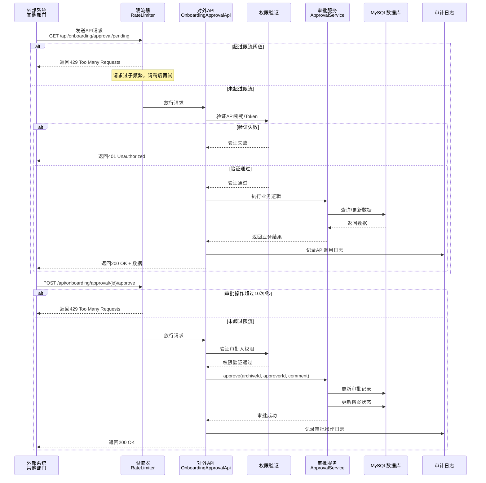
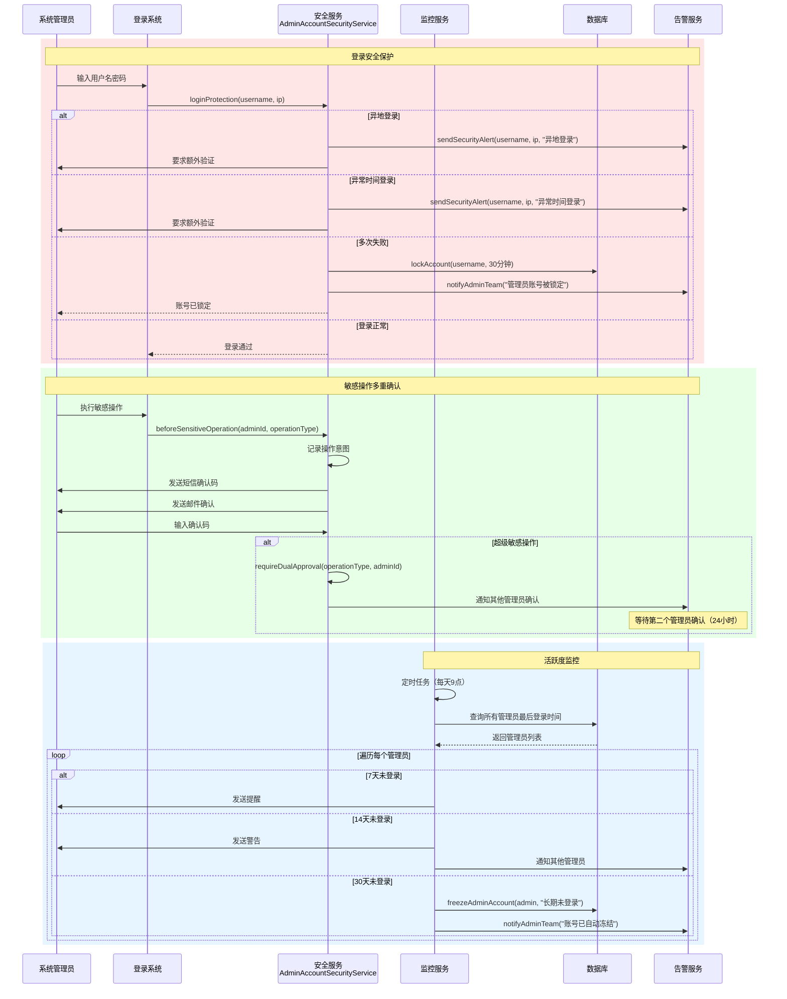

# HR集成系统——邀请码模块开发计划 V2.2

> **最后更新**：2026-01-31  
> **架构方案**：混合架构（小岛形式 + 集成）  
> **文档版本**：v2.2  
> **文档作者**：Liberty（产品设计与策划）、AI Assistant（技术实现与文档编写）

---

## 📌 版本说明

### 新版本标识
本文档描述的是 **V2.2 新版本** 的入职档案模块，与旧版本的邀请码系统完全独立。

### 新旧版本区分
- **新版本（V2.2）**：入职档案模块，使用 `OnboardingArchive`、`ApprovalRecord`、`InvitationSendRecord` 等实体
- **旧版本（待清理）**：普通邀请码系统，使用 `InvitationCode` 实体

### 详细区分文档
详见：[新旧版本区分说明.md](./HR集成系统——新旧版本区分说明.md)

---

***

## 一、架构设计

### 推荐方案：混合架构（小岛形式 + 集成）

#### 核心思想

```
邀请码模块作为"半独立小岛"：
- 代码层面：独立模块/服务
- 部署层面：可以与HR系统一起部署（初期），也可以独立部署（后期）
- 接口层面：提供标准API给其他部门
- 数据层面：共享用户/部门数据，但业务数据独立
```

#### 架构图

```
┌─────────────────────────────────────────────────────────────┐
│                     HR系统（主系统）                          │
│  ┌──────────────┐  ┌──────────────┐  ┌──────────────┐      │
│  │   员工管理    │  │   考勤管理    │  │   薪资管理    │      │
│  └──────────────┘  └──────────────┘  └──────────────┘      │
│                                                              │
│  ┌─────────────────────────────────────────────────────┐   │
│  │              邀请码模块（半独立）                      │   │
│  │                                                      │   │
│  │  内部服务：                                            │   │
│  │  - ArchiveService（档案）                             │   │
│  │  - ApprovalService（审批）                            │   │
│  │  - InvitationService（邀请码）                        │   │
│  │                                                      │   │
│  │  对外API接口：                                         │   │
│  │  ┌─────────────────────────────────────────────┐    │   │
│  │  │  POST /api/onboarding/archive              │    │   │
│  │  │  GET  /api/onboarding/archive/{id}         │    │   │
│  │  │  POST /api/onboarding/approval/{id}/approve│    │   │
│  │  │  POST /api/onboarding/approval/{id}/reject │    │   │
│  │  │  GET  /api/onboarding/approval/pending     │    │   │
│  │  └─────────────────────────────────────────────┘    │   │
│  │                                                      │   │
│  │  依赖HR系统：                                         │   │
│  │  - 用户体系（通过接口获取）                            │   │
│  │  - 部门体系（通过接口获取）                            │   │
│  │  - 权限体系（通过接口验证）                            │   │
│  └─────────────────────────────────────────────────────┘   │
└─────────────────────────────────────────────────────────────┘
          │
          │ 对外API
          │
┌─────────┴───────────────────────────────────────────────────┐
│                    其他部门/系统                              │
│  ┌──────────────┐  ┌──────────────┐  ┌──────────────┐      │
│  │   技术部审批  │  │   财务部查看  │  │  招聘系统触发 │      │
│  │   （审批接口）│  │   （查询接口）│  │  （创建接口） │      │
│  └──────────────┘  └──────────────┘  └──────────────┘      │
└─────────────────────────────────────────────────────────────┘
```

#### 数据隔离设计

```
HR主数据库                    邀请码模块数据库
┌──────────────┐             ┌──────────────┐
│   users      │────────────▶│  onboarding  │
│  departments │  只读接口   │  _archives   │
│   roles      │             │  approvals   │
└──────────────┘             │  invitations │
                             │  expenses    │
                             └──────────────┘
```

* **共享数据**：用户、部门、角色（通过接口只读）

* **独立数据**：档案、审批、邀请码、费用（独立表）

***

## 二、邀请码管理系统开发计划

### 系统归属

**所属集合**：HR系统（半独立模块）  
**系统名称**：员工入职管理系统 - 邀请码模块  
**关联系统**：

* 上游：自动化招聘系统（占位符）

* 下游：登录认证系统

* 并行：财务系统（占位符）

* 外部：其他部门审批系统（通过API）

***

### 核心流程

```
自动化招聘系统（占位符）
  ↓ 触发信号（候选人通过面试/接受offer）
  ↓ 候选人投递简历（电子+纸质）
  ↓ 系统标记投递岗位
  ↓ 面试流程
  ↓ 通过面试
  ↓ 自动触发创建入职档案
HR补充信息、分配部门职位
  ↓ 确定薪资（HR薪资审查 + 用人部门建议）
审批系统
  ↓ 根据职位级别自动分配审批流程
  ↓ 形式审查（HR）+ 实质审查（用人部门）
邀请码自动生成
  ↓ 审批通过后自动生成
  ↓ 自动发送给候选人（邮件+短信）
  ↓ 通知部门主管
  ↓ 【占位符】发送费用对接财务系统
候选人注册
  ↓ 使用邀请码完成注册
  ↓ 自动归属到对应部门、职位、角色
过期监控
  ↓ 24小时内过期提醒部门主管
  ↓ 过期后通知HR处理
异常处理
  ↓ HR介入处理异常（重新发送/延期/撤销）
```

***

### 开发阶段

#### 第1周：核心功能

* [ ] 入职档案管理页面（HR创建档案）

* [ ] 审批流程引擎

* [ ] 邀请码自动生成逻辑

* [ ] 自动发送功能

* [ ] 对外API接口框架

#### 第2周：监控与异常

* [ ] 过期监控与提醒

* [ ] HR异常处理界面

* [ ] 审批管理页面

* [ ] 审计日志

* [ ] 给其他部门的审批API

#### 第3周：薪资与对接预留

* [ ] 薪资审查功能

* [ ] 【占位符】自动化招聘系统对接接口

* [ ] 【占位符】财务系统对接接口

* [ ] HR系统数据接口（用户、部门、权限）

***

### 审批流程设计

| 职位级别           | 审批流程                   | 说明    |
| -------------- | ---------------------- | ----- |
| **普通员工**       | HR形式审查 → 直接主管实质审查      | 简单流程  |
| **主管/经理**      | HR形式审查 → 部门总监实质审查      | 管理层审批 |
| **部门总监**       | HR形式审查+建议 → 总经理审批      | 高管审批  |
| **副总/总经理/董监高** | HR形式审查+建议+风险评估 → 董事长审批 | 最高层审批 |

**特殊处理：**

* 部门总监入职：由总经理直接审批（不经过其他总监）

* 新部门无主管：由上级部门负责人或总经理审批

* HR否决权：核心岗位HR可否决，但可申诉给董事长

***

### HR职责与权限

| 环节       | HR职责        | 权限            |
| -------- | ----------- | ------------- |
| **档案创建** | 补充信息，分配部门职位 | 创建权（受级别限制）    |
| **形式审查** | 审核资料完整性     | 通过/驳回         |
| **薪资审查** | 监督薪资合理性     | 建议权/否决权（核心岗位） |
| **异常处理** | 处理邀请码异常     | 介入处理权         |

**HR权限限制：**

* 普通HR只能创建普通员工档案

* HR负责人可以创建管理层档案

* HR只能创建比自己级别低的岗位

***

### 对外API接口设计

#### 1. 给其他部门的审批接口（带限流保护）

```java
/**
 * 入职审批接口（提供给其他部门）
 * 限流策略：审批操作 10次/秒
 */
@RestController
@RequestMapping("/api/onboarding")
public class OnboardingApprovalApi {
    
    /**
     * 获取待审批列表（给部门主管用）
     * 限流：100次/秒（查询类接口）
     */
    @RateLimiter(name = "onboarding-query", permitsPerSecond = 100)
    @GetMapping("/approval/pending")
    public List<PendingApprovalDTO> getPendingApprovals(
            @RequestParam Long approverId) {
        // 验证approverId是否有审批权限
        return approvalService.getPendingByApprover(approverId);
    }
    
    /**
     * 审批通过（给部门主管用）
     * 限流：10次/秒（操作类接口）
     */
    @RateLimiter(name = "onboarding-approval", permitsPerSecond = 10)
    @PostMapping("/approval/{archiveId}/approve")
    public ResponseEntity<String> approve(
            @PathVariable Long archiveId,
            @RequestParam Long approverId,
            @RequestParam String comment) {
        // 验证审批人权限
        approvalService.approve(archiveId, approverId, comment);
        return ResponseEntity.ok("审批通过");
    }
    
    /**
     * 审批拒绝（给部门主管用）
     * 限流：10次/秒（操作类接口）
     */
    @RateLimiter(name = "onboarding-approval", permitsPerSecond = 10)
    @PostMapping("/approval/{archiveId}/reject")
    public ResponseEntity<String> reject(
            @PathVariable Long archiveId,
            @RequestParam Long approverId,
            @RequestParam String reason) {
        approvalService.reject(archiveId, approverId, reason);
        return ResponseEntity.ok("已拒绝");
    }
}

/**
 * 限流异常处理
 */
@RestControllerAdvice
public class RateLimitExceptionHandler {
    
    @ExceptionHandler(RateLimitExceededException.class)
    public ResponseEntity<ErrorResponse> handleRateLimitExceeded(RateLimitExceededException e) {
        return ResponseEntity.status(429)
            .body(new ErrorResponse("请求过于频繁，请稍后再试", 429));
    }
}
```

#### 2. 给招聘系统的触发接口

```java
/**
 * 招聘系统对接接口（占位符）
 */
@RestController
@RequestMapping("/api/onboarding/hire-integration")
public class HireIntegrationApi {
    
    /**
     * 【占位符】接收招聘系统触发，自动创建档案
     */
    @PostMapping("/trigger")
    public ResponseEntity<String> receiveHireTrigger(
            @RequestBody HireTriggerRequest request) {
        // TODO: 后续对接自动化招聘系统
        Long archiveId = archiveService.createFromHireSystem(request);
        return ResponseEntity.ok("档案已创建，ID: " + archiveId);
    }
}
```

#### 3. 给财务系统的费用接口

```java
/**
 * 财务系统对接接口（占位符）
 */
@RestController
@RequestMapping("/api/onboarding/financial-integration")
public class FinancialIntegrationApi {
    
    /**
     * 【占位符】查询费用记录（给财务系统用）
     */
    @GetMapping("/expenses")
    public List<ExpenseRecordDTO> getExpenses(
            @RequestParam LocalDate startDate,
            @RequestParam LocalDate endDate) {
        // TODO: 后续对接财务系统
        return expenseService.getByDateRange(startDate, endDate);
    }
}
```

#### 4. 依赖HR系统的数据接口

```java
/**
 * HR系统数据接口（内部使用）
 */
@RestController
@RequestMapping("/api/onboarding/hr-data")
public class HrDataApi {
    
    /**
     * 获取用户信息
     */
    @GetMapping("/users/{userId}")
    public UserDTO getUser(@PathVariable Long userId) {
        // 调用HR系统接口
        return hrSystemClient.getUser(userId);
    }
    
    /**
     * 获取部门信息
     */
    @GetMapping("/departments/{deptId}")
    public DepartmentDTO getDepartment(@PathVariable String deptId) {
        return hrSystemClient.getDepartment(deptId);
    }
    
    /**
     * 验证用户权限
     */
    @PostMapping("/permissions/check")
    public boolean checkPermission(
            @RequestParam Long userId,
            @RequestParam String permission) {
        return hrSystemClient.checkPermission(userId, permission);
    }
}
```

***

### 数据库表设计

#### 1. 入职档案表

```sql
CREATE TABLE onboarding_archive (
    id BIGINT PRIMARY KEY AUTO_INCREMENT,
    candidate_id VARCHAR(50) COMMENT '候选人ID',
    candidate_name VARCHAR(100) NOT NULL COMMENT '姓名',
    email VARCHAR(100) NOT NULL COMMENT '邮箱',
    phone VARCHAR(20) COMMENT '手机',
    position VARCHAR(100) NOT NULL COMMENT '职位',
    position_level VARCHAR(20) COMMENT '职位级别',
    department_id VARCHAR(50) NOT NULL COMMENT '部门ID',
    role_id VARCHAR(50) COMMENT '角色ID',
    expected_salary DECIMAL(10,2) COMMENT '期望薪资',
    final_salary DECIMAL(10,2) COMMENT '最终薪资',
    onboard_date DATE COMMENT '预计入职日期',
    invitation_code_id BIGINT COMMENT '关联邀请码ID',
    status VARCHAR(20) COMMENT '状态',
    create_by BIGINT COMMENT '创建人（HR）',
    create_time DATETIME DEFAULT CURRENT_TIMESTAMP,
    update_time DATETIME DEFAULT CURRENT_TIMESTAMP ON UPDATE CURRENT_TIMESTAMP,
    INDEX idx_status (status),
    INDEX idx_department (department_id)
);
```

#### 2. 审批记录表

```sql
CREATE TABLE approval_record (
    id BIGINT PRIMARY KEY AUTO_INCREMENT,
    archive_id BIGINT NOT NULL COMMENT '档案ID',
    step_order INT COMMENT '步骤序号',
    step_name VARCHAR(50) COMMENT '步骤名称',
    reviewer_id BIGINT COMMENT '审批人ID',
    reviewer_role VARCHAR(50) COMMENT '审批人角色',
    review_type VARCHAR(20) COMMENT '审查类型：FORMAL/SUBSTANTIVE',
    result VARCHAR(20) COMMENT '结果：PASSED/REJECTED',
    comment TEXT COMMENT '审批意见',
    review_time DATETIME COMMENT '审批时间',
    signature VARCHAR(255) COMMENT '数字签名（防篡改）',
    create_time DATETIME DEFAULT CURRENT_TIMESTAMP,
    INDEX idx_archive_id (archive_id)
);
```

#### 3. 邀请码发送记录表

```sql
CREATE TABLE invitation_send_record (
    id BIGINT PRIMARY KEY AUTO_INCREMENT,
    invitation_code_id BIGINT NOT NULL COMMENT '邀请码ID',
    send_method VARCHAR(20) COMMENT '发送方式：EMAIL/SMS',
    send_status VARCHAR(20) COMMENT '发送状态',
    send_time DATETIME COMMENT '发送时间',
    recipient VARCHAR(100) COMMENT '接收人',
    error_message VARCHAR(500) COMMENT '错误信息',
    batch_id VARCHAR(50) COMMENT '批次ID',
    create_time DATETIME DEFAULT CURRENT_TIMESTAMP,
    INDEX idx_invitation_code_id (invitation_code_id)
);
```

#### 4. 费用记录表（财务占位符）

```sql
CREATE TABLE invitation_expense_record (
    id BIGINT PRIMARY KEY AUTO_INCREMENT,
    batch_id VARCHAR(50) COMMENT '批次ID',
    expense_type VARCHAR(50) COMMENT '费用类型：EMAIL/SMS',
    quantity INT COMMENT '数量',
    unit_price DECIMAL(10,4) COMMENT '单价',
    total_amount DECIMAL(10,2) COMMENT '总金额',
    department_id VARCHAR(50) COMMENT '部门ID',
    status VARCHAR(20) COMMENT '状态：PENDING/SYNCED',
    financial_system_id VARCHAR(100) COMMENT '财务系统ID（对接后回填）',
    create_time DATETIME DEFAULT CURRENT_TIMESTAMP,
    INDEX idx_batch_id (batch_id)
);
```

#### 5. 提醒记录表

```sql
CREATE TABLE invitation_reminder_log (
    id BIGINT PRIMARY KEY AUTO_INCREMENT,
    invitation_code_id BIGINT COMMENT '邀请码ID',
    reminder_type VARCHAR(20) COMMENT '提醒类型：EXPIRING_24H/EXPIRED',
    recipient_id BIGINT COMMENT '接收人ID（部门主管）',
    recipient_type VARCHAR(20) COMMENT '接收人类型：MANAGER/HR',
    send_time DATETIME COMMENT '发送时间',
    read_status VARCHAR(20) COMMENT '阅读状态',
    create_time DATETIME DEFAULT CURRENT_TIMESTAMP
);
```

***

## 三、权力安全漏洞及解决方案

### 漏洞1：HR创建档案时的权限过大

**问题：**

* HR在创建档案时可以任意分配部门、职位、角色

* 没有限制HR只能创建特定级别以下的岗位

**风险：**

* HR可能给自己或他人创建高管级别的档案

* 越权分配敏感权限

**解决方案：**

```java
// 添加HR权限限制
public class HrPermissionChecker {
    
    public void checkCreatePermission(Long hrId, String positionLevel) {
        User hr = userService.getById(hrId);
        
        // HR只能创建比自己级别低的岗位
        if (hr.getPositionLevel() <= PositionLevel.fromCode(positionLevel).getLevel()) {
            throw new BusinessException("您无权创建该级别的岗位档案");
        }
        
        // 或者：普通HR只能创建普通员工，HR负责人可以创建管理层
        if (!hr.hasRole("HR_HEAD") && isManagementLevel(positionLevel)) {
            throw new BusinessException("只有HR负责人可以创建管理层档案");
        }
    }
}
```

***

### 漏洞2：审批人自己审批自己

**问题：**

* 虽然之前讨论了"自己不能审自己"，但没有具体实现细节

**风险：**

* 主管给自己创建档案时，可能绕过审批

**解决方案：**

```java
// 严格禁止自己审批自己
public class ApprovalValidator {
    
    public void validateApprover(Long archiveId, Long approverId) {
        OnboardingArchive archive = archiveRepository.findById(archiveId);
        
        // 审批人不能是档案创建人
        if (approverId.equals(archive.getCreateBy())) {
            throw new BusinessException("不能审批自己创建的档案");
        }
        
        // 审批人不能是候选人本人（防止自批）
        User approver = userService.getById(approverId);
        if (approver.getEmail().equals(archive.getEmail())) {
            throw new BusinessException("不能审批自己的入职申请");
        }
    }
}
```

***

### 漏洞3：邀请码发送后的权限控制缺失（含重放攻击防护）

**问题：**

* 邀请码发送后，候选人可以转发给他人使用

* 系统无法验证实际使用人是否是预期的候选人

* 邀请码可能被多次使用（重放攻击）

**风险：**

* 邀请码被转发给非预期人员

* 冒名入职

* 一个邀请码被多人使用

**解决方案：**

```java
// 邀请码绑定候选人信息 + 一次性使用验证
public class InvitationCodeBinding {
    
    public void generateBoundInvitationCode(OnboardingArchive archive) {
        InvitationCode code = new InvitationCode();
        code.setCode(generateUniqueCode());
        code.setBoundEmail(archive.getEmail());  // 绑定邮箱
        code.setBoundPhone(archive.getPhone());  // 绑定手机
        code.setBoundName(archive.getCandidateName()); // 绑定姓名
        code.setUseCount(0);  // 初始化使用次数
        code.setMaxUseCount(1);  // 最大使用次数为1（一次性）
        code.setStatus("UNUSED");  // 未使用状态
        
        // 注册时验证绑定信息
        // ...
    }
    
    // 注册时验证
    public void validateBinding(String code, String email, String phone, String name) {
        InvitationCode invitationCode = invitationCodeMapper.findByCode(code);
        
        // 验证是否已被使用
        if (!"UNUSED".equals(invitationCode.getStatus())) {
            throw new BusinessException("该邀请码已被使用");
        }
        
        // 验证使用次数
        if (invitationCode.getUseCount() >= invitationCode.getMaxUseCount()) {
            throw new BusinessException("邀请码使用次数已达上限");
        }
        
        // 验证邮箱或手机是否匹配
        if (!email.equals(invitationCode.getBoundEmail()) && 
            !phone.equals(invitationCode.getBoundPhone())) {
            throw new BusinessException("邀请码与您的信息不匹配，请联系HR");
        }
    }
    
    // 使用成功后标记为已使用
    public void markAsUsed(String code, Long userId) {
        InvitationCode invitationCode = invitationCodeMapper.findByCode(code);
        invitationCode.setStatus("USED");
        invitationCode.setUseCount(invitationCode.getUseCount() + 1);
        invitationCode.setUsedTime(LocalDateTime.now());
        invitationCode.setUsedBy(userId);
        invitationCodeMapper.update(invitationCode);
    }
}
```

***

### 漏洞4：部门主管离职或调岗后的审批权限

**问题：**

* 审批流程进行中，审批人（部门主管）离职或调岗

* 审批流程卡住

**风险：**

* 流程无法继续

* 需要人工干预

**解决方案：**

```java
// 动态获取当前部门主管
public class DynamicApproverResolver {
    
    public User resolveCurrentApprover(String departmentId, String requiredRole) {
        // 实时查询当前部门主管（不是缓存的）
        User currentManager = userService.getCurrentManagerByDepartment(departmentId);
        
        if (currentManager == null) {
            // 部门主管空缺，升级到上级部门
            return findUpperLevelApprover(departmentId);
        }
        
        return currentManager;
    }
}

// 审批前验证审批人是否仍在职
public void validateApproverStatus(Long approverId) {
    User approver = userService.getById(approverId);
    
    if (!"ACTIVE".equals(approver.getStatus())) {
        throw new BusinessException("审批人已离职或调岗，请重新分配审批人");
    }
}
```

***

### 漏洞5：批量生成邀请码的权限控制

**问题：**

* 如果支持批量生成，HR可能批量创建大量邀请码

* 没有数量限制

**风险：**

* 资源浪费

* 安全隐患（大量未使用邀请码）

**解决方案：**

```java
// 批量生成限制
public class BatchGenerationLimiter {
    
    public void checkBatchLimit(Long hrId, int requestCount) {
        // 单次批量限制
        if (requestCount > 50) {
            throw new BusinessException("单次最多生成50个邀请码");
        }
        
        // 月度总量限制
        int monthlyCount = getMonthlyGenerationCount(hrId);
        if (monthlyCount + requestCount > 200) {
            throw new BusinessException("您本月邀请码生成额度已用完");
        }
    }
}
```

**注意：** 根据讨论，实际系统中不是HR手动批量生成，而是通过招聘流程逐个自动生成，此限制作为兜底保护。

***

### 漏洞6：审批历史篡改风险

**问题：**

* 审批记录可能被篡改

* 无法保证审批历史的真实性

**风险：**

* 事后无法追溯

* 责任不清

**解决方案：**

```java
// 审批记录防篡改
@Entity
@Table(name = "approval_record")
public class ApprovalRecord {
    
    // ... 其他字段
    
    @Column(name = "signature")
    private String signature;  // 数字签名
    
    @PrePersist
    public void prePersist() {
        // 生成数字签名
        this.signature = generateSignature();
    }
    
    private String generateSignature() {
        String data = this.archiveId + this.reviewerId + this.result + this.reviewTime;
        return DigestUtils.sha256Hex(data + SECRET_KEY);
    }
}
```

***

### 漏洞7：邀请码过期后的复活风险

**问题：**

* 过期邀请码被重新激活

* 没有严格的复活审批

**风险：**

* 过期邀请码被滥用

**解决方案：**

```java
// 过期邀请码复活需要严格审批
public class ExpiredCodeRevivalService {
    
    public void reviveExpiredCode(Long codeId, Long hrId, String reason) {
        // 1. 验证HR权限（只有HR负责人可以复活）
        User hr = userService.getById(hrId);
        if (!hr.hasRole("HR_HEAD")) {
            throw new BusinessException("只有HR负责人可以复活过期邀请码");
        }
        
        // 2. 记录复活原因
        // 3. 通知部门主管
        // 4. 设置新的有效期（缩短）
        // 5. 记录审计日志
    }
}
```

***

### 漏洞8：系统管理员的超级权限

**问题：**

* 系统管理员可以绕过所有审批

* 没有监督机制

**风险：**

* 管理员滥用职权

* 管理员账号被盗用

* 管理员长期不登录（睡眠账号）

**解决方案（六层保障体系）：**

#### 第一层：账号安全策略

```java
@Service
public class AdminAccountSecurityService {
    
    public void enforceSecurityPolicy(Long adminId) {
        // 1. 强制强密码
        if (!isStrongPassword(admin.getPassword())) {
            forcePasswordReset(adminId);
        }
        
        // 2. 强制双因素认证（2FA）
        if (!has2FAEnabled(adminId)) {
            forceEnable2FA(adminId);
        }
        
        // 3. 定期密码更换（每30天）
        if (isPasswordExpired(adminId)) {
            forcePasswordReset(adminId);
        }
    }
}
```

#### 第二层：登录保护

```java
public void loginProtection(String username, String ip) {
    // 1. 异地登录检测
    if (!isCommonLoginLocation(username, ip)) {
        sendSecurityAlert(username, ip, "异地登录");
        requireAdditionalVerification(username);
    }
    
    // 2. 异常时间登录检测（凌晨2-5点）
    if (isAbnormalLoginTime()) {
        sendSecurityAlert(username, ip, "异常时间登录");
        requireAdditionalVerification(username);
    }
    
    // 3. 多次失败锁定
    if (getFailedLoginCount(username) >= 3) {
        lockAccount(username, Duration.ofMinutes(30));
        notifyAdminTeam("管理员账号被锁定: " + username);
    }
}
```

#### 第三层：敏感操作多重确认

```java
public void beforeSensitiveOperation(Long adminId, String operationType) {
    // 1. 记录操作意图
    OperationIntent intent = recordOperationIntent(adminId, operationType);
    
    // 2. 发送确认码到管理员手机
    String verificationCode = generateVerificationCode();
    smsService.send(adminId, "您的确认码是: " + verificationCode + "，5分钟内有效");
    
    // 3. 同时发送邮件
    emailService.send(adminId, "敏感操作确认", "操作类型: " + operationType);
    
    // 4. 等待确认（5分钟超时）
    awaitConfirmation(intent.getId(), verificationCode);
}

// 超级敏感操作需要双人确认
public void requireDualApproval(String operationType, Long primaryAdminId) {
    // 1. 主管理员发起
    recordOperationRequest(primaryAdminId, operationType);
    
    // 2. 需要第二个管理员确认
    List<User> otherAdmins = getOtherActiveAdmins(primaryAdminId);
    
    // 3. 发送确认请求给其他管理员
    for (User otherAdmin : otherAdmins) {
        notificationService.send(otherAdmin.getId(), 
            "管理员" + primaryAdminId + "请求执行敏感操作: " + operationType + 
            "，请确认或拒绝");
    }
    
    // 4. 等待任一其他管理员确认（24小时超时）
    awaitDualApproval(operationType, primaryAdminId, Duration.ofHours(24));
}
```

#### 第四层：活跃度监控

```java
@Scheduled(cron = "0 0 9 * * ?")
public void checkAdminActivity() {
    List<User> admins = userService.getAllAdmins();
    
    for (User admin : admins) {
        LocalDateTime lastLogin = admin.getLastLoginTime();
        long daysSinceLastLogin = ChronoUnit.DAYS.between(lastLogin, LocalDateTime.now());
        
        // 7天未登录：发送提醒
        if (daysSinceLastLogin >= 7 && daysSinceLastLogin < 14) {
            sendInactivityReminder(admin, "您已7天未登录系统");
        }
        // 14天未登录：发送警告并通知其他管理员
        else if (daysSinceLastLogin >= 14 && daysSinceLastLogin < 30) {
            sendInactivityWarning(admin, "您已14天未登录，请尽快登录");
            notifyOtherAdmins("管理员" + admin.getUsername() + "已14天未登录");
        }
        // 30天未登录：自动冻结账号
        else if (daysSinceLastLogin >= 30) {
            freezeAdminAccount(admin, "长期未登录自动冻结");
            notifyAdminTeam("管理员" + admin.getUsername() + "账号已自动冻结");
            activateEmergencyContact(admin);
        }
    }
}
```

#### 第五层：账号恢复机制

```java
public void recoverFrozenAccount(Long frozenAdminId, Long recovererId) {
    // 1. 验证恢复人权限（必须是其他管理员或总经理）
    validateRecovererPermission(recovererId);
    
    // 2. 验证身份（多重验证）
    verifyIdentity(frozenAdminId);
    
    // 3. 强制密码重置
    forcePasswordReset(frozenAdminId);
    
    // 4. 强制重新绑定2FA
    forceRebind2FA(frozenAdminId);
    
    // 5. 解冻账号
    unfreezeAccount(frozenAdminId);
    
    // 6. 记录恢复日志
    auditLogService.logOperation("ACCOUNT_RECOVERY", recovererId, 
        "ADMIN", frozenAdminId, "FROZEN", "ACTIVE");
    
    // 7. 通知所有管理员
    notifyAllAdmins("管理员账号已恢复: " + frozenAdminId);
}

// 终极恢复：所有管理员都不可用
public void ultimateRecovery(String securityToken) {
    // 1. 验证安全令牌（预先保存在安全地方的物理令牌）
    if (!validateSecurityToken(securityToken)) {
        throw new SecurityException("安全令牌无效");
    }
    
    // 2. 创建临时超级管理员（24小时有效）
    User tempAdmin = createTemporarySuperAdmin();
    
    // 3. 临时管理员可以重建管理员团队
    // 4. 24小时后自动删除临时管理员
    scheduleTempAdminDeletion(tempAdmin.getId(), Duration.ofHours(24));
}
```

#### 第六层：物理安全保障

```java
@PostConstruct
public void systemStartupProtection() {
    // 1. 检查是否有至少2个活跃管理员
    long activeAdminCount = userService.countActiveAdmins();
    if (activeAdminCount < 2) {
        enterSafeMode();
        notifyAdminTeam("警告：活跃管理员少于2人，系统进入安全模式");
    }
    
    // 2. 检查管理员账号健康状态
    checkAdminAccountHealth();
}
```

***

### 漏洞9：审批流程循环风险

**问题：**

* 如果审批流程设计不当，可能出现A审B、B审C、C又审A的循环依赖

* 或者审批人被调岗后形成审批闭环

**风险：**

* 审批流程无限循环

* 责任不清

* 流程卡住无法继续

**解决方案：**

```java
// 防止审批循环
public class ApprovalCycleDetector {
    
    public void detectCycle(Long archiveId, Long newApproverId) {
        // 获取该档案已有的审批链
        List<ApprovalRecord> approvalChain = approvalService.getApprovalChain(archiveId);
        
        // 检查新审批人是否已经在审批链中
        Set<Long> existingApprovers = approvalChain.stream()
            .map(ApprovalRecord::getReviewerId)
            .collect(Collectors.toSet());
        
        if (existingApprovers.contains(newApproverId)) {
            throw new BusinessException("审批流程出现循环，请重新分配审批人");
        }
        
        // 检查审批深度（防止过长的审批链）
        if (approvalChain.size() >= 5) {
            throw new BusinessException("审批层级过多，请简化审批流程");
        }
    }
}
```

***

## 四、补充的安全措施

### 1. 操作日志完整性

* 所有操作必须记录：操作人、时间、IP、操作内容

* 日志不可删除、不可修改

* 定期备份日志

### 2. 敏感操作二次确认

* 生成邀请码：确认

* 撤销邀请码：二次确认

* 修改审批结果：需要更高权限审批

### 3. 定期权限审计

* 每月检查HR权限分配

* 检查是否有越权分配

* 清理离职人员权限

### 4. 异常操作监控

* 同一HR短时间内大量生成邀请码 → 告警

* 非正常时间操作 → 告警

* 异地登录操作 → 告警

### 5. 审批流程循环检测

* 实时检测审批链是否出现循环

* 限制审批层级不超过5层

* 自动阻止循环审批的发生

### 6. API限流保护

* 审批类接口：10次/秒

* 查询类接口：100次/秒

* 触发限流时返回429状态码

***

## 五、占位符清单

| 占位符           | 说明              | 对接系统    | 计划时间 |
| ------------- | --------------- | ------- | ---- |
| **自动化招聘系统对接** | 接收招聘触发信号，自动创建档案 | 自动化招聘系统 | 后续开发 |
| **财务系统对接**    | 发送邀请码发送费用记录     | 财务系统    | 后续对接 |

***

## 六、开发优先级

### 高优先级（第1-2周）

1. 入职档案管理页面
2. 审批流程引擎
3. 邀请码自动生成
4. HR权限限制
5. 审批人验证
6. 对外API接口框架
7. **API限流保护**（新增）

### 中优先级（第2-3周）

1. 邀请码绑定验证
2. 动态审批人解析
3. 过期监控与提醒
4. 异常处理界面
5. 给其他部门的审批API
6. **审批流程循环检测**（新增）

### 低优先级（第3-4周）

1. 审批记录防篡改
2. 过期邀请码复活审批
3. 系统管理员安全保障体系
4. 审计日志
5. HR系统数据接口

***

## 七、关键设计决策

1. **架构方案**：混合架构（半独立小岛形式）
2. **HR不主动生成邀请码**：系统自动生成，HR仅处理异常
3. **审批流程按职位级别**：不同级别不同流程
4. **过期提醒给主管**：不是给候选人
5. **薪资公平性监督**：HR负责监督，避免内部不公平
6. **审计日志全覆盖**：全流程可追溯
7. **系统管理员六层保护**：防止超级权限滥用
8. **对外API标准化**：便于其他部门接入
9. **审批流程防循环**：防止审批链出现闭环（新增）
10. **邀请码一次性使用**：防止重放攻击（新增）
11. **API限流保护**：防止接口被滥用（新增）

***

## 八、系统流程图

### 8.1 系统架构概览



***

### 8.2 入职档案创建详细流程



***

### 8.3 审批流程详细流程



***

### 8.4 邀请码生成与发送流程



***

### 8.5 邀请码验证与注册流程



***

### 8.6 异常处理流程



***

### 8.7 对外API调用流程



***

### 8.8 系统管理员安全保障流程



***

**文档版本**：v2.2  
**创建日期**：2026-01-29  
**更新日期**：2026-01-31  
**架构方案**：混合架构（小岛形式 + 集成）
