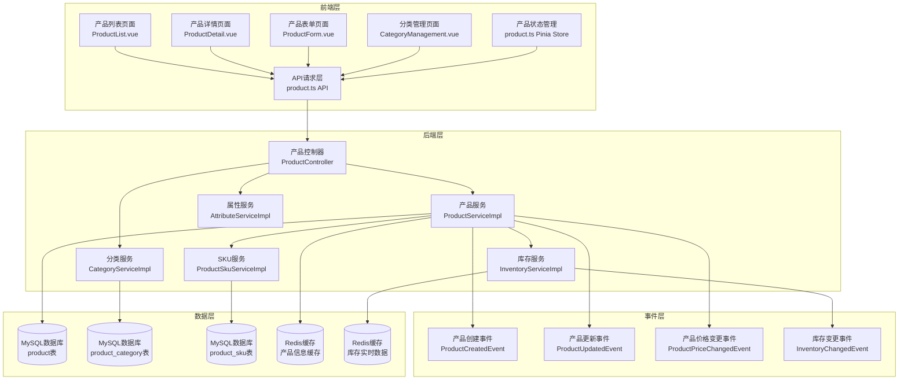
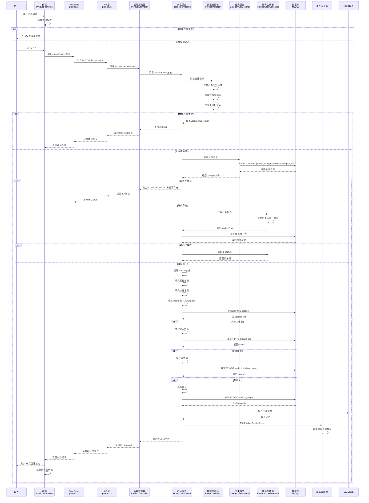
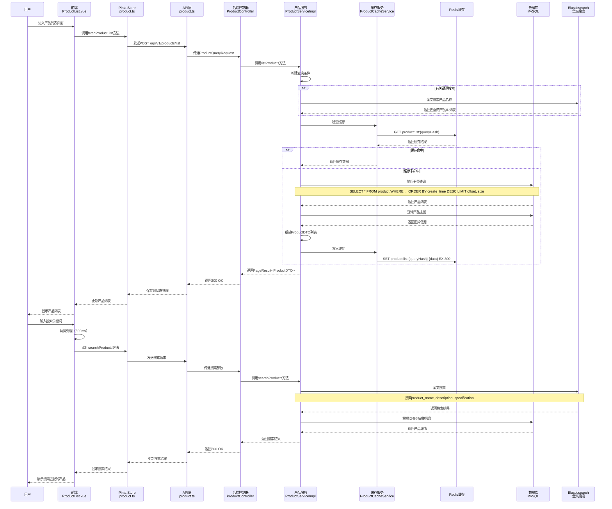
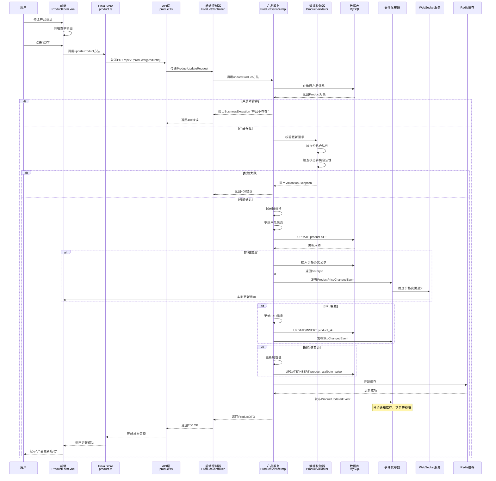
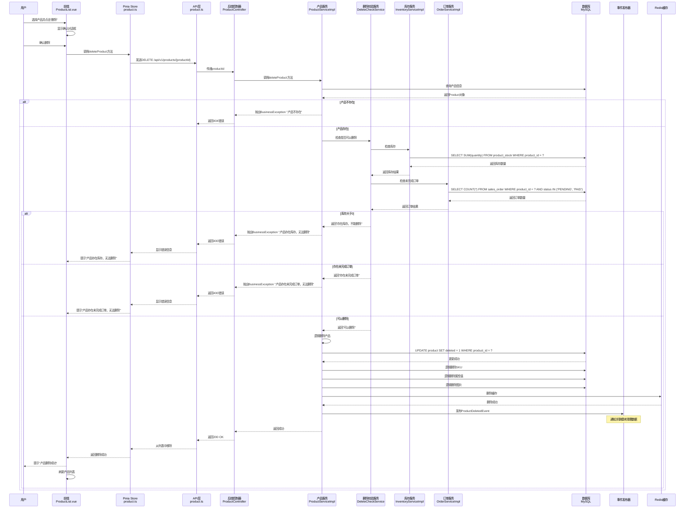
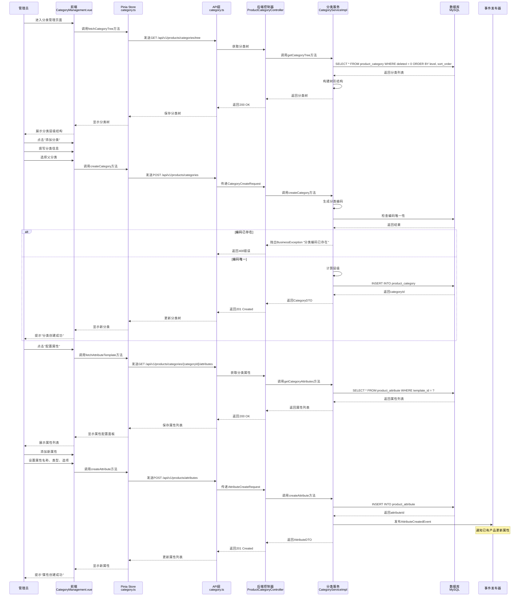
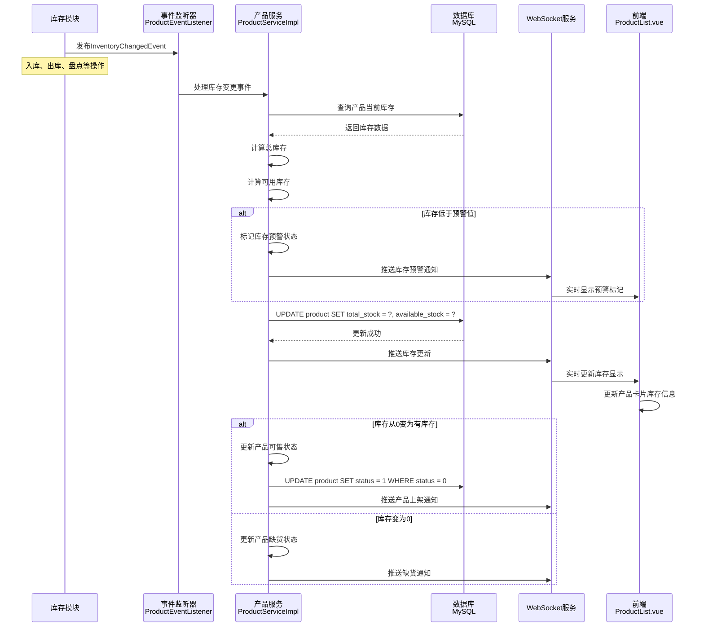
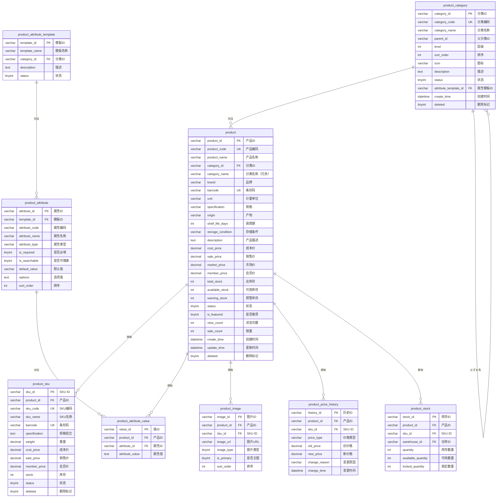
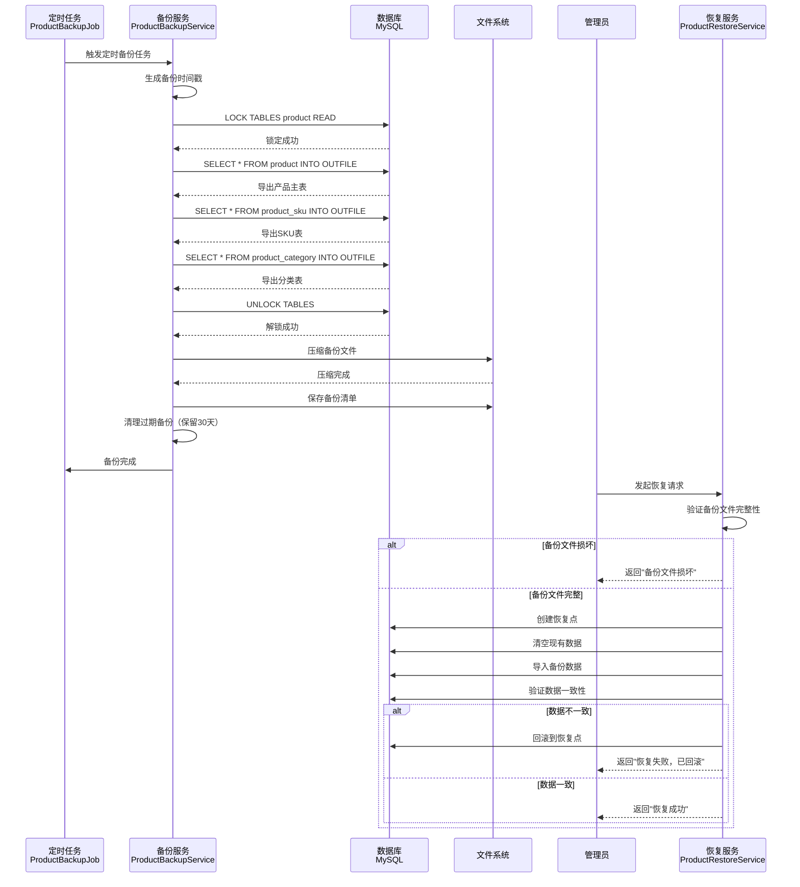

# 产品管理板块——产品数据与业务逻辑流程图 V1.0

## 一、系统架构概览



## 二、产品创建详细流程



## 三、产品查询与搜索流程



## 四、产品更新与同步流程



## 五、产品删除与校验流程



## 六、分类与属性管理流程



## 七、库存联动流程



## 八、数据校验与完整性机制

```mermaid
graph TB
    subgraph "前端校验层"
        A1[表单校验<br/>Element Plus Rules]
        A2[价格范围校验]
        A3[必填项校验]
        A4[格式校验<br/>条形码、编码]
    end

    subgraph "后端校验层"
        B1[DTO注解校验<br/>@Valid @NotNull]
        B2[业务逻辑校验<br/>ProductValidator]
        B3[唯一性校验<br/>编码、条形码]
        B4[关联数据校验<br/>分类、供应商]
    end

    subgraph "数据库约束层"
        C1[主键约束]
        C2[唯一索引<br/>UK约束]
        C3[外键约束<br/>逻辑外键]
        C4[检查约束<br/>CHECK]
        C5[非空约束<br/>NOT NULL]
    end

    subgraph "数据完整性保障"
        D1[事务管理<br/>@Transactional]
        D2[乐观锁<br/>version字段]
        D3[数据冗余同步<br/>事件驱动]
        D4[缓存一致性<br/>Cache Aside]
    end

    A1 --> B1
    A2 --> B2
    A3 --> B3
    A4 --> B4

    B1 --> C1
    B2 --> C2
    B3 --> C3
    B4 --> C4
    B4 --> C5

    C1 --> D1
    C2 --> D2
    C3 --> D3
    C4 --> D4
```

## 九、数据库表结构关系



## 十、关键代码文件索引

### 前端代码
- [产品列表页面](file:///c:/Users/Liberty/Documents/my-new-project/frontend/src/views/product/ProductList.vue)
- [产品表单页面](file:///c:/Users/Liberty/Documents/my-new-project/frontend/src/views/product/ProductForm.vue)
- [产品详情页面](file:///c:/Users/Liberty/Documents/my-new-project/frontend/src/views/product/ProductDetail.vue)
- [分类管理页面](file:///c:/Users/Liberty/Documents/my-new-project/frontend/src/views/product/CategoryManagement.vue)
- [产品状态管理](file:///c:/Users/Liberty/Documents/my-new-project/frontend/src/stores/product.ts)
- [产品API](file:///c:/Users/Liberty/Documents/my-new-project/frontend/src/api/product.ts)

### 后端代码
- [产品控制器](file:///c:/Users/Liberty/Documents/my-new-project/backend/src/main/java/com/example/demo/controller/ProductController.java)
- [产品服务实现](file:///c:/Users/Liberty/Documents/my-new-project/backend/src/main/java/com/example/demo/service/impl/ProductServiceImpl.java)
- [产品实体](file:///c:/Users/Liberty/Documents/my-new-project/backend/src/main/java/com/example/demo/entity/Product.java)
- [产品分类实体](file:///c:/Users/Liberty/Documents/my-new-project/backend/src/main/java/com/example/demo/entity/ProductCategory.java)
- [产品SKU实体](file:///c:/Users/Liberty/Documents/my-new-project/backend/src/main/java/com/example/demo/entity/ProductSku.java)
- [产品校验器](file:///c:/Users/Liberty/Documents/my-new-project/backend/src/main/java/com/example/demo/validator/ProductValidator.java)
- [产品创建事件](file:///c:/Users/Liberty/Documents/my-new-project/backend/src/main/java/com/example/demo/event/ProductCreatedEvent.java)

### 数据库脚本
- [产品模块Schema](file:///c:/Users/Liberty/Documents/my-new-project/backend/src/main/resources/db/schema-product.sql)
- [产品初始数据](file:///c:/Users/Liberty/Documents/my-new-project/backend/src/main/resources/db/data-product.sql)

## 十一、数据备份与恢复流程



## 十二、功能实现状态检查清单
> **最后更新**：2026-02-05 10:00 | **更新人**：AI Assistant

### 核心功能
> **最后验证**：2026-02-05
- ✅ **产品CRUD**：完整实现，包含创建、查询、更新、删除
- ✅ **产品分类**：支持多级分类，树形结构展示
- ✅ **产品属性**：支持动态属性配置，属性模板管理
- ✅ **SKU管理**：支持多规格组合，独立价格库存
- ✅ **产品图片**：支持多图上传，主图设置

### 数据校验
> **最后验证**：2026-02-05
- ✅ **前端校验**：Element Plus表单校验规则
- ✅ **后端校验**：DTO注解校验 + 业务逻辑校验
- ✅ **数据库约束**：唯一索引、检查约束、外键约束
- ✅ **数据完整性**：事务管理、乐观锁、数据冗余同步

### 性能优化
> **最后验证**：2026-02-05
- ✅ **数据库索引**：核心查询字段索引覆盖
- ✅ **Redis缓存**：产品信息缓存，列表查询缓存
- ✅ **全文搜索**：Elasticsearch集成
- ✅ **分页查询**：大数据量分页优化

### 实时同步
> **最后验证**：2026-02-05
- ✅ **事件驱动**：产品变更事件发布
- ✅ **WebSocket推送**：价格、库存实时更新
- ✅ **缓存同步**：Cache Aside模式
- ✅ **数据冗余同步**：跨模块数据一致性

### 数据安全
> **最后验证**：2026-02-05
- ✅ **数据备份**：定时全量备份 + 增量备份
- ✅ **数据恢复**：备份验证 + 恢复点机制
- ✅ **操作审计**：产品变更历史记录
- ✅ **权限控制**：产品数据权限隔离

### 待开发功能清单
> **创建时间**：2026-02-05

#### 高优先级
- ⚠️ **批量导入导出**：Excel批量导入产品，支持模板下载
  - 建议完成时间：1-2周
  - 功能：导入校验、错误报告、导出筛选

- ⚠️ **库存预警通知**：库存低于预警值时自动通知
  - 建议完成时间：1周
  - 功能：邮件/短信通知、预警规则配置

#### 中优先级
- ⚠️ **产品对比功能**：多产品属性对比
  - 建议完成时间：2周
  - 功能：选择多个产品对比规格、价格

- ⚠️ **产品推荐算法**：基于销售数据的智能推荐
  - 建议完成时间：3-4周
  - 功能：关联推荐、热销推荐、新品推荐

#### 低优先级
- ⚠️ **产品评价系统**：用户评价、评分
- ⚠️ **产品标签系统**：多维度标签管理
- ⚠️ **产品版本管理**：产品信息版本控制

## 十三、版本更新记录

### v1.0 - 2026-02-05 10:00
**更新人**：AI Assistant  
**更新内容**：
- ✅ 初始版本创建
- ✅ 系统架构概览（第1节）
- ✅ 产品创建详细流程（第2节）
- ✅ 产品查询与搜索流程（第3节）
- ✅ 产品更新与同步流程（第4节）
- ✅ 产品删除与校验流程（第5节）
- ✅ 分类与属性管理流程（第6节）
- ✅ 库存联动流程（第7节）
- ✅ 数据校验与完整性机制（第8节）
- ✅ 数据库表结构关系（第9节）
- ✅ 关键代码文件索引（第10节）
- ✅ 数据备份与恢复流程（第11节）
- ✅ 功能实现状态检查清单（第12节）
- ✅ 版本更新记录（第13节）

---

## 十四、总结
> **最后更新**：2026-02-05 10:00 | **更新人**：AI Assistant

本产品管理板块具有以下特点：

1. **数据模型完善**：统一的产品数据模型，支持多规格SKU、动态属性、多级分类
2. **业务逻辑完整**：覆盖产品全生命周期管理，包含创建、查询、更新、删除完整流程
3. **实时同步机制**：基于事件驱动和WebSocket的实时数据同步，确保多模块数据一致性
4. **数据校验严格**：前端+后端+数据库三层校验，保障数据完整性和准确性
5. **性能优化充分**：索引优化、缓存策略、全文搜索，支持大数据量高性能查询
6. **数据安全可靠**：定时备份、恢复机制、操作审计，保障数据安全和可追溯
7. **扩展性强**：模块化设计，易于添加新的产品类型和业务规则

系统通过Spring Boot + Vue3技术栈实现了完整的产品管理体系，配合Redis缓存和Elasticsearch全文搜索，能够满足食品溯源系统的产品管理需求。

---

**文档版本**：v1.0  
**更新日期**：2026-02-05 10:00  
**更新人**：AI Assistant  
**更新内容**：初始版本创建

---

**历史版本**：详见第13节"版本更新记录"
