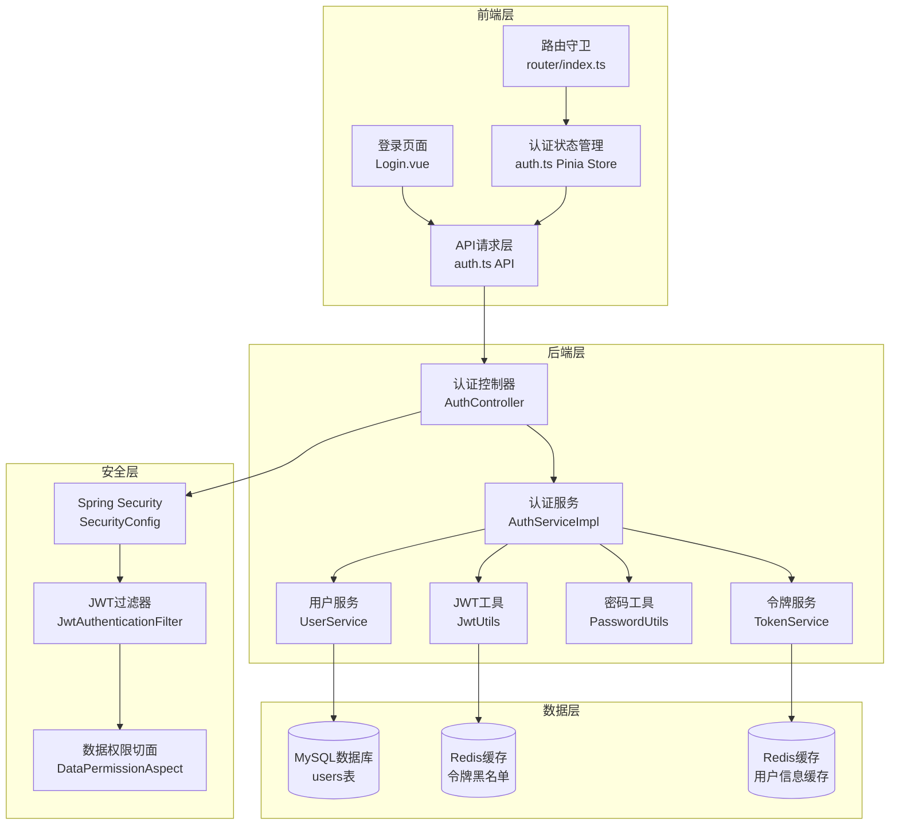
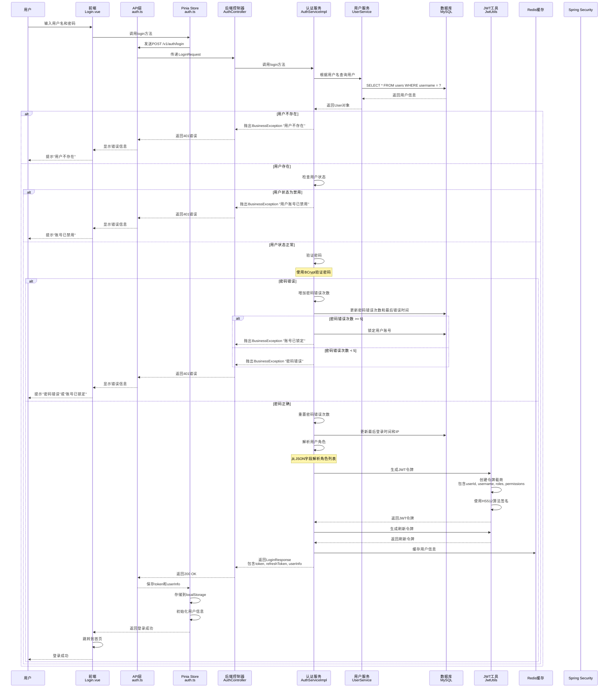
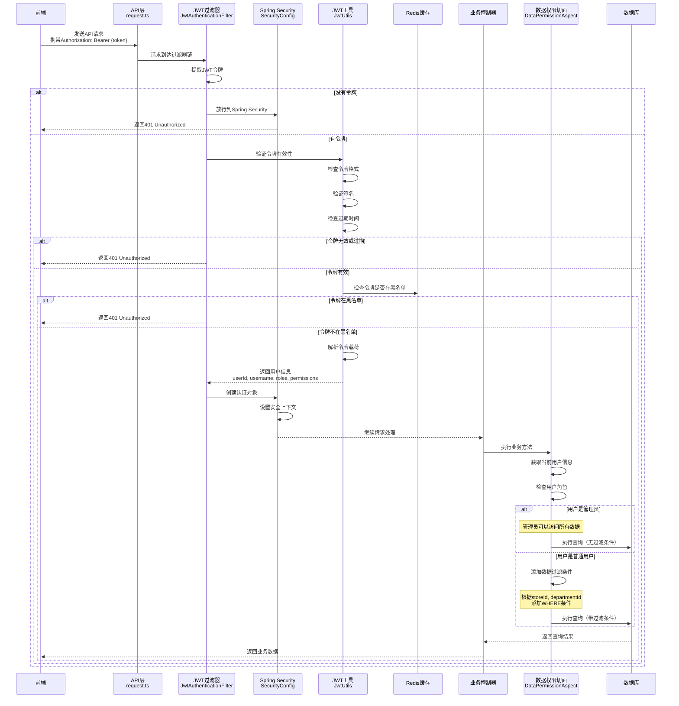
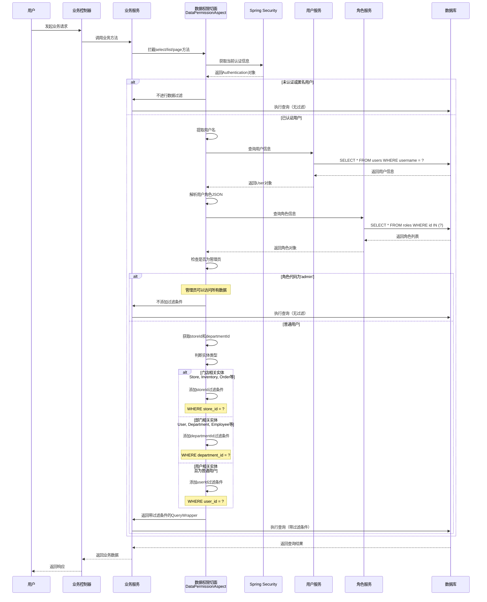
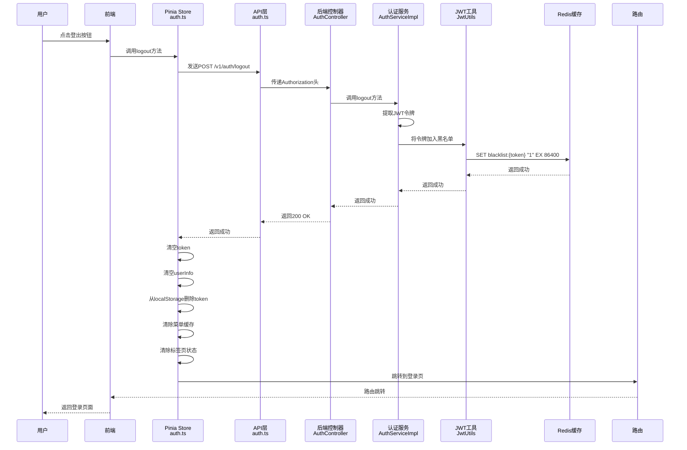
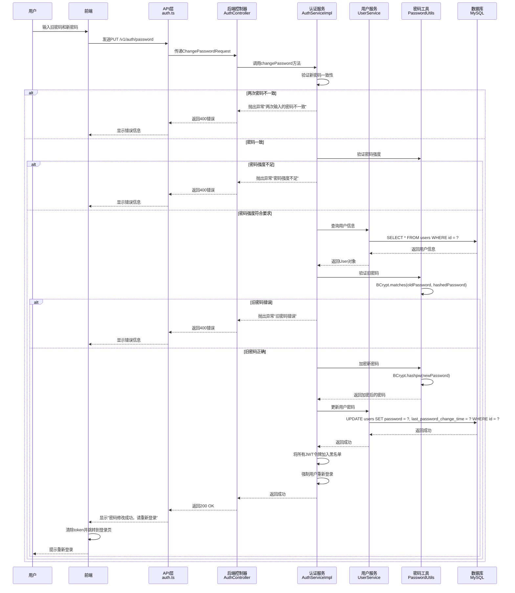
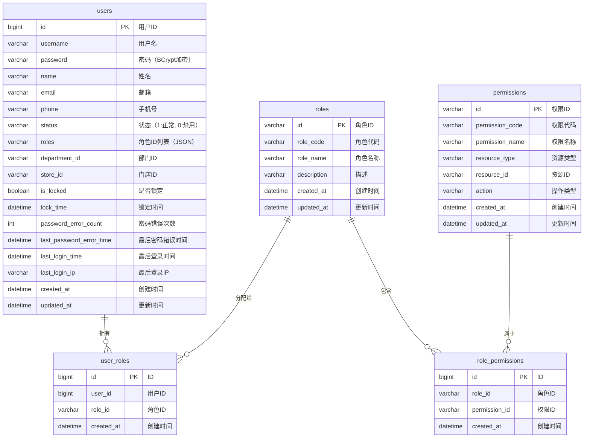
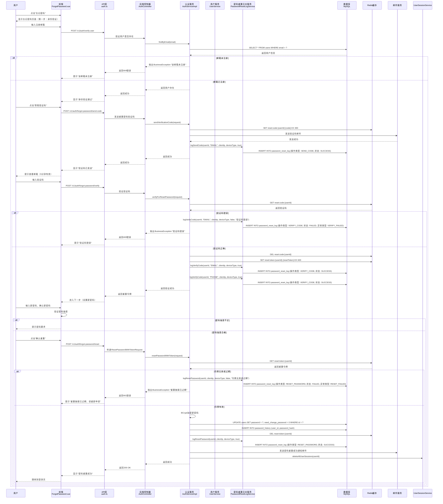
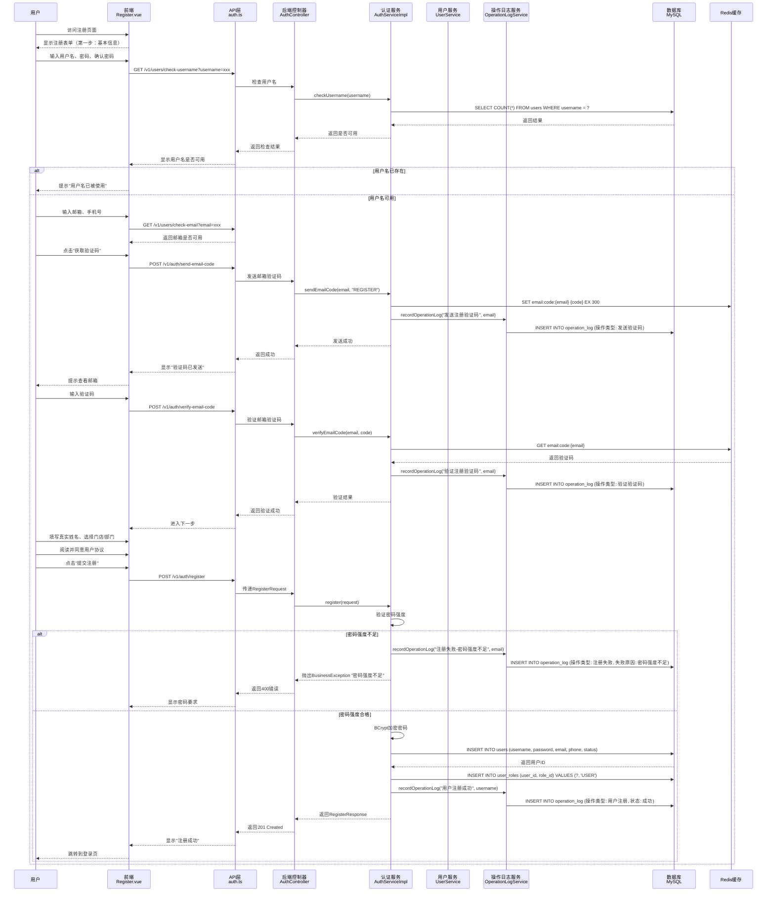
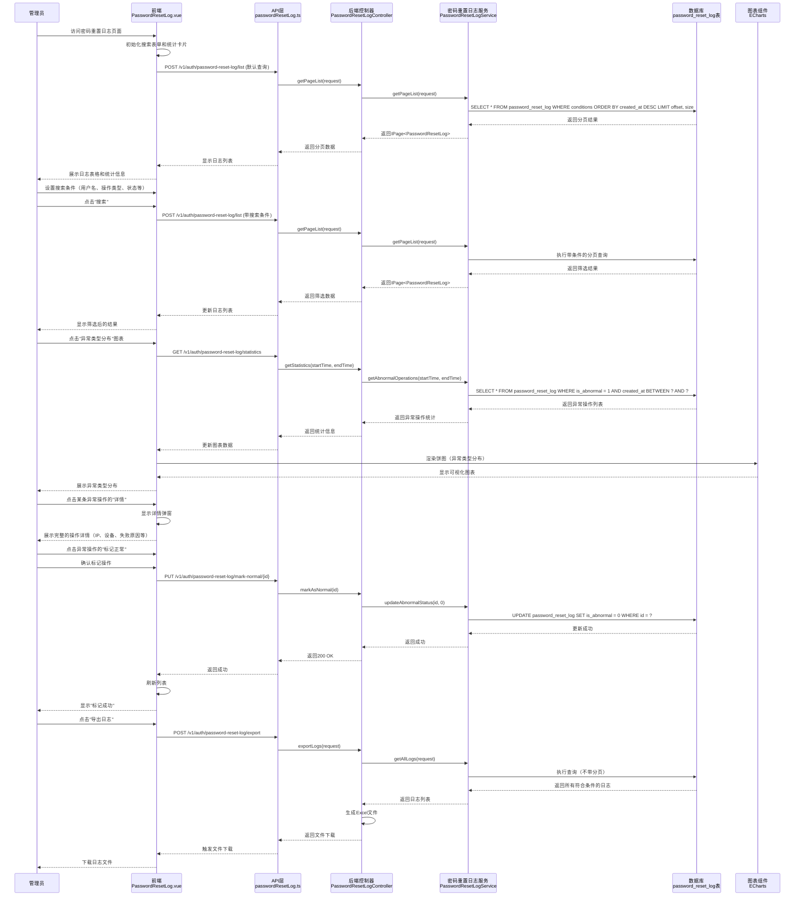

# 登录系统——登录与账号权限分配流程图 V2.1

## 一、系统架构概览



## 二、用户登录详细流程



## 三、JWT令牌认证流程



## 四、权限分配与验证流程

```mermaid
graph TB
    subgraph "用户登录"
        A1[用户输入用户名密码]
        A2[验证用户信息]
        A3[验证密码]
        A4[查询用户角色]
        A5[生成JWT令牌<br/>包含角色和权限]
    end

    subgraph "角色权限模型"
        B1[用户表<br/>users]
        B2[角色表<br/>roles]
        B3[权限表<br/>permissions]
        B4[用户-角色关联表<br/>user_roles]
        B5[角色-权限关联表<br/>role_permissions]
    end

    subgraph "权限验证"
        C1[JWT过滤器验证令牌]
        C2[从令牌中提取角色和权限]
        C3[方法级权限验证<br/>@PreAuthorize]
        C4[数据权限过滤<br/>DataPermissionAspect]
    end

    subgraph "数据权限"
        D1[门店级别权限<br/>store_id过滤]
        D2[部门级别权限<br/>department_id过滤]
        D3[用户级别权限<br/>user_id过滤]
        D4[管理员权限<br/>无过滤]
    end

    A1 --> A2
    A2 --> A3
    A3 --> A4
    A4 --> A5

    B1 --> B4
    B4 --> B2
    B2 --> B5
    B5 --> B3

    A4 --> B1
    A5 --> C1

    C1 --> C2
    C2 --> C3
    C3 --> C4

    C4 --> D1
    C4 --> D2
    C4 --> D3
    C4 --> D4
```

## 五、数据权限过滤详细流程



## 六、用户登出流程



## 七、密码修改流程



## 八、安全机制总览

```mermaid
graph TB
    subgraph "认证安全"
        A1[JWT令牌认证]
        A2[BCrypt密码加密<br/>强度12轮]
        A3[令牌黑名单机制]
        A4[令牌过期时间<br/>24小时]
    end

    subgraph "账户安全"
        B1[用户状态管理<br/>启用/禁用]
        B2[账户锁定机制<br/>5次错误后锁定]
        B3[密码错误次数限制]
        B4[最后登录时间记录]
    end

    subgraph "数据安全"
        C1[数据权限过滤<br/>门店/部门/用户级别]
        C2[SQL注入防护<br/>参数化查询]
        C3[XSS防护<br/>输入验证]
        C4[敏感数据脱敏<br/>@Desensitize注解]
    end

    subgraph "传输安全"
        D1[HTTPS加密传输]
        D2[请求速率限制<br/>100次/分钟]
        D3[CORS跨域配置]
        D4[CSRF防护]
    end

    subgraph "审计安全"
        E1[操作日志记录]
        E2[登录日志记录]
        E3[安全事件监控]
        E4[异常行为检测]
    end
```

## 九、数据库表结构关系



## 十、关键代码文件索引

### 前端代码
- [登录页面](file:///c:/Users/Liberty/Documents/my-new-project/frontend/src/views/login/index.vue)
- [认证状态管理](file:///c:/Users/Liberty/Documents/my-new-project/frontend/src/stores/auth.ts)
- [认证API](file:///c:/Users/Liberty/Documents/my-new-project/frontend/src/api/auth.ts)
- [认证工具](file:///c:/Users/Liberty/Documents/my-new-project/frontend/src/utils/auth.ts)
- [路由配置](file:///c:/Users/Liberty/Documents/my-new-project/frontend/src/router/index.ts)

### 后端代码
- [认证控制器](file:///c:/Users/Liberty/Documents/my-new-project/backend/src/main/java/com/example/demo/controller/AuthController.java)
- [认证服务实现](file:///c:/Users/Liberty/Documents/my-new-project/backend/src/main/java/com/example/demo/service/impl/AuthServiceImpl.java)
- [用户实体](file:///c:/Users/Liberty/Documents/my-new-project/backend/src/main/java/com/example/demo/entity/User.java)
- [数据权限切面](file:///c:/Users/Liberty/Documents/my-new-project/backend/src/main/java/com/example/demo/aspect/DataPermissionAspect.java)
- [认证服务接口](file:///c:/Users/Liberty/Documents/my-new-project/backend/src/main/java/com/example/demo/security/service/AuthenticationService.java)
- [认证服务实现](file:///c:/Users/Liberty/Documents/my-new-project/backend/src/main/java/com/example/demo/security/service/impl/AuthenticationServiceImpl.java)
- [认证模块设计文档](file:///c:/Users/Liberty/Documents/my-new-project/backend/src/main/java/com/example/demo/security/AuthenticationModuleDesign.md)

## 十一、忘记密码流程（已集成日志监控）



### 忘记密码日志监控功能

| 监控项 | 说明 | 实现状态 |
|--------|------|----------|
| 验证码发送日志 | 记录发送验证码的操作，包括成功和失败 | ✅ 已实现 |
| 验证码验证日志 | 记录验证码验证操作，标记验证失败 | ✅ 已实现 |
| 密码重置日志 | 记录密码重置操作，包括成功和失败 | ✅ 已实现 |
| 异常操作检测 | 自动标记异常操作（频率过高、验证失败等） | ✅ 已实现 |
| 前端监控页面 | 管理员可在系统后台查看所有日志 | ✅ 已实现 |
| 统计报表 | 展示异常类型分布、成功率等统计信息 | ✅ 已实现 |

### 异常检测规则

1. **频率限制**：1小时内同一用户超过10次操作标记为异常
2. **IP限制**：1小时内同一IP超过20次操作标记为异常
3. **异常比例**：1小时内异常操作超过5次标记为异常

---

## 十二、用户注册流程（已集成日志监控）



### 注册流程日志监控功能

| 监控项 | 说明 | 实现状态 |
|--------|------|----------|
| 验证码发送日志 | 记录发送注册验证码的操作 | ✅ 已实现 |
| 验证码验证日志 | 记录验证码验证操作 | ✅ 已实现 |
| 注册成功日志 | 记录用户注册成功 | ✅ 已实现 |
| 注册失败日志 | 记录注册失败原因（密码强度不足等） | ✅ 已实现 |
| 前端监控页面 | 通过操作日志页面查看 | ✅ 已实现 |

---

## 十三、密码重置日志监控流程（新增）



### 密码重置日志监控功能特性

| 功能模块 | 特性描述 | 实现状态 |
|----------|----------|----------|
| **日志记录** | 记录所有密码重置相关操作（发送验证码、验证验证码、重置密码） | ✅ 已实现 |
| **异常检测** | 自动检测异常行为（频率限制、IP限制、异常比例） | ✅ 已实现 |
| **前端监控** | 提供可视化监控页面，支持搜索、筛选、分页 | ✅ 已实现 |
| **统计报表** | 展示异常类型分布饼图、成功率统计 | ✅ 已实现 |
| **详情查看** | 支持查看单条操作的详细信息 | ✅ 已实现 |
| **异常标记** | 支持将异常操作标记为正常 | ✅ 已实现 |
| **数据导出** | 支持导出日志数据为Excel文件 | ✅ 已实现 |
| **权限控制** | 只有管理员可以访问日志监控页面 | ✅ 已实现 |

### 异常检测规则

1. **用户频率限制**：1小时内同一用户超过10次操作标记为异常
2. **IP频率限制**：1小时内同一IP地址超过20次操作标记为异常
3. **异常比例检测**：1小时内异常操作超过5次标记为异常
4. **操作失败检测**：验证码发送失败、验证失败、重置失败自动标记为异常

### 前端页面功能

- **搜索筛选**：支持按用户名、操作类型、状态、IP地址、异常状态等条件筛选
- **时间范围**：支持选择时间范围进行查询
- **统计卡片**：展示总操作数、异常操作数、成功率、今日异常数
- **图表展示**：使用ECharts展示异常类型分布饼图
- **表格展示**：详细展示每条日志的所有字段信息
- **操作功能**：支持查看详情、标记正常、批量导出等操作

---

## 十四、功能实现状态检查清单
> **最后更新**：2026-01-29 16:30 | **更新人**：AI Assistant

### 核心安全功能
> **最后验证**：2026-01-29
- ✅ **JWT令牌认证**：完整实现，包含令牌生成、验证、刷新、黑名单
- ✅ **密码安全加密**：使用BCrypt加密，强度12轮
- ✅ **令牌黑名单**：登出后令牌失效
- ✅ **数据权限过滤**：门店、部门、用户级别的数据隔离

### 性能优化
> **最后验证**：2026-01-29
- ✅ **Redis缓存**：用户权限信息缓存1小时，减少数据库查询
- ✅ **会话缓存**：用户会话信息缓存24小时
- ✅ **权限缓存**：避免每次查询都解析角色

### 功能增强
> **最后验证**：2026-01-29
- ✅ **会话管理**：查看活跃会话，支持选择性退出
- ✅ **登录日志**：记录所有登录成功和失败
- ✅ **审计完善**：提供日志查询和导出功能
- ✅ **设备管理**：支持踢出其他设备

### 邀请码注册功能状态
> **最后验证**：2026-01-29
- ✅ **邀请码系统**：完整实现，包含生成、验证、使用全流程
- ✅ **数据库表**：invitation_codes表和password_history表已创建
- ✅ **三步注册流程**：邀请码验证→账号信息→个人信息
- ✅ **密码强度指示器**：前端实时可视化显示
- ⚠️ **邀请码管理页面**：后端API已提供，前端管理页面待开发

### 普通注册功能状态
> **最后验证**：2026-01-29
- ✅ **普通注册功能**：完整实现，包含验证码验证、密码强度检查
- ✅ **注册日志记录**：通过OperationLogService记录注册操作
- ✅ **前端注册页面**：已创建，支持三步注册流程
- ✅ **操作日志页面**：可通过系统管理-操作日志查看注册日志

### 忘记密码功能状态
> **最后验证**：2026-01-29
- ✅ **忘记密码功能**：完整实现，包含双因素验证、密码历史检查
- ✅ **密码重置日志**：通过PasswordResetLogService专门记录
- ✅ **前端忘记密码页面**：已创建，支持三步重置流程
- ✅ **日志监控页面**：已创建，路径：系统管理-密码重置日志

### 日志监控功能状态
> **最后验证**：2026-01-29
- ✅ **密码重置日志表**：password_reset_log表自动创建
- ✅ **日志记录服务**：PasswordResetLogService完整实现
- ✅ **日志查询API**：提供分页查询、统计、异常检测接口
- ✅ **前端监控页面**：PasswordResetLog.vue完整实现
- ✅ **异常检测规则**：频率限制、IP限制、异常比例检测
- ✅ **统计报表**：ECharts饼图展示异常类型分布

### 数据一致性
> **最后验证**：2026-01-29
- ✅ **角色存储统一**：移除JSON字段，统一使用关联表
- ✅ **数据规范化**：符合数据库规范化原则
- ✅ **避免冗余**：减少数据不一致风险

### 可维护性
> **最后验证**：2026-01-29
- ✅ **模块化设计**：清晰的代码结构
- ✅ **完善的文档**：详细的流程图和说明
- ✅ **规范的命名**：统一的命名规范

### 待开发功能清单
> **创建时间**：2026-01-29

#### 高优先级
- ⚠️ **邀请码管理页面**：后端API已提供，前端管理页面待开发
  - 建议完成时间：1-2周
  - 功能：生成邀请码、查看使用情况、过期管理

#### 中优先级
- ⚠️ **注册日志专用页面**：目前通过操作日志查看，可创建专用监控页面
  - 建议完成时间：2-4周
  - 参考：类似密码重置日志页面

- ⚠️ **日志导出功能**：前端页面已预留按钮，后端导出API待实现
  - 建议完成时间：1-2周
  - 格式：Excel导出

#### 低优先级
- ⚠️ **登录日志专用页面**：目前通过系统管理查看，可优化展示
- ⚠️ **用户行为分析报表**：基于日志数据的统计分析

---

## 十五、总结
> **最后更新**：2026-01-29 16:30 | **更新人**：AI Assistant

本餐饮管理系统的登录与权限系统具有以下特点：

1. **安全性高**：使用JWT令牌认证、BCrypt密码加密、令牌黑名单等多重安全机制
2. **权限细粒度**：支持基于角色的访问控制（RBAC），实现门店、部门、用户级别的数据隔离
3. **可扩展性强**：模块化设计，易于添加新的认证方式和权限类型
4. **性能优异**：使用Redis缓存用户信息和令牌，减少数据库查询
5. **审计完善**：记录登录日志、操作日志、密码重置日志，便于安全审计和问题排查
6. **监控全面**：提供密码重置日志监控页面，支持异常检测和统计报表

系统通过Spring Security框架实现了完整的认证授权体系，配合自定义的数据权限切面，实现了灵活的数据访问控制，确保了系统的安全性和数据的隔离性。

---

## 十六、生产环境建议改进项
> **创建时间**：2026-01-29 16:30 | **更新人**：AI Assistant

### 高优先级（建议1-2周内完成）

1. **添加图形验证码机制**
   - 建议时间：1周内
   - 原因：防止暴力破解和机器人攻击
   - 实现位置：登录页面、注册页面、忘记密码页面

2. **实现请求频率限制**
   - 建议时间：1周内
   - 原因：防止API滥用和DDoS攻击
   - 实现方式：基于IP和用户ID的限流

3. **完善邀请码管理页面**
   - 建议时间：2周内
   - 原因：后端API已提供，前端页面缺失
   - 功能：生成邀请码、查看使用情况、过期管理

### 中优先级（建议1个月内完成）

4. **集成 ELK 日志分析系统**
   - 建议时间：2-3周
   - 原因：提供更强大的日志搜索和分析能力
   - 组件：Elasticsearch + Logstash + Kibana

5. **添加敏感操作双因素认证**
   - 建议时间：2周
   - 原因：增强敏感操作的安全性
   - 场景：修改密码、修改绑定邮箱等

6. **实现 Token 刷新频率限制**
   - 建议时间：1周
   - 原因：防止Token被滥用
   - 策略：限制每小时刷新次数

7. **注册日志专用监控页面**
   - 建议时间：2周
   - 原因：目前通过操作日志查看，可创建专用页面
   - 参考：类似密码重置日志页面

### 低优先级（建议3个月内完成）

8. **添加 IP 白名单/黑名单功能**
   - 建议时间：2周
   - 原因：增强系统安全性
   - 功能：限制特定IP访问

9. **实现地理位置定位**
   - 建议时间：2-3周
   - 原因：记录用户登录地点，异常登录检测
   - 实现：基于IP的地理位置解析

10. **添加异常登录告警**
    - 建议时间：2周
    - 原因：及时发现异常登录行为
    - 方式：邮件/短信通知管理员

11. **实现 OAuth2.0 和 OpenID Connect**
    - 建议时间：4-6周
    - 原因：支持第三方登录（微信、钉钉等）
    - 场景：企业用户快速登录

12. **用户行为分析报表**
    - 建议时间：3-4周
    - 原因：基于日志数据的统计分析
    - 内容：登录趋势、异常行为统计等

---

## 十七、版本更新记录

### v2.1 - 2026-01-29 16:30
**更新人**：AI Assistant  
**更新内容**：
- ✅ 为第14节添加时间戳和最后验证日期
- ✅ 为第15节添加时间戳
- ✅ 第14节新增"待开发功能清单"子节
- ✅ 新增第16节：生产环境建议改进项
- ✅ 新增第17节：版本更新记录
- ✅ 更新文档末尾版本信息

### v2.0 - 2026-01-29
**更新人**：AI Assistant  
**更新内容**：
- ✅ 添加忘记密码日志监控流程（第13节）
- ✅ 更新忘记密码流程图，添加日志记录节点（第11节）
- ✅ 更新注册流程图，添加日志记录节点（第12节）
- ✅ 更新功能实现状态检查清单（第14节）
- ✅ 添加密码重置日志监控功能特性说明（第13节）

### v1.0 - 2026-01-28
**更新人**：AI Assistant  
**更新内容**：
- ✅ 初始版本创建
- ✅ 系统架构概览（第1节）
- ✅ 用户登录详细流程（第2节）
- ✅ JWT令牌认证流程（第3节）
- ✅ 权限分配与验证流程（第4节）
- ✅ 数据权限过滤详细流程（第5节）
- ✅ 用户登出流程（第6节）
- ✅ 密码修改流程（第7节）
- ✅ 安全机制总览（第8节）
- ✅ 数据库表结构关系（第9节）
- ✅ 关键代码文件索引（第10节）

---

**文档版本**：v2.1  
**更新日期**：2026-01-29 16:30  
**更新人**：AI Assistant  
**更新内容**：
- ✅ 为第14、15节添加时间戳和最后验证日期
- ✅ 第14节新增"待开发功能清单"子节
- ✅ 新增第16节：生产环境建议改进项
- ✅ 新增第17节：版本更新记录
- ✅ 完善文档版本管理

---

**历史版本**：详见第17节"版本更新记录"
