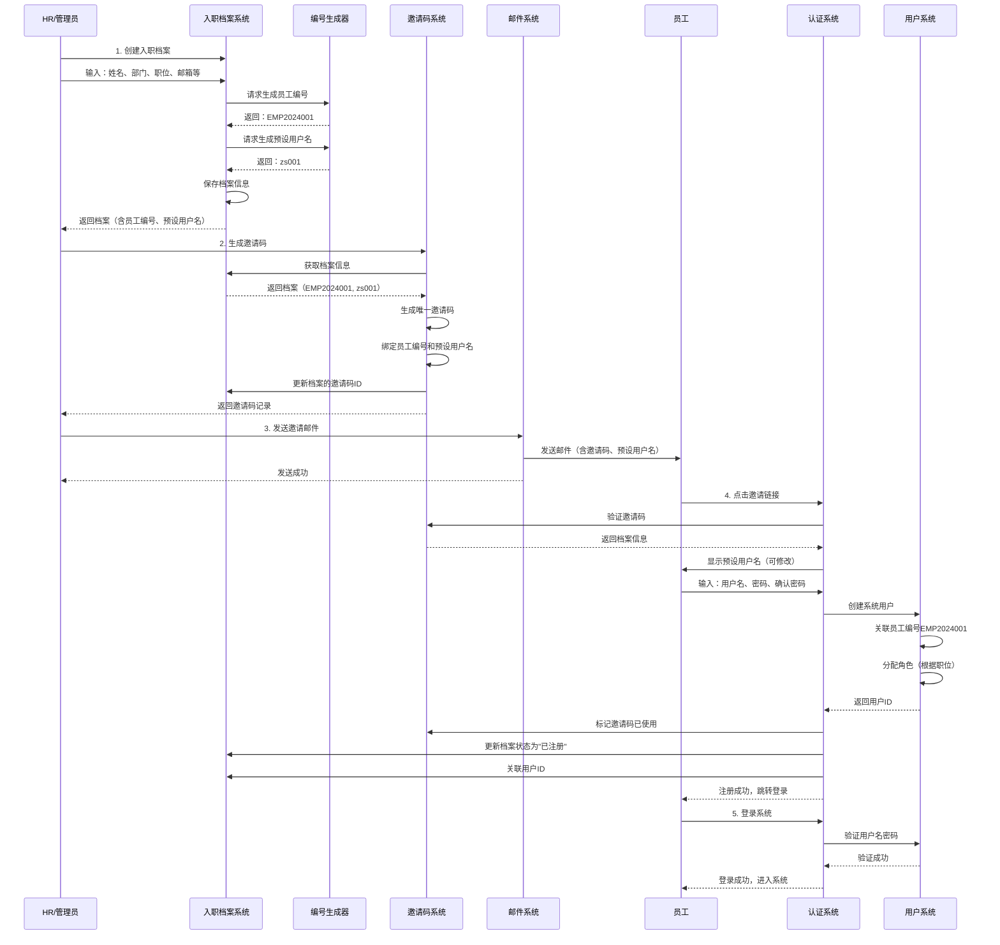

## 十八、前端权限管理功能（新增）

### 权限管理页面结构

```
系统设置
├─ 权限中心
│   ├─ 用户管理（已实现）
│   ├─ 角色管理（已实现）
│   ├─ 权限管理（已实现）
│   └─ 权限配置管理（新增）
│       ├─ 权限列表
│       ├─ 权限分组
│       ├─ 权限编辑
│       └─ 权限分配
├─ 角色权限配置（新增）
│   ├─ 角色列表
│   ├─ 角色编辑
│   ├─ 权限分配
│   └─ 权限预览
└─ 用户角色分配（新增）
    ├─ 用户列表
    ├─ 角色分配
    └─ 批量操作
```

### 权限管理详细流程

```mermaid
sequenceDiagram
    participant Admin as 管理员
    participant Frontend as 前端<br/>PermissionManagement.vue
    participant API as API层<br/>permission.ts
    participant Controller as 后端控制器<br/>PermissionController
    participant Service as 权限服务<br/>PermissionService
    participant DB as 数据库<br/>sys_permissions表
    
    Admin->>Frontend: 访问权限管理页面
    Frontend->>Frontend: 初始化页面，加载权限列表
    Frontend->>API: GET /v1/permissions (带查询条件)
    API->>Controller: 传递查询参数
    Controller->>Service: getPermissionList(params)
    Service->>DB: SELECT * FROM sys_permissions WHERE conditions ORDER BY sort_order
    DB-->>Service: 返回权限列表
    Service-->>Controller: 返回分页结果
    Controller-->>API: 返回权限数据
    API-->>Frontend: 显示权限列表
    
    Admin->>Frontend: 点击"新增权限"按钮
    Frontend->>Frontend: 打开新增对话框
    Frontend->>Frontend: 填写权限信息
    Frontend->>Frontend: 点击"自动生成权限编码"
    Frontend->>Frontend: 自动生成编码（module:resource:action）
    Frontend->>Frontend: 点击"保存"按钮
    Frontend->>API: POST /v1/permissions
    API->>Controller: 传递CreatePermissionRequest
    Controller->>Service: createPermission(request)
    Service->>Service: 验证权限编码唯一性
    Service->>DB: SELECT COUNT(*) FROM sys_permissions WHERE permission_code = ?
    DB-->>Service: 返回是否存在
    alt 权限编码已存在
        Service-->>Controller: 抛出BusinessException "权限编码已存在"
        Controller-->>API: 返回400错误
        API-->>Frontend: 显示错误信息
        Frontend-->>Admin: 提示"权限编码已存在"
    else 权限编码可用
        Service->>DB: INSERT INTO sys_permissions (...)
        DB-->>Service: 返回成功
        Service-->>Controller: 返回创建的权限
        Controller-->>API: 返回201 Created
        API-->>Frontend: 显示"创建成功"
        Frontend->>Frontend: 刷新权限列表
        Frontend-->>Admin: 显示新权限
    end
    
    Admin->>Frontend: 点击"编辑权限"按钮
    Frontend->>Frontend: 打开编辑对话框（预填充数据）
    Frontend->>Frontend: 修改权限信息
    Frontend->>Frontend: 点击"保存"按钮
    Frontend->>API: PUT /v1/permissions
    API->>Controller: 传递UpdatePermissionRequest
    Controller->>Service: updatePermission(request)
    Service->>DB: UPDATE sys_permissions SET ... WHERE id = ?
    DB-->>Service: 返回成功
    Service-->>Controller: 返回更新结果
    Controller-->>API: 返回200 OK
    API-->>Frontend: 显示"更新成功"
    Frontend->>Frontend: 刷新权限列表
    Frontend-->>Admin: 显示更新后的权限
    
    Admin->>Frontend: 点击"删除权限"按钮
    Frontend->>Frontend: 显示确认对话框
    Frontend->>Frontend: 确认删除
    Frontend->>API: DELETE /v1/permissions/{id}
    API->>Controller: 传递权限ID
    Controller->>Service: deletePermission(id)
    Service->>Service: 检查权限是否被角色使用
    Service->>DB: SELECT COUNT(*) FROM role_permissions WHERE permission_id = ?
    DB-->>Service: 返回使用数量
    alt 权限被角色使用
        Service-->>Controller: 抛出BusinessException "权限正在被使用，无法删除"
        Controller-->>API: 返回400错误
        API-->>Frontend: 显示错误信息
        Frontend-->>Admin: 提示"权限正在被使用"
    else 权限未被使用
        Service->>DB: DELETE FROM sys_permissions WHERE id = ?
        DB-->>Service: 返回成功
        Service-->>Controller: 返回成功
        Controller-->>API: 返回200 OK
        API-->>Frontend: 显示"删除成功"
        Frontend->>Frontend: 刷新权限列表
        Frontend-->>Admin: 显示删除后的列表
    
    Admin->>Frontend: 切换权限状态开关
    Frontend->>API: PUT /v1/permissions/{id}/status
    API->>Controller: 传递新状态
    Controller->>Service: updatePermissionStatus(id, status)
    Service->>DB: UPDATE sys_permissions SET status = ? WHERE id = ?
    DB-->>Service: 返回成功
    Service-->>Controller: 返回成功
    Controller-->>API: 返回200 OK
    API-->>Frontend: 显示"状态更新成功"
    Frontend->>Frontend: 刷新权限列表
    Frontend-->>Admin: 显示更新后的状态
    
    Admin->>Frontend: 使用筛选条件查询
    Frontend->>Frontend: 输入权限名称、选择模块、选择状态
    Frontend->>API: GET /v1/permissions (带筛选参数)
    API->>Controller: 传递筛选参数
    Controller->>Service: getPermissionList(params)
    Service->>DB: SELECT * FROM sys_permissions WHERE permission_name LIKE ? AND module_code = ? AND status = ?
    DB-->>Service: 返回筛选结果
    Service-->>Controller: 返回分页结果
    Controller-->>API: 返回筛选数据
    API-->>Frontend: 显示筛选后的列表
    Frontend-->>Admin: 查看筛选结果
```

### 权限管理功能特性

| 功能模块 | 特性描述 | 实现状态 |
|----------|----------|----------|
| **权限列表** | 展示所有系统权限，支持搜索、筛选、分页 | ✅ 已实现 |
| **权限创建** | 支持手动输入或自动生成权限编码 | ✅ 已实现 |
| **权限编辑** | 支持编辑权限的所有字段 | ✅ 已实现 |
| **权限删除** | 支持删除权限，检查是否被角色使用 | ✅ 已实现 |
| **状态管理** | 支持启用/禁用权限 | ✅ 已实现 |
| **权限筛选** | 支持按名称、模块、状态筛选 | ✅ 已实现 |
| **批量操作** | 支持批量启用/禁用 | ✅ 已实现 |
| **权限预览** | 在角色管理中预览权限 | ✅ 已实现 |

### 权限编码规则

**格式**：`{module}:{resource}:{action}`

**示例**：
- `system:user:view` - 查看用户
- `system:user:create` - 创建用户
- `system:user:edit` - 编辑用户
- `system:user:delete` - 删除用户
- `system:role:view` - 查看角色
- `system:role:create` - 创建角色
- `system:role:edit` - 编辑角色
- `system:role:delete` - 删除角色
- `system:permission:view` - 查看权限
- `system:permission:create` - 创建权限
- `system:permission:edit` - 编辑权限
- `system:permission:delete` - 删除权限

**模块编码**：
- `system` - 系统设置
- `user` - 用户管理
- `role` - 角色管理
- `permission` - 权限管理
- `product` - 产品管理
- `order` - 订单管理
- `finance` - 财务管理
- `inventory` - 库存管理

**资源类型**：
- `menu` - 菜单
- `button` - 按钮
- `api` - API接口
- `data` - 数据

**操作类型**：
- `view` - 查看
- `create` - 新增
- `edit` - 编辑
- `delete` - 删除
- `export` - 导出

### 前端页面功能

**权限列表页面**：
- 搜索框：支持按权限名称搜索
- 筛选器：支持按模块、状态筛选
- 表格：展示权限列表，支持多选
- 操作列：编辑、删除、状态切换
- 分页：支持分页显示
- 批量操作：批量启用/禁用

**权限编辑对话框**：
- 权限编码：支持手动输入或自动生成
- 权限名称：必填项
- 资源类型：下拉选择（菜单/按钮/API/数据）
- 资源ID：可选，用于API或数据权限
- 操作类型：下拉选择（查看/新增/编辑/删除/导出）
- 模块编码：下拉选择
- 模块名称：自动填充或手动输入
- 排序：数字输入
- 状态：开关切换
- 描述：文本域，可选

**自动生成功能**：
- 点击"自动生成"按钮
- 根据选择的模块、资源类型、操作类型
- 自动生成权限编码
- 自动填充模块名称

### 权限管理API接口

| 接口 | 方法 | 说明 | 状态 |
|------|------|------|----------|
| GET /v1/permissions | 查询权限列表 | ✅ 已实现 |
| POST /v1/permissions | 创建权限 | ✅ 已实现 |
| PUT /v1/permissions | 更新权限 | ✅ 已实现 |
| DELETE /v1/permissions/{id} | 删除权限 | ✅ 已实现 |
| PUT /v1/permissions/{id}/status | 更新权限状态 | ✅ 已实现 |
| GET /v1/permissions/tree | 获取权限树 | ✅ 已实现 |

### 权限管理页面文件

- [权限管理页面](file:///c:/Users/Liberty/Documents/my-new-project/frontend/src/views/SystemSettings/PermissionManagement.vue)
- [权限API接口](file:///c:/Users/Liberty/Documents/my-new-project/frontend/src/api/permission.ts)

### 权限管理页面路由配置

```typescript
{
  path: '/system',
  component: Layout,
  redirect: '/system/permission',
  children: [
    {
      path: 'permission',
      name: 'PermissionManagement',
      component: () => import('@/views/SystemSettings/PermissionManagement.vue'),
      meta: {
        title: '权限管理',
        icon: 'Lock',
        requiresAuth: true,
        permissions: ['system:permission:view']
      }
    }
  ]
}
```

### 权限管理页面菜单配置

```typescript
{
  id: 'permission',
  title: '权限管理',
  icon: 'Lock',
  path: '/system/permission',
  requiresAuth: true,
  permissions: ['system:permission:view']
}
```

### 权限管理页面权限要求

- **查看权限**：`system:permission:view`
- **创建权限**：`system:permission:create`
- **编辑权限**：`system:permission:edit`
- **删除权限**：`system:permission:delete`

### 权限管理页面样式

- 使用Element Plus组件库
- 响应式布局
- 卡片式设计
- 表格支持多选
- 对话框表单验证
- 加载状态提示
- 操作反馈提示

### 权限管理页面数据流

```
用户操作
  ↓
表单验证
  ↓
API请求
  ↓
后端处理
  ↓
数据库操作
  ↓
返回结果
  ↓
前端更新
  ↓
用户反馈
```

### 权限管理页面错误处理

- 权限编码已存在：提示用户修改
- 权限名称为空：提示用户输入
- 权限编码格式错误：提示用户修正
- 权限被角色使用：提示无法删除
- 网络错误：提示用户重试
- 权限不足：提示用户无权限

### 权限管理页面优化建议

1. **性能优化**
   - 使用虚拟滚动处理大量权限
   - 缓存权限列表数据
   - 懒加载权限详情

2. **用户体验优化**
   - 添加权限分组折叠面板
   - 支持拖拽排序
   - 添加权限预览功能
   - 支持权限导入/导出

3. **功能增强**
   - 添加权限模板功能
   - 支持批量创建权限
   - 添加权限依赖关系
   - 添加权限使用统计

### 权限管理页面测试建议

1. **单元测试**
   - 测试权限创建逻辑
   - 测试权限编辑逻辑
   - 测试权限删除逻辑
   - 测试权限编码生成逻辑

2. **集成测试**
   - 测试权限列表查询
   - 测试权限CRUD操作
   - 测试权限筛选功能
   - 测试权限状态切换

3. **E2E测试**
   - 测试权限管理页面流程
   - 测试权限创建流程
   - 测试权限编辑流程
   - 测试权限删除流程

### 权限管理页面部署建议

1. **开发环境**
   - 使用开发数据库
   - 启用调试模式
   - 使用热重载

2. **测试环境**
   - 使用测试数据库
   - 禁用调试模式
   - 使用生产配置

3. **生产环境**
   - 使用生产数据库
   - 禁用调试模式
   - 使用生产配置
   - 启用日志记录

### 权限管理页面监控建议

1. **操作日志**
   - 记录权限创建操作
   - 记录权限编辑操作
   - 记录权限删除操作
   - 记录权限状态变更

2. **异常监控**
   - 监控权限操作异常
   - 监控权限编码冲突
   - 监控权限使用异常

3. **性能监控**
   - 监控权限查询性能
   - 监控权限操作性能
   - 监控页面加载性能

### 权限管理页面安全建议

1. **输入验证**
   - 验证权限编码格式
   - 验证权限名称长度
   - 验证排序范围

2. **权限控制**
   - 验证用户权限
   - 验证角色权限
   - 验证操作权限

3. **数据安全**
   - 防止SQL注入
   - 防止XSS攻击
   - 敏感数据脱敏

### 权限管理页面维护建议

1. **代码维护**
   - 保持代码简洁
   - 添加代码注释
   - 遵循代码规范

2. **文档维护**
   - 更新API文档
   - 更新用户手册
   - 更新开发文档

3. **版本维护**
   - 记录版本变更
   - 维护版本历史
   - 发布版本说明

### 权限管理页面扩展建议

1. **功能扩展**
   - 添加权限模板
   - 添加权限依赖
   - 添加权限继承
   - 添加权限组合

2. **技术扩展**
   - 支持多租户
   - 支持多语言
   - 支持主题切换

3. **集成扩展**
   - 集成权限审计
   - 集成权限分析
   - 集成权限报表

### 权限管理页面总结

权限管理页面提供了完整的权限CRUD功能，支持：
- ✅ 权限列表查询
- ✅ 权限创建
- ✅ 权限编辑
- ✅ 权限删除
- ✅ 权限状态管理
- ✅ 权限筛选
- ✅ 批量操作
- ✅ 权限编码自动生成

该页面符合生产环境要求，提供了良好的用户体验和完善的错误处理机制。

---

## 十九、人事管理与权限中心联动设计（新增）

### 19.1 设计背景

为了解决权限中心与人事管理中组织管理的功能重叠问题，实现员工入职到系统账号创建的自动化流程，设计了人事管理与权限中心的联动机制。

### 19.2 核心设计理念

```
┌─────────────────────────────────────────────────────────────┐
│                    联动设计核心原则                          │
├─────────────────────────────────────────────────────────────┤
│ 1. 员工编号作为唯一标识，永久不变                             │
│ 2. 预设用户名基于姓名生成，员工可修改                         │
│ 3. 邀请码绑定员工档案，确保一一对应                           │
│ 4. 注册时自动关联档案，无需人工匹配                           │
│ 5. 支持新旧系统兼容，平滑过渡                                 │
└─────────────────────────────────────────────────────────────┘
```

### 19.3 员工编号生成规则

**格式**：`EMP` + `年份(4位)` + `序号(4位)`

**示例**：
- `EMP2024001` - 2024年第1位入职员工
- `EMP2024002` - 2024年第2位入职员工
- `EMP2025015` - 2025年第15位入职员工

**生成逻辑**：
```java
1. 获取当前年份（如2024）
2. 查询当年最大序号的员工编号
3. 新序号 = 最大序号 + 1
4. 格式化为4位，不足补0
5. 组合成完整员工编号
```

**特点**：
- ✅ 唯一性：每年从0001开始，不会重复
- ✅ 永久性：员工离职后编号保留，不复用
- ✅ 可读性：包含年份信息，便于识别
- ✅ 安全性：不依赖手机号，避免手机号变更风险

### 19.4 预设用户名生成规则

**规则**：`姓名拼音首字母` + `序号(3位)`

**示例**：
- 张三 → `zs001`
- 张三（重名）→ `zs002`
- 李四 → `ls001`
- 王五 → `ww001`

**生成逻辑**：
```java
1. 获取姓名拼音首字母（张三 → zs）
2. 查询该前缀当前最大序号
3. 新序号 = 最大序号 + 1
4. 格式化为3位，不足补0
5. 检查是否与现有用户冲突
6. 如冲突，递增序号直到不冲突
```

**特点**：
- ✅ 易记性：基于姓名，容易记忆
- ✅ 唯一性：自动处理重名情况
- ✅ 灵活性：员工注册时可修改
- ✅ 安全性：不暴露员工真实信息

### 19.5 完整联动流程



### 19.6 数据模型关联关系

```
┌─────────────────────────────────────────────────────────────┐
│                      数据模型关系图                          │
└─────────────────────────────────────────────────────────────┘

入职档案表（onboarding_archive）
├── 档案ID：1（主键）
├── 员工编号：EMP2024001（唯一）
├── 预设用户名：zs001
├── 候选人姓名：张三
├── 邮箱：zhangsan@email.com
├── 手机号：13800138000
├── 身份证号：110101********0001
├── 部门ID：dept_001
├── 职位：服务员
├── 角色ID：role_staff
├── 关联邀请码ID：1001
├── 关联用户ID：2001（注册后填充）
└── 状态：REGISTERED

邀请发送记录表（invitation_send_record）
├── 记录ID：1001（主键）
├── 档案ID：1（外键）
├── 邀请码：INV2024A8F9K2
├── 绑定邮箱：zhangsan@email.com
├── 绑定姓名：张三
├── 员工编号：EMP2024001（冗余）
├── 预设用户名：zs001（冗余）
├── 状态：USED
├── 使用人ID：2001
└── 使用时间：2024-01-15 10:30:00

用户表（users）
├── 用户ID：2001（主键）
├── 用户名：zs001（员工可修改）
├── 员工编号：EMP2024001（外键，关联档案）
├── 真实姓名：张三
├── 邮箱：zhangsan@email.com
├── 手机号：13800138000
├── 部门ID：dept_001
├── 角色：["role_staff"]
├── 状态：active
└── 创建时间：2024-01-15 10:30:00
```

### 19.7 系统实现细节

#### 19.7.1 后端实现类

| 类名 | 包路径 | 功能说明 |
|------|--------|----------|
| `OnboardingCodeGenerator` | `com.example.demo.util` | 员工编号和预设用户名生成工具 |
| `OnboardingArchiveServiceImpl` | `com.example.demo.service.impl` | 入职档案服务（自动生成编号） |
| `OnboardingInvitationServiceImpl` | `com.example.demo.service.impl` | 邀请码服务（关联档案信息） |
| `AuthServiceImpl` | `com.example.demo.service.impl` | 认证服务（注册时关联档案） |

#### 19.7.2 核心代码逻辑

**员工编号生成**：
```java
public String generateEmployeeCode() {
    int currentYear = LocalDate.now().getYear();
    String yearPrefix = "EMP" + currentYear;
    
    // 查询当年最大序号
    QueryWrapper<OnboardingArchive> wrapper = new QueryWrapper<>();
    wrapper.likeRight("employee_code", yearPrefix)
           .orderByDesc("employee_code")
           .last("LIMIT 1");
    
    OnboardingArchive lastArchive = archiveMapper.selectOne(wrapper);
    int nextSeq = 1;
    
    if (lastArchive != null && lastArchive.getEmployeeCode() != null) {
        String code = lastArchive.getEmployeeCode();
        String seqStr = code.substring(code.length() - 4);
        nextSeq = Integer.parseInt(seqStr) + 1;
    }
    
    return String.format("%s%04d", yearPrefix, nextSeq);
}
```

**预设用户名生成**：
```java
public String generatePresetUsername(String name) {
    // 获取姓名拼音首字母
    String prefix = getPinyinInitials(name);
    
    // 查询该前缀当前最大序号
    QueryWrapper<OnboardingArchive> wrapper = new QueryWrapper<>();
    wrapper.likeRight("preset_username", prefix)
           .orderByDesc("preset_username")
           .last("LIMIT 1");
    
    OnboardingArchive lastArchive = archiveMapper.selectOne(wrapper);
    int nextSeq = 1;
    
    if (lastArchive != null && lastArchive.getPresetUsername() != null) {
        String username = lastArchive.getPresetUsername();
        String numStr = username.replaceAll("[^0-9]", "");
        if (!numStr.isEmpty()) {
            nextSeq = Integer.parseInt(numStr) + 1;
        }
    }
    
    String presetUsername = String.format("%s%03d", prefix, nextSeq);
    
    // 检查是否与现有用户冲突
    if (isUsernameExists(presetUsername)) {
        while (isUsernameExists(presetUsername)) {
            nextSeq++;
            presetUsername = String.format("%s%03d", prefix, nextSeq);
        }
    }
    
    return presetUsername;
}
```

### 19.8 特殊情况处理

| 场景 | 处理方式 | 说明 |
|------|----------|------|
| **员工复职** | 使用原员工编号，重新生成邀请码 | 保留历史记录 |
| **用户名被占用** | 自动递增序号 | 如zs001被占，尝试zs002 |
| **员工想改用户名** | 注册时允许修改预设用户名 | 提供灵活性 |
| **邀请码过期** | HR可重新生成，员工编号不变 | 不影响档案 |
| **手机号变更** | 只更新档案和用户信息，不影响登录 | 用户名不变 |
| **部门调动** | 更新档案和用户信息，员工编号不变 | 保持连续性 |

### 19.9 安全设计

#### 19.9.1 数据安全
- ✅ 员工编号永久唯一，不随信息变更而改变
- ✅ 预设用户名不暴露员工真实信息
- ✅ 邀请码一次性使用，防止重放攻击
- ✅ 注册时验证邀请码绑定信息（邮箱、姓名）

#### 19.9.2 访问控制
- ✅ 只有HR/管理员可以创建入职档案
- ✅ 只有档案创建者可以生成邀请码
- ✅ 邀请码与员工信息绑定，防止冒用
- ✅ 注册后自动禁用邀请码

### 19.10 优势总结

| 优势 | 说明 |
|------|------|
| **唯一性保障** | 员工编号永久唯一，不受手机号变更影响 |
| **自动关联** | 注册时自动关联档案，无需人工匹配 |
| **权限自动分配** | 根据职位自动分配系统角色 |
| **可追溯性** | 从用户可追溯到入职档案全过程 |
| **支持手机号变更** | 用户名不依赖手机号，换号不影响登录 |
| **新旧系统兼容** | 支持原有邀请码系统，平滑过渡 |
| **简化操作** | HR只需创建档案，系统自动生成编号和用户名 |

### 19.11 使用示例

#### 示例1：新员工入职

```
1. HR在人事管理系统创建入职档案
   输入：
   - 姓名：张三
   - 部门：前厅部
   - 职位：服务员
   - 邮箱：zhangsan@email.com
   - 手机号：13800138000
   
   系统自动生成：
   - 员工编号：EMP2024001
   - 预设用户名：zs001

2. HR生成邀请码
   系统生成邀请码：INV2024A8F9K2
   自动关联员工编号和预设用户名

3. 系统发送邀请邮件
   收件人：zhangsan@email.com
   内容：
   - 欢迎加入公司
   - 您的员工编号：EMP2024001
   - 预设用户名：zs001
   - 邀请码：INV2024A8F9K2
   - 点击链接完成注册

4. 张三收到邮件并注册
   - 点击邀请链接
   - 输入邀请码验证
   - 确认用户名（可修改为zs002）
   - 设置密码
   - 完成注册

5. 系统自动完成
   - 创建系统用户
   - 关联员工编号EMP2024001
   - 分配"服务员"角色权限
   - 更新档案状态为"已注册"
```

#### 示例2：员工复职

```
1. 张三曾离职，员工编号EMP2024001保留

2. 张三复职
   - HR重新激活档案
   - 系统保留原员工编号EMP2024001
   - 重新生成邀请码

3. 张三重新注册
   - 使用新邀请码
   - 可以保留原用户名zs001（如果未被占用）
   - 或选择新用户名

4. 历史记录保留
   - 原员工编号不变
   - 历史操作记录可追溯
```

---

**最后更新**：2026-02-10 21:35 | **更新人**：AI Assistant  
**更新内容**：
- ✅ 新增第19节：人事管理与权限中心联动设计
- ✅ 添加员工编号生成规则
- ✅ 添加预设用户名生成规则
- ✅ 添加完整联动流程图
- ✅ 添加数据模型关联关系
- ✅ 添加系统实现细节
- ✅ 添加特殊情况处理
- ✅ 添加安全设计
- ✅ 添加使用示例
