# 系统设置——系统配置与设备管理流程图 V1.0

## 一、系统架构概览

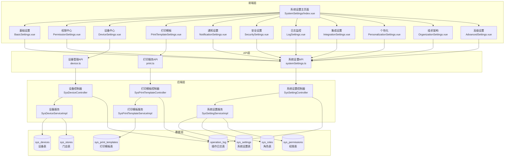

## 二、系统设置模块结构

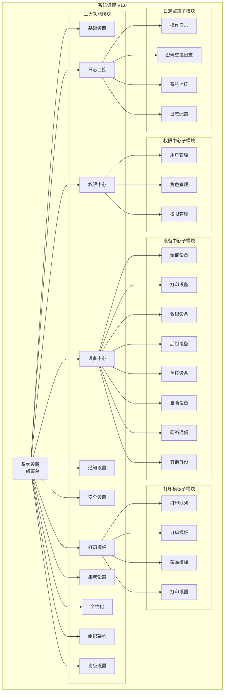

## 三、系统设置配置流程

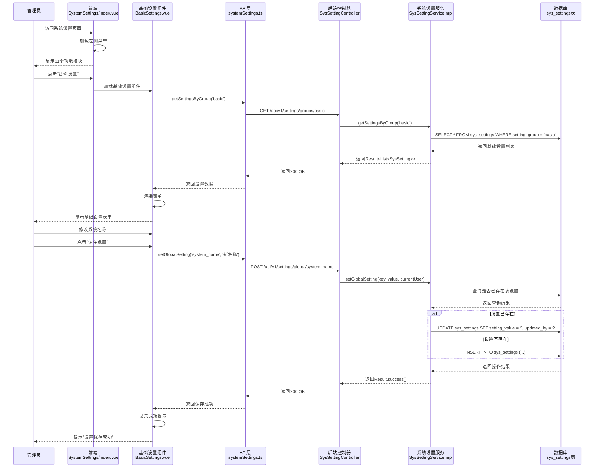

## 四、分层配置优先级流程

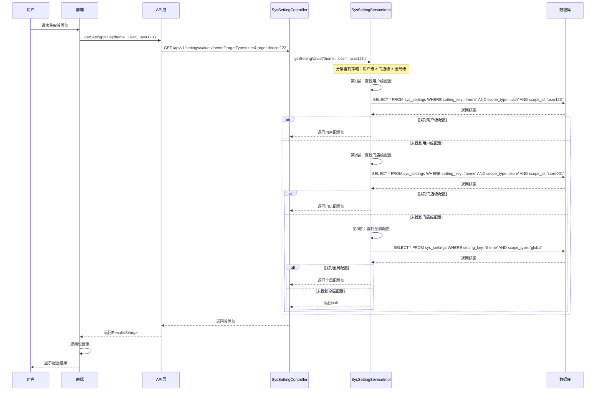

## 五、设备管理流程

### 5.1 设备添加流程

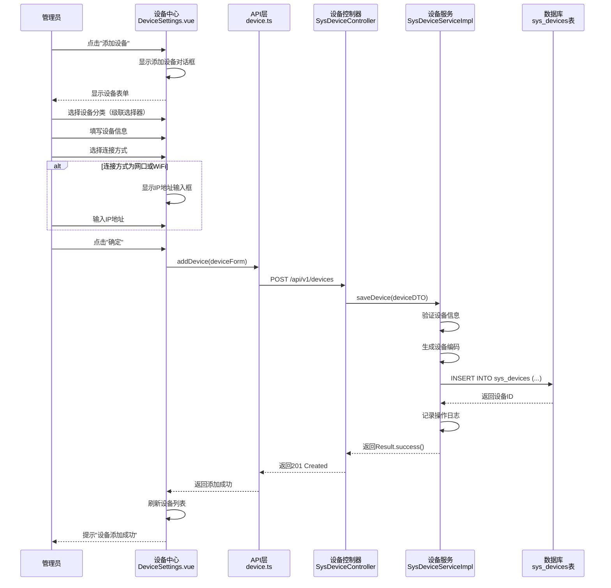

### 5.2 设备分类体系

```mermaid
graph TB
    subgraph "设备分类 V1.0"
        A[设备中心]
        
        subgraph "打印设备"
            B1[热敏打印机<br/>前台/后厨]
            B2[针式打印机<br/>发票打印]
            B3[激光打印机<br/>A4报表]
            B4[喷墨打印机<br/>彩色打印]
            B5[标签打印机<br/>条码/二维码]
            B6[面单打印机<br/>快递/外卖]
        end
        
        subgraph "收银设备"
            C1[POS收银机<br/>传统/安卓/Windows]
            C2[扫码设备<br/>扫码枪/扫码盒]
            C3[支付设备<br/>刷卡机/刷脸支付]
            C4[现金管理<br/>钱箱/点钞机]
            C5[客显设备<br/>LED/LCD/双屏]
        end
        
        subgraph "后厨设备"
            D1[厨房显示系统<br/>KDS]
            D2[叫号设备<br/>叫号器/语音播报]
            D3[后厨扫码设备<br/>扫码核对/出餐确认]
            D4[传感设备<br/>温湿度传感器]
            D5[计时设备<br/>厨房计时器]
        end
        
        subgraph "监控设备"
            E1[视频监控<br/>摄像头/NVR]
            E2[安防设备<br/>门禁/报警器]
            E3[客流统计<br/>计数器/热区分析]
        end
        
        subgraph "自助设备"
            F1[自助点餐机<br/>立式/台式]
            F2[自助服务<br/>结账机/取餐柜]
            F3[排队叫号<br/>取号机/显示屏]
        end
        
        subgraph "网络通信"
            G1[网络设备<br/>路由器/交换机/AP]
            G2[通信设备<br/>对讲机/广播]
            G3[物联网<br/>智能网关]
        end
        
        subgraph "其他外设"
            H1[显示设备<br/>电子菜单屏]
            H2[称重设备<br/>电子秤/条码秤]
            H3[存储设备<br/>移动硬盘/U盘]
        end
    end
    
    A --> B1
    A --> B2
    A --> B3
    A --> B4
    A --> B5
    A --> B6
    A --> C1
    A --> C2
    A --> C3
    A --> C4
    A --> C5
    A --> D1
    A --> D2
    A --> D3
    A --> D4
    A --> D5
    A --> E1
    A --> E2
    A --> E3
    A --> F1
    A --> F2
    A --> F3
    A --> G1
    A --> G2
    A --> G3
    A --> H1
    A --> H2
    A --> H3
```

## 六、打印模板管理流程

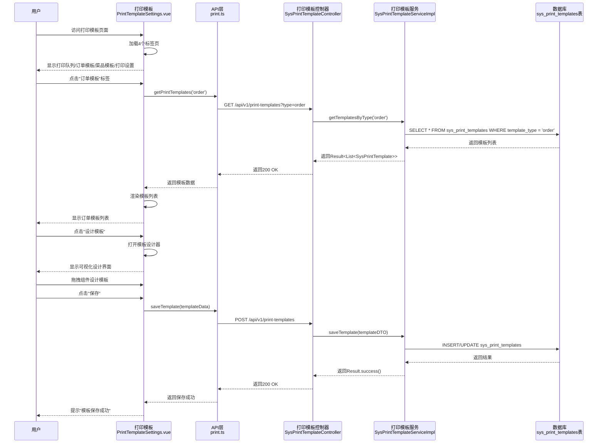

## 七、权限中心管理流程

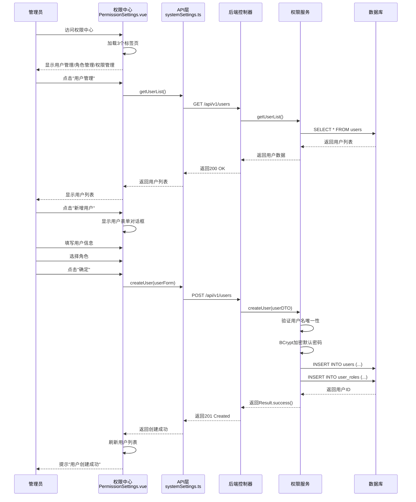

## 八、日志监控流程

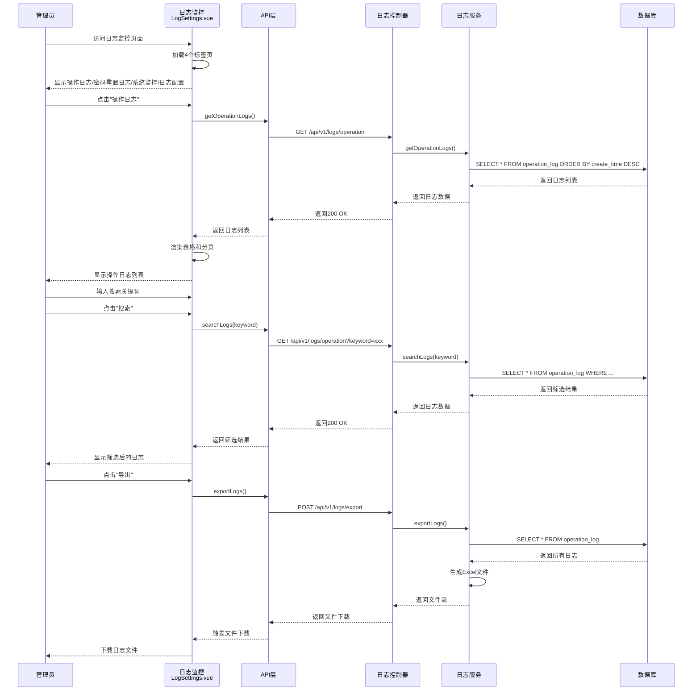

## 九、数据库表结构关系

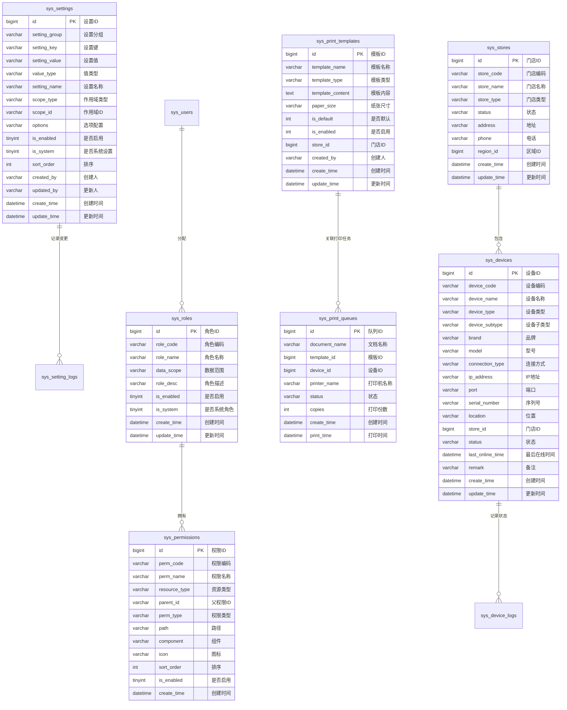

## 十、关键代码文件索引

### 前端代码
- [系统设置主页面](file:///c:/Users/Liberty/Documents/my-new-project/frontend/src/views/SystemSettings/Index.vue)
- [基础设置组件](file:///c:/Users/Liberty/Documents/my-new-project/frontend/src/views/SystemSettings/BasicSettings.vue)
- [权限中心组件](file:///c:/Users/Liberty/Documents/my-new-project/frontend/src/views/SystemSettings/PermissionSettings.vue)
- [设备中心组件](file:///c:/Users/Liberty/Documents/my-new-project/frontend/src/views/SystemSettings/DeviceSettings.vue)
- [打印模板组件](file:///c:/Users/Liberty/Documents/my-new-project/frontend/src/views/SystemSettings/PrintTemplateSettings.vue)
- [通知设置组件](file:///c:/Users/Liberty/Documents/my-new-project/frontend/src/views/SystemSettings/NotificationSettings.vue)
- [安全设置组件](file:///c:/Users/Liberty/Documents/my-new-project/frontend/src/views/SystemSettings/SecuritySettings.vue)
- [日志监控组件](file:///c:/Users/Liberty/Documents/my-new-project/frontend/src/views/SystemSettings/LogSettings.vue)
- [集成设置组件](file:///c:/Users/Liberty/Documents/my-new-project/frontend/src/views/SystemSettings/IntegrationSettings.vue)
- [个性化组件](file:///c:/Users/Liberty/Documents/my-new-project/frontend/src/views/SystemSettings/PersonalizationSettings.vue)
- [组织架构组件](file:///c:/Users/Liberty/Documents/my-new-project/frontend/src/views/SystemSettings/OrganizationSettings.vue)
- [高级设置组件](file:///c:/Users/Liberty/Documents/my-new-project/frontend/src/views/SystemSettings/AdvancedSettings.vue)
- [系统设置API](file:///c:/Users/Liberty/Documents/my-new-project/frontend/src/api/systemSettings.ts)
- [路由配置](file:///c:/Users/Liberty/Documents/my-new-project/frontend/src/router/index.ts)

### 后端代码
- [系统设置实体](file:///c:/Users/Liberty/Documents/my-new-project/backend/src/main/java/com/example/demo/entity/SysSetting.java)
- [系统设置Mapper](file:///c:/Users/Liberty/Documents/my-new-project/backend/src/main/java/com/example/demo/mapper/SysSettingMapper.java)
- [系统设置Service接口](file:///c:/Users/Liberty/Documents/my-new-project/backend/src/main/java/com/example/demo/service/SysSettingService.java)
- [系统设置Service实现](file:///c:/Users/Liberty/Documents/my-new-project/backend/src/main/java/com/example/demo/service/impl/SysSettingServiceImpl.java)
- [系统设置Controller](file:///c:/Users/Liberty/Documents/my-new-project/backend/src/main/java/com/example/demo/controller/SysSettingController.java)
- [设备实体](file:///c:/Users/Liberty/Documents/my-new-project/backend/src/main/java/com/example/demo/entity/SysDevice.java)
- [打印模板实体](file:///c:/Users/Liberty/Documents/my-new-project/backend/src/main/java/com/example/demo/entity/SysPrintTemplate.java)
- [角色实体](file:///c:/Users/Liberty/Documents/my-new-project/backend/src/main/java/com/example/demo/entity/SysRole.java)
- [权限实体](file:///c:/Users/Liberty/Documents/my-new-project/backend/src/main/java/com/example/demo/entity/SysPermission.java)
- [门店实体](file:///c:/Users/Liberty/Documents/my-new-project/backend/src/main/java/com/example/demo/entity/SysStore.java)
- [统一响应结果](file:///c:/Users/Liberty/Documents/my-new-project/backend/src/main/java/com/example/demo/common/Result.java)

### 数据库脚本
- [系统设置表迁移脚本](file:///c:/Users/Liberty/Documents/my-new-project/backend/src/main/resources/db/migration/V2__Create_System_Settings_Tables.sql)

## 十一、功能实现状态检查清单

> **最后更新**：2026-02-02 23:00 | **更新人**：AI Assistant

### 核心功能模块
> **最后验证**：2026-02-02
- ✅ **基础设置**：企业信息、时间设置、数据备份配置
- ✅ **权限中心**：用户管理、角色管理、权限管理
- ✅ **设备中心**：7大分类、30+设备类型管理
- ✅ **打印模板**：打印队列、订单模板、菜品模板、打印设置
- ✅ **通知设置**：短信、邮件、系统通知配置
- ✅ **安全设置**：密码策略、登录安全、访问控制
- ✅ **日志监控**：操作日志、密码重置日志、系统监控
- ✅ **集成设置**：支付接口、外卖平台、短信邮件服务
- ✅ **个性化**：主题设置、界面设置
- ✅ **组织架构**：门店管理、区域管理
- ✅ **高级设置**：缓存管理、定时任务、数据导入导出

### 数据库表
> **最后验证**：2026-02-02
- ✅ **sys_settings**：系统设置表
- ✅ **sys_devices**：设备表
- ✅ **sys_print_templates**：打印模板表
- ✅ **sys_roles**：角色表
- ✅ **sys_permissions**：权限表
- ✅ **sys_stores**：门店表
- ✅ **sys_user_stores**：用户门店关联表
- ✅ **sys_role_permissions**：角色权限关联表
- ✅ **sys_print_queues**：打印队列表
- ✅ **sys_device_logs**：设备日志表
- ✅ **sys_setting_logs**：设置变更日志表

### API接口
> **最后验证**：2026-02-02
- ✅ **系统设置API**：7个接口（查询、设置、批量操作）
- ✅ **分层配置**：用户级、门店级、全局级配置
- ✅ **默认设置初始化**：一键初始化默认配置

### 前端页面
> **最后验证**：2026-02-02
- ✅ **系统设置主页面**：左侧菜单导航
- ✅ **11个功能模块**：完整页面框架
- ✅ **设备分类**：7大分类、级联选择器
- ✅ **打印模板**：4个标签页
- ✅ **权限中心**：3个标签页（用户/角色/权限）
- ✅ **日志监控**：4个标签页

## 十二、系统设置工作流程

### 12.1 开发工作流程

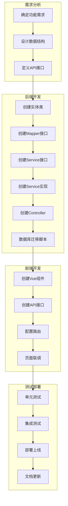

### 12.2 配置变更流程

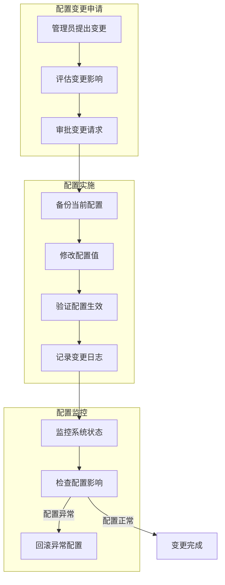

## 十三、版本更新记录

### v1.0 - 2026-02-02 23:00
**更新人**：AI Assistant  
**更新内容**：
- ✅ 初始版本创建
- ✅ 系统架构概览（第1节）
- ✅ 系统设置模块结构（第2节）
- ✅ 系统设置配置流程（第3节）
- ✅ 分层配置优先级流程（第4节）
- ✅ 设备管理流程（第5节）
- ✅ 打印模板管理流程（第6节）
- ✅ 权限中心管理流程（第7节）
- ✅ 日志监控流程（第8节）
- ✅ 数据库表结构关系（第9节）
- ✅ 关键代码文件索引（第10节）
- ✅ 功能实现状态检查清单（第11节）
- ✅ 系统设置工作流程（第12节）
- ✅ 版本更新记录（第13节）

---

**文档版本**：v1.0  
**创建日期**：2026-02-02 23:00  
**创建人**：AI Assistant  
**适用范围**：餐饮管理系统 - 系统设置模块

---

**历史版本**：详见第13节"版本更新记录"
